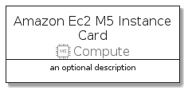
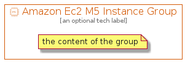

# AmazonEc2M5Instance


```text
aws-20210730/Resource/Compute/AmazonEc2M5Instance
```

```text
include('aws-20210730/Resource/Compute/AmazonEc2M5Instance')
```


| Illustration | AmazonEc2M5Instance | AmazonEc2M5InstanceCard | AmazonEc2M5InstanceGroup |
| :---: | :---: | :---: | :---: |
|  |  |  |  |


## AmazonEc2M5Instance

### Load remotely
```plantuml
@startuml
' configures the library
!global $LIB_BASE_LOCATION="https://github.com/tmorin/plantuml-libs/distribution"

' loads the library's bootstrap
!include $LIB_BASE_LOCATION/bootstrap.puml

' loads the package bootstrap
include('aws-20210730/bootstrap')

' loads the Item which embeds the element AmazonEc2M5Instance
include('aws-20210730/Resource/Compute/AmazonEc2M5Instance')

' renders the element
AmazonEc2M5Instance('AmazonEc2M5Instance', 'Amazon Ec2 M5 Instance', 'an optional tech label')
@enduml
```

### Load locally
```plantuml
@startuml
' configures the library
!global $INCLUSION_MODE="local"
!global $LIB_BASE_LOCATION="../../.."

' loads the library's bootstrap
!include $LIB_BASE_LOCATION/bootstrap.puml

' loads the package bootstrap
include('aws-20210730/bootstrap')

' loads the Item which embeds the element AmazonEc2M5Instance
include('aws-20210730/Resource/Compute/AmazonEc2M5Instance')

' renders the element
AmazonEc2M5Instance('AmazonEc2M5Instance', 'Amazon Ec2 M5 Instance', 'an optional tech label')
@enduml
```

## AmazonEc2M5InstanceCard

### Load remotely
```plantuml
@startuml
' configures the library
!global $LIB_BASE_LOCATION="https://github.com/tmorin/plantuml-libs/distribution"

' loads the library's bootstrap
!include $LIB_BASE_LOCATION/bootstrap.puml

' loads the package bootstrap
include('aws-20210730/bootstrap')

' loads the Item which embeds the element AmazonEc2M5InstanceCard
include('aws-20210730/Resource/Compute/AmazonEc2M5Instance')

' renders the element
AmazonEc2M5InstanceCard('AmazonEc2M5InstanceCard', 'Amazon Ec2 M5 Instance Card', 'an optional description')
@enduml
```

### Load locally
```plantuml
@startuml
' configures the library
!global $INCLUSION_MODE="local"
!global $LIB_BASE_LOCATION="../../.."

' loads the library's bootstrap
!include $LIB_BASE_LOCATION/bootstrap.puml

' loads the package bootstrap
include('aws-20210730/bootstrap')

' loads the Item which embeds the element AmazonEc2M5InstanceCard
include('aws-20210730/Resource/Compute/AmazonEc2M5Instance')

' renders the element
AmazonEc2M5InstanceCard('AmazonEc2M5InstanceCard', 'Amazon Ec2 M5 Instance Card', 'an optional description')
@enduml
```

## AmazonEc2M5InstanceGroup

### Load remotely
```plantuml
@startuml
' configures the library
!global $LIB_BASE_LOCATION="https://github.com/tmorin/plantuml-libs/distribution"

' loads the library's bootstrap
!include $LIB_BASE_LOCATION/bootstrap.puml

' loads the package bootstrap
include('aws-20210730/bootstrap')

' loads the Item which embeds the element AmazonEc2M5InstanceGroup
include('aws-20210730/Resource/Compute/AmazonEc2M5Instance')

' renders the element
AmazonEc2M5InstanceGroup('AmazonEc2M5InstanceGroup', 'Amazon Ec2 M5 Instance Group', 'an optional tech label') {
    note as note
        the content of the group
    end note
}
@enduml
```

### Load locally
```plantuml
@startuml
' configures the library
!global $INCLUSION_MODE="local"
!global $LIB_BASE_LOCATION="../../.."

' loads the library's bootstrap
!include $LIB_BASE_LOCATION/bootstrap.puml

' loads the package bootstrap
include('aws-20210730/bootstrap')

' loads the Item which embeds the element AmazonEc2M5InstanceGroup
include('aws-20210730/Resource/Compute/AmazonEc2M5Instance')

' renders the element
AmazonEc2M5InstanceGroup('AmazonEc2M5InstanceGroup', 'Amazon Ec2 M5 Instance Group', 'an optional tech label') {
    note as note
        the content of the group
    end note
}
@enduml
```

