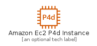
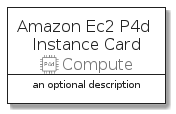
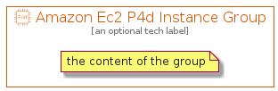

# AmazonEc2P4DInstance


```text
aws-20210730/Resource/Compute/AmazonEc2P4DInstance
```

```text
include('aws-20210730/Resource/Compute/AmazonEc2P4DInstance')
```


| Illustration | AmazonEc2P4DInstance | AmazonEc2P4DInstanceCard | AmazonEc2P4DInstanceGroup |
| :---: | :---: | :---: | :---: |
|  |  |  |  |


## AmazonEc2P4DInstance

### Load remotely
```plantuml
@startuml
' configures the library
!global $LIB_BASE_LOCATION="https://raw.githubusercontent.com/tmorin/plantuml-libs/master/distribution"

' loads the library's bootstrap
!include $LIB_BASE_LOCATION/bootstrap.puml

' loads the package bootstrap
include('aws-20210730/bootstrap')

' loads the Item which embeds the element AmazonEc2P4DInstance
include('aws-20210730/Resource/Compute/AmazonEc2P4DInstance')

' renders the element
AmazonEc2P4DInstance('AmazonEc2P4dInstance', 'Amazon Ec2 P4d Instance', 'an optional tech label')
@enduml
```

### Load locally
```plantuml
@startuml
' configures the library
!global $INCLUSION_MODE="local"
!global $LIB_BASE_LOCATION="../../.."

' loads the library's bootstrap
!include $LIB_BASE_LOCATION/bootstrap.puml

' loads the package bootstrap
include('aws-20210730/bootstrap')

' loads the Item which embeds the element AmazonEc2P4DInstance
include('aws-20210730/Resource/Compute/AmazonEc2P4DInstance')

' renders the element
AmazonEc2P4DInstance('AmazonEc2P4dInstance', 'Amazon Ec2 P4d Instance', 'an optional tech label')
@enduml
```

## AmazonEc2P4DInstanceCard

### Load remotely
```plantuml
@startuml
' configures the library
!global $LIB_BASE_LOCATION="https://raw.githubusercontent.com/tmorin/plantuml-libs/master/distribution"

' loads the library's bootstrap
!include $LIB_BASE_LOCATION/bootstrap.puml

' loads the package bootstrap
include('aws-20210730/bootstrap')

' loads the Item which embeds the element AmazonEc2P4DInstanceCard
include('aws-20210730/Resource/Compute/AmazonEc2P4DInstance')

' renders the element
AmazonEc2P4DInstanceCard('AmazonEc2P4dInstanceCard', 'Amazon Ec2 P4d Instance Card', 'an optional description')
@enduml
```

### Load locally
```plantuml
@startuml
' configures the library
!global $INCLUSION_MODE="local"
!global $LIB_BASE_LOCATION="../../.."

' loads the library's bootstrap
!include $LIB_BASE_LOCATION/bootstrap.puml

' loads the package bootstrap
include('aws-20210730/bootstrap')

' loads the Item which embeds the element AmazonEc2P4DInstanceCard
include('aws-20210730/Resource/Compute/AmazonEc2P4DInstance')

' renders the element
AmazonEc2P4DInstanceCard('AmazonEc2P4dInstanceCard', 'Amazon Ec2 P4d Instance Card', 'an optional description')
@enduml
```

## AmazonEc2P4DInstanceGroup

### Load remotely
```plantuml
@startuml
' configures the library
!global $LIB_BASE_LOCATION="https://raw.githubusercontent.com/tmorin/plantuml-libs/master/distribution"

' loads the library's bootstrap
!include $LIB_BASE_LOCATION/bootstrap.puml

' loads the package bootstrap
include('aws-20210730/bootstrap')

' loads the Item which embeds the element AmazonEc2P4DInstanceGroup
include('aws-20210730/Resource/Compute/AmazonEc2P4DInstance')

' renders the element
AmazonEc2P4DInstanceGroup('AmazonEc2P4dInstanceGroup', 'Amazon Ec2 P4d Instance Group', 'an optional tech label') {
    note as note
        the content of the group
    end note
}
@enduml
```

### Load locally
```plantuml
@startuml
' configures the library
!global $INCLUSION_MODE="local"
!global $LIB_BASE_LOCATION="../../.."

' loads the library's bootstrap
!include $LIB_BASE_LOCATION/bootstrap.puml

' loads the package bootstrap
include('aws-20210730/bootstrap')

' loads the Item which embeds the element AmazonEc2P4DInstanceGroup
include('aws-20210730/Resource/Compute/AmazonEc2P4DInstance')

' renders the element
AmazonEc2P4DInstanceGroup('AmazonEc2P4dInstanceGroup', 'Amazon Ec2 P4d Instance Group', 'an optional tech label') {
    note as note
        the content of the group
    end note
}
@enduml
```

