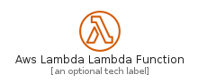
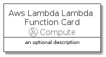
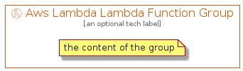

# AwsLambdaLambdaFunction


```text
aws-20210730/Resource/Compute/AwsLambdaLambdaFunction
```

```text
include('aws-20210730/Resource/Compute/AwsLambdaLambdaFunction')
```


| Illustration | AwsLambdaLambdaFunction | AwsLambdaLambdaFunctionCard | AwsLambdaLambdaFunctionGroup |
| :---: | :---: | :---: | :---: |
|  |  |  |  |


## AwsLambdaLambdaFunction

### Load remotely
```plantuml
@startuml
' configures the library
!global $LIB_BASE_LOCATION="https://github.com/tmorin/plantuml-libs/distribution"

' loads the library's bootstrap
!include $LIB_BASE_LOCATION/bootstrap.puml

' loads the package bootstrap
include('aws-20210730/bootstrap')

' loads the Item which embeds the element AwsLambdaLambdaFunction
include('aws-20210730/Resource/Compute/AwsLambdaLambdaFunction')

' renders the element
AwsLambdaLambdaFunction('AwsLambdaLambdaFunction', 'Aws Lambda Lambda Function', 'an optional tech label')
@enduml
```

### Load locally
```plantuml
@startuml
' configures the library
!global $INCLUSION_MODE="local"
!global $LIB_BASE_LOCATION="../../.."

' loads the library's bootstrap
!include $LIB_BASE_LOCATION/bootstrap.puml

' loads the package bootstrap
include('aws-20210730/bootstrap')

' loads the Item which embeds the element AwsLambdaLambdaFunction
include('aws-20210730/Resource/Compute/AwsLambdaLambdaFunction')

' renders the element
AwsLambdaLambdaFunction('AwsLambdaLambdaFunction', 'Aws Lambda Lambda Function', 'an optional tech label')
@enduml
```

## AwsLambdaLambdaFunctionCard

### Load remotely
```plantuml
@startuml
' configures the library
!global $LIB_BASE_LOCATION="https://github.com/tmorin/plantuml-libs/distribution"

' loads the library's bootstrap
!include $LIB_BASE_LOCATION/bootstrap.puml

' loads the package bootstrap
include('aws-20210730/bootstrap')

' loads the Item which embeds the element AwsLambdaLambdaFunctionCard
include('aws-20210730/Resource/Compute/AwsLambdaLambdaFunction')

' renders the element
AwsLambdaLambdaFunctionCard('AwsLambdaLambdaFunctionCard', 'Aws Lambda Lambda Function Card', 'an optional description')
@enduml
```

### Load locally
```plantuml
@startuml
' configures the library
!global $INCLUSION_MODE="local"
!global $LIB_BASE_LOCATION="../../.."

' loads the library's bootstrap
!include $LIB_BASE_LOCATION/bootstrap.puml

' loads the package bootstrap
include('aws-20210730/bootstrap')

' loads the Item which embeds the element AwsLambdaLambdaFunctionCard
include('aws-20210730/Resource/Compute/AwsLambdaLambdaFunction')

' renders the element
AwsLambdaLambdaFunctionCard('AwsLambdaLambdaFunctionCard', 'Aws Lambda Lambda Function Card', 'an optional description')
@enduml
```

## AwsLambdaLambdaFunctionGroup

### Load remotely
```plantuml
@startuml
' configures the library
!global $LIB_BASE_LOCATION="https://github.com/tmorin/plantuml-libs/distribution"

' loads the library's bootstrap
!include $LIB_BASE_LOCATION/bootstrap.puml

' loads the package bootstrap
include('aws-20210730/bootstrap')

' loads the Item which embeds the element AwsLambdaLambdaFunctionGroup
include('aws-20210730/Resource/Compute/AwsLambdaLambdaFunction')

' renders the element
AwsLambdaLambdaFunctionGroup('AwsLambdaLambdaFunctionGroup', 'Aws Lambda Lambda Function Group', 'an optional tech label') {
    note as note
        the content of the group
    end note
}
@enduml
```

### Load locally
```plantuml
@startuml
' configures the library
!global $INCLUSION_MODE="local"
!global $LIB_BASE_LOCATION="../../.."

' loads the library's bootstrap
!include $LIB_BASE_LOCATION/bootstrap.puml

' loads the package bootstrap
include('aws-20210730/bootstrap')

' loads the Item which embeds the element AwsLambdaLambdaFunctionGroup
include('aws-20210730/Resource/Compute/AwsLambdaLambdaFunction')

' renders the element
AwsLambdaLambdaFunctionGroup('AwsLambdaLambdaFunctionGroup', 'Aws Lambda Lambda Function Group', 'an optional tech label') {
    note as note
        the content of the group
    end note
}
@enduml
```

