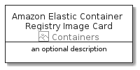

# AmazonElasticContainerRegistryImage


```text
aws-20210730/Resource/Containers/AmazonElasticContainerRegistryImage
```

```text
include('aws-20210730/Resource/Containers/AmazonElasticContainerRegistryImage')
```


| Illustration | AmazonElasticContainerRegistryImage | AmazonElasticContainerRegistryImageCard | AmazonElasticContainerRegistryImageGroup |
| :---: | :---: | :---: | :---: |
|  |  |  |  |


## AmazonElasticContainerRegistryImage

### Load remotely
```plantuml
@startuml
' configures the library
!global $LIB_BASE_LOCATION="https://github.com/tmorin/plantuml-libs/distribution"

' loads the library's bootstrap
!include $LIB_BASE_LOCATION/bootstrap.puml

' loads the package bootstrap
include('aws-20210730/bootstrap')

' loads the Item which embeds the element AmazonElasticContainerRegistryImage
include('aws-20210730/Resource/Containers/AmazonElasticContainerRegistryImage')

' renders the element
AmazonElasticContainerRegistryImage('AmazonElasticContainerRegistryImage', 'Amazon Elastic Container Registry Image', 'an optional tech label')
@enduml
```

### Load locally
```plantuml
@startuml
' configures the library
!global $INCLUSION_MODE="local"
!global $LIB_BASE_LOCATION="../../.."

' loads the library's bootstrap
!include $LIB_BASE_LOCATION/bootstrap.puml

' loads the package bootstrap
include('aws-20210730/bootstrap')

' loads the Item which embeds the element AmazonElasticContainerRegistryImage
include('aws-20210730/Resource/Containers/AmazonElasticContainerRegistryImage')

' renders the element
AmazonElasticContainerRegistryImage('AmazonElasticContainerRegistryImage', 'Amazon Elastic Container Registry Image', 'an optional tech label')
@enduml
```

## AmazonElasticContainerRegistryImageCard

### Load remotely
```plantuml
@startuml
' configures the library
!global $LIB_BASE_LOCATION="https://github.com/tmorin/plantuml-libs/distribution"

' loads the library's bootstrap
!include $LIB_BASE_LOCATION/bootstrap.puml

' loads the package bootstrap
include('aws-20210730/bootstrap')

' loads the Item which embeds the element AmazonElasticContainerRegistryImageCard
include('aws-20210730/Resource/Containers/AmazonElasticContainerRegistryImage')

' renders the element
AmazonElasticContainerRegistryImageCard('AmazonElasticContainerRegistryImageCard', 'Amazon Elastic Container Registry Image Card', 'an optional description')
@enduml
```

### Load locally
```plantuml
@startuml
' configures the library
!global $INCLUSION_MODE="local"
!global $LIB_BASE_LOCATION="../../.."

' loads the library's bootstrap
!include $LIB_BASE_LOCATION/bootstrap.puml

' loads the package bootstrap
include('aws-20210730/bootstrap')

' loads the Item which embeds the element AmazonElasticContainerRegistryImageCard
include('aws-20210730/Resource/Containers/AmazonElasticContainerRegistryImage')

' renders the element
AmazonElasticContainerRegistryImageCard('AmazonElasticContainerRegistryImageCard', 'Amazon Elastic Container Registry Image Card', 'an optional description')
@enduml
```

## AmazonElasticContainerRegistryImageGroup

### Load remotely
```plantuml
@startuml
' configures the library
!global $LIB_BASE_LOCATION="https://github.com/tmorin/plantuml-libs/distribution"

' loads the library's bootstrap
!include $LIB_BASE_LOCATION/bootstrap.puml

' loads the package bootstrap
include('aws-20210730/bootstrap')

' loads the Item which embeds the element AmazonElasticContainerRegistryImageGroup
include('aws-20210730/Resource/Containers/AmazonElasticContainerRegistryImage')

' renders the element
AmazonElasticContainerRegistryImageGroup('AmazonElasticContainerRegistryImageGroup', 'Amazon Elastic Container Registry Image Group', 'an optional tech label') {
    note as note
        the content of the group
    end note
}
@enduml
```

### Load locally
```plantuml
@startuml
' configures the library
!global $INCLUSION_MODE="local"
!global $LIB_BASE_LOCATION="../../.."

' loads the library's bootstrap
!include $LIB_BASE_LOCATION/bootstrap.puml

' loads the package bootstrap
include('aws-20210730/bootstrap')

' loads the Item which embeds the element AmazonElasticContainerRegistryImageGroup
include('aws-20210730/Resource/Containers/AmazonElasticContainerRegistryImage')

' renders the element
AmazonElasticContainerRegistryImageGroup('AmazonElasticContainerRegistryImageGroup', 'Amazon Elastic Container Registry Image Group', 'an optional tech label') {
    note as note
        the content of the group
    end note
}
@enduml
```

