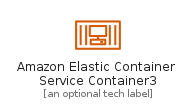
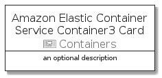

# AmazonElasticContainerServiceContainer3


```text
aws-20210730/Resource/Containers/AmazonElasticContainerServiceContainer3
```

```text
include('aws-20210730/Resource/Containers/AmazonElasticContainerServiceContainer3')
```


| Illustration | AmazonElasticContainerServiceContainer3 | AmazonElasticContainerServiceContainer3Card | AmazonElasticContainerServiceContainer3Group |
| :---: | :---: | :---: | :---: |
|  |  |  |  |


## AmazonElasticContainerServiceContainer3

### Load remotely
```plantuml
@startuml
' configures the library
!global $LIB_BASE_LOCATION="https://github.com/tmorin/plantuml-libs/distribution"

' loads the library's bootstrap
!include $LIB_BASE_LOCATION/bootstrap.puml

' loads the package bootstrap
include('aws-20210730/bootstrap')

' loads the Item which embeds the element AmazonElasticContainerServiceContainer3
include('aws-20210730/Resource/Containers/AmazonElasticContainerServiceContainer3')

' renders the element
AmazonElasticContainerServiceContainer3('AmazonElasticContainerServiceContainer3', 'Amazon Elastic Container Service Container3', 'an optional tech label')
@enduml
```

### Load locally
```plantuml
@startuml
' configures the library
!global $INCLUSION_MODE="local"
!global $LIB_BASE_LOCATION="../../.."

' loads the library's bootstrap
!include $LIB_BASE_LOCATION/bootstrap.puml

' loads the package bootstrap
include('aws-20210730/bootstrap')

' loads the Item which embeds the element AmazonElasticContainerServiceContainer3
include('aws-20210730/Resource/Containers/AmazonElasticContainerServiceContainer3')

' renders the element
AmazonElasticContainerServiceContainer3('AmazonElasticContainerServiceContainer3', 'Amazon Elastic Container Service Container3', 'an optional tech label')
@enduml
```

## AmazonElasticContainerServiceContainer3Card

### Load remotely
```plantuml
@startuml
' configures the library
!global $LIB_BASE_LOCATION="https://github.com/tmorin/plantuml-libs/distribution"

' loads the library's bootstrap
!include $LIB_BASE_LOCATION/bootstrap.puml

' loads the package bootstrap
include('aws-20210730/bootstrap')

' loads the Item which embeds the element AmazonElasticContainerServiceContainer3Card
include('aws-20210730/Resource/Containers/AmazonElasticContainerServiceContainer3')

' renders the element
AmazonElasticContainerServiceContainer3Card('AmazonElasticContainerServiceContainer3Card', 'Amazon Elastic Container Service Container3 Card', 'an optional description')
@enduml
```

### Load locally
```plantuml
@startuml
' configures the library
!global $INCLUSION_MODE="local"
!global $LIB_BASE_LOCATION="../../.."

' loads the library's bootstrap
!include $LIB_BASE_LOCATION/bootstrap.puml

' loads the package bootstrap
include('aws-20210730/bootstrap')

' loads the Item which embeds the element AmazonElasticContainerServiceContainer3Card
include('aws-20210730/Resource/Containers/AmazonElasticContainerServiceContainer3')

' renders the element
AmazonElasticContainerServiceContainer3Card('AmazonElasticContainerServiceContainer3Card', 'Amazon Elastic Container Service Container3 Card', 'an optional description')
@enduml
```

## AmazonElasticContainerServiceContainer3Group

### Load remotely
```plantuml
@startuml
' configures the library
!global $LIB_BASE_LOCATION="https://github.com/tmorin/plantuml-libs/distribution"

' loads the library's bootstrap
!include $LIB_BASE_LOCATION/bootstrap.puml

' loads the package bootstrap
include('aws-20210730/bootstrap')

' loads the Item which embeds the element AmazonElasticContainerServiceContainer3Group
include('aws-20210730/Resource/Containers/AmazonElasticContainerServiceContainer3')

' renders the element
AmazonElasticContainerServiceContainer3Group('AmazonElasticContainerServiceContainer3Group', 'Amazon Elastic Container Service Container3 Group', 'an optional tech label') {
    note as note
        the content of the group
    end note
}
@enduml
```

### Load locally
```plantuml
@startuml
' configures the library
!global $INCLUSION_MODE="local"
!global $LIB_BASE_LOCATION="../../.."

' loads the library's bootstrap
!include $LIB_BASE_LOCATION/bootstrap.puml

' loads the package bootstrap
include('aws-20210730/bootstrap')

' loads the Item which embeds the element AmazonElasticContainerServiceContainer3Group
include('aws-20210730/Resource/Containers/AmazonElasticContainerServiceContainer3')

' renders the element
AmazonElasticContainerServiceContainer3Group('AmazonElasticContainerServiceContainer3Group', 'Amazon Elastic Container Service Container3 Group', 'an optional tech label') {
    note as note
        the content of the group
    end note
}
@enduml
```

