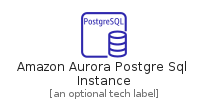
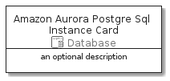

# AmazonAuroraPostgreSqlInstance


```text
aws-20210730/Resource/Database/AmazonAuroraPostgreSqlInstance
```

```text
include('aws-20210730/Resource/Database/AmazonAuroraPostgreSqlInstance')
```


| Illustration | AmazonAuroraPostgreSqlInstance | AmazonAuroraPostgreSqlInstanceCard | AmazonAuroraPostgreSqlInstanceGroup |
| :---: | :---: | :---: | :---: |
|  |  |  |  |


## AmazonAuroraPostgreSqlInstance

### Load remotely
```plantuml
@startuml
' configures the library
!global $LIB_BASE_LOCATION="https://raw.githubusercontent.com/tmorin/plantuml-libs/master/distribution"

' loads the library's bootstrap
!include $LIB_BASE_LOCATION/bootstrap.puml

' loads the package bootstrap
include('aws-20210730/bootstrap')

' loads the Item which embeds the element AmazonAuroraPostgreSqlInstance
include('aws-20210730/Resource/Database/AmazonAuroraPostgreSqlInstance')

' renders the element
AmazonAuroraPostgreSqlInstance('AmazonAuroraPostgreSqlInstance', 'Amazon Aurora Postgre Sql Instance', 'an optional tech label')
@enduml
```

### Load locally
```plantuml
@startuml
' configures the library
!global $INCLUSION_MODE="local"
!global $LIB_BASE_LOCATION="../../.."

' loads the library's bootstrap
!include $LIB_BASE_LOCATION/bootstrap.puml

' loads the package bootstrap
include('aws-20210730/bootstrap')

' loads the Item which embeds the element AmazonAuroraPostgreSqlInstance
include('aws-20210730/Resource/Database/AmazonAuroraPostgreSqlInstance')

' renders the element
AmazonAuroraPostgreSqlInstance('AmazonAuroraPostgreSqlInstance', 'Amazon Aurora Postgre Sql Instance', 'an optional tech label')
@enduml
```

## AmazonAuroraPostgreSqlInstanceCard

### Load remotely
```plantuml
@startuml
' configures the library
!global $LIB_BASE_LOCATION="https://raw.githubusercontent.com/tmorin/plantuml-libs/master/distribution"

' loads the library's bootstrap
!include $LIB_BASE_LOCATION/bootstrap.puml

' loads the package bootstrap
include('aws-20210730/bootstrap')

' loads the Item which embeds the element AmazonAuroraPostgreSqlInstanceCard
include('aws-20210730/Resource/Database/AmazonAuroraPostgreSqlInstance')

' renders the element
AmazonAuroraPostgreSqlInstanceCard('AmazonAuroraPostgreSqlInstanceCard', 'Amazon Aurora Postgre Sql Instance Card', 'an optional description')
@enduml
```

### Load locally
```plantuml
@startuml
' configures the library
!global $INCLUSION_MODE="local"
!global $LIB_BASE_LOCATION="../../.."

' loads the library's bootstrap
!include $LIB_BASE_LOCATION/bootstrap.puml

' loads the package bootstrap
include('aws-20210730/bootstrap')

' loads the Item which embeds the element AmazonAuroraPostgreSqlInstanceCard
include('aws-20210730/Resource/Database/AmazonAuroraPostgreSqlInstance')

' renders the element
AmazonAuroraPostgreSqlInstanceCard('AmazonAuroraPostgreSqlInstanceCard', 'Amazon Aurora Postgre Sql Instance Card', 'an optional description')
@enduml
```

## AmazonAuroraPostgreSqlInstanceGroup

### Load remotely
```plantuml
@startuml
' configures the library
!global $LIB_BASE_LOCATION="https://raw.githubusercontent.com/tmorin/plantuml-libs/master/distribution"

' loads the library's bootstrap
!include $LIB_BASE_LOCATION/bootstrap.puml

' loads the package bootstrap
include('aws-20210730/bootstrap')

' loads the Item which embeds the element AmazonAuroraPostgreSqlInstanceGroup
include('aws-20210730/Resource/Database/AmazonAuroraPostgreSqlInstance')

' renders the element
AmazonAuroraPostgreSqlInstanceGroup('AmazonAuroraPostgreSqlInstanceGroup', 'Amazon Aurora Postgre Sql Instance Group', 'an optional tech label') {
    note as note
        the content of the group
    end note
}
@enduml
```

### Load locally
```plantuml
@startuml
' configures the library
!global $INCLUSION_MODE="local"
!global $LIB_BASE_LOCATION="../../.."

' loads the library's bootstrap
!include $LIB_BASE_LOCATION/bootstrap.puml

' loads the package bootstrap
include('aws-20210730/bootstrap')

' loads the Item which embeds the element AmazonAuroraPostgreSqlInstanceGroup
include('aws-20210730/Resource/Database/AmazonAuroraPostgreSqlInstance')

' renders the element
AmazonAuroraPostgreSqlInstanceGroup('AmazonAuroraPostgreSqlInstanceGroup', 'Amazon Aurora Postgre Sql Instance Group', 'an optional tech label') {
    note as note
        the content of the group
    end note
}
@enduml
```

