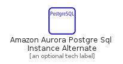
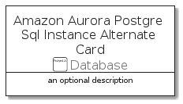

# AmazonAuroraPostgreSqlInstanceAlternate


```text
aws-20210730/Resource/Database/AmazonAuroraPostgreSqlInstanceAlternate
```

```text
include('aws-20210730/Resource/Database/AmazonAuroraPostgreSqlInstanceAlternate')
```


| Illustration | AmazonAuroraPostgreSqlInstanceAlternate | AmazonAuroraPostgreSqlInstanceAlternateCard | AmazonAuroraPostgreSqlInstanceAlternateGroup |
| :---: | :---: | :---: | :---: |
|  |  |  |  |


## AmazonAuroraPostgreSqlInstanceAlternate

### Load remotely
```plantuml
@startuml
' configures the library
!global $LIB_BASE_LOCATION="https://github.com/tmorin/plantuml-libs/distribution"

' loads the library's bootstrap
!include $LIB_BASE_LOCATION/bootstrap.puml

' loads the package bootstrap
include('aws-20210730/bootstrap')

' loads the Item which embeds the element AmazonAuroraPostgreSqlInstanceAlternate
include('aws-20210730/Resource/Database/AmazonAuroraPostgreSqlInstanceAlternate')

' renders the element
AmazonAuroraPostgreSqlInstanceAlternate('AmazonAuroraPostgreSqlInstanceAlternate', 'Amazon Aurora Postgre Sql Instance Alternate', 'an optional tech label')
@enduml
```

### Load locally
```plantuml
@startuml
' configures the library
!global $INCLUSION_MODE="local"
!global $LIB_BASE_LOCATION="../../.."

' loads the library's bootstrap
!include $LIB_BASE_LOCATION/bootstrap.puml

' loads the package bootstrap
include('aws-20210730/bootstrap')

' loads the Item which embeds the element AmazonAuroraPostgreSqlInstanceAlternate
include('aws-20210730/Resource/Database/AmazonAuroraPostgreSqlInstanceAlternate')

' renders the element
AmazonAuroraPostgreSqlInstanceAlternate('AmazonAuroraPostgreSqlInstanceAlternate', 'Amazon Aurora Postgre Sql Instance Alternate', 'an optional tech label')
@enduml
```

## AmazonAuroraPostgreSqlInstanceAlternateCard

### Load remotely
```plantuml
@startuml
' configures the library
!global $LIB_BASE_LOCATION="https://github.com/tmorin/plantuml-libs/distribution"

' loads the library's bootstrap
!include $LIB_BASE_LOCATION/bootstrap.puml

' loads the package bootstrap
include('aws-20210730/bootstrap')

' loads the Item which embeds the element AmazonAuroraPostgreSqlInstanceAlternateCard
include('aws-20210730/Resource/Database/AmazonAuroraPostgreSqlInstanceAlternate')

' renders the element
AmazonAuroraPostgreSqlInstanceAlternateCard('AmazonAuroraPostgreSqlInstanceAlternateCard', 'Amazon Aurora Postgre Sql Instance Alternate Card', 'an optional description')
@enduml
```

### Load locally
```plantuml
@startuml
' configures the library
!global $INCLUSION_MODE="local"
!global $LIB_BASE_LOCATION="../../.."

' loads the library's bootstrap
!include $LIB_BASE_LOCATION/bootstrap.puml

' loads the package bootstrap
include('aws-20210730/bootstrap')

' loads the Item which embeds the element AmazonAuroraPostgreSqlInstanceAlternateCard
include('aws-20210730/Resource/Database/AmazonAuroraPostgreSqlInstanceAlternate')

' renders the element
AmazonAuroraPostgreSqlInstanceAlternateCard('AmazonAuroraPostgreSqlInstanceAlternateCard', 'Amazon Aurora Postgre Sql Instance Alternate Card', 'an optional description')
@enduml
```

## AmazonAuroraPostgreSqlInstanceAlternateGroup

### Load remotely
```plantuml
@startuml
' configures the library
!global $LIB_BASE_LOCATION="https://github.com/tmorin/plantuml-libs/distribution"

' loads the library's bootstrap
!include $LIB_BASE_LOCATION/bootstrap.puml

' loads the package bootstrap
include('aws-20210730/bootstrap')

' loads the Item which embeds the element AmazonAuroraPostgreSqlInstanceAlternateGroup
include('aws-20210730/Resource/Database/AmazonAuroraPostgreSqlInstanceAlternate')

' renders the element
AmazonAuroraPostgreSqlInstanceAlternateGroup('AmazonAuroraPostgreSqlInstanceAlternateGroup', 'Amazon Aurora Postgre Sql Instance Alternate Group', 'an optional tech label') {
    note as note
        the content of the group
    end note
}
@enduml
```

### Load locally
```plantuml
@startuml
' configures the library
!global $INCLUSION_MODE="local"
!global $LIB_BASE_LOCATION="../../.."

' loads the library's bootstrap
!include $LIB_BASE_LOCATION/bootstrap.puml

' loads the package bootstrap
include('aws-20210730/bootstrap')

' loads the Item which embeds the element AmazonAuroraPostgreSqlInstanceAlternateGroup
include('aws-20210730/Resource/Database/AmazonAuroraPostgreSqlInstanceAlternate')

' renders the element
AmazonAuroraPostgreSqlInstanceAlternateGroup('AmazonAuroraPostgreSqlInstanceAlternateGroup', 'Amazon Aurora Postgre Sql Instance Alternate Group', 'an optional tech label') {
    note as note
        the content of the group
    end note
}
@enduml
```

