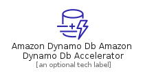
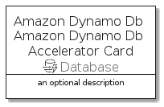

# AmazonDynamoDbAmazonDynamoDbAccelerator


```text
aws-20210730/Resource/Database/AmazonDynamoDbAmazonDynamoDbAccelerator
```

```text
include('aws-20210730/Resource/Database/AmazonDynamoDbAmazonDynamoDbAccelerator')
```


| Illustration | AmazonDynamoDbAmazonDynamoDbAccelerator | AmazonDynamoDbAmazonDynamoDbAcceleratorCard | AmazonDynamoDbAmazonDynamoDbAcceleratorGroup |
| :---: | :---: | :---: | :---: |
|  |  |  |  |


## AmazonDynamoDbAmazonDynamoDbAccelerator

### Load remotely
```plantuml
@startuml
' configures the library
!global $LIB_BASE_LOCATION="https://github.com/tmorin/plantuml-libs/distribution"

' loads the library's bootstrap
!include $LIB_BASE_LOCATION/bootstrap.puml

' loads the package bootstrap
include('aws-20210730/bootstrap')

' loads the Item which embeds the element AmazonDynamoDbAmazonDynamoDbAccelerator
include('aws-20210730/Resource/Database/AmazonDynamoDbAmazonDynamoDbAccelerator')

' renders the element
AmazonDynamoDbAmazonDynamoDbAccelerator('AmazonDynamoDbAmazonDynamoDbAccelerator', 'Amazon Dynamo Db Amazon Dynamo Db Accelerator', 'an optional tech label')
@enduml
```

### Load locally
```plantuml
@startuml
' configures the library
!global $INCLUSION_MODE="local"
!global $LIB_BASE_LOCATION="../../.."

' loads the library's bootstrap
!include $LIB_BASE_LOCATION/bootstrap.puml

' loads the package bootstrap
include('aws-20210730/bootstrap')

' loads the Item which embeds the element AmazonDynamoDbAmazonDynamoDbAccelerator
include('aws-20210730/Resource/Database/AmazonDynamoDbAmazonDynamoDbAccelerator')

' renders the element
AmazonDynamoDbAmazonDynamoDbAccelerator('AmazonDynamoDbAmazonDynamoDbAccelerator', 'Amazon Dynamo Db Amazon Dynamo Db Accelerator', 'an optional tech label')
@enduml
```

## AmazonDynamoDbAmazonDynamoDbAcceleratorCard

### Load remotely
```plantuml
@startuml
' configures the library
!global $LIB_BASE_LOCATION="https://github.com/tmorin/plantuml-libs/distribution"

' loads the library's bootstrap
!include $LIB_BASE_LOCATION/bootstrap.puml

' loads the package bootstrap
include('aws-20210730/bootstrap')

' loads the Item which embeds the element AmazonDynamoDbAmazonDynamoDbAcceleratorCard
include('aws-20210730/Resource/Database/AmazonDynamoDbAmazonDynamoDbAccelerator')

' renders the element
AmazonDynamoDbAmazonDynamoDbAcceleratorCard('AmazonDynamoDbAmazonDynamoDbAcceleratorCard', 'Amazon Dynamo Db Amazon Dynamo Db Accelerator Card', 'an optional description')
@enduml
```

### Load locally
```plantuml
@startuml
' configures the library
!global $INCLUSION_MODE="local"
!global $LIB_BASE_LOCATION="../../.."

' loads the library's bootstrap
!include $LIB_BASE_LOCATION/bootstrap.puml

' loads the package bootstrap
include('aws-20210730/bootstrap')

' loads the Item which embeds the element AmazonDynamoDbAmazonDynamoDbAcceleratorCard
include('aws-20210730/Resource/Database/AmazonDynamoDbAmazonDynamoDbAccelerator')

' renders the element
AmazonDynamoDbAmazonDynamoDbAcceleratorCard('AmazonDynamoDbAmazonDynamoDbAcceleratorCard', 'Amazon Dynamo Db Amazon Dynamo Db Accelerator Card', 'an optional description')
@enduml
```

## AmazonDynamoDbAmazonDynamoDbAcceleratorGroup

### Load remotely
```plantuml
@startuml
' configures the library
!global $LIB_BASE_LOCATION="https://github.com/tmorin/plantuml-libs/distribution"

' loads the library's bootstrap
!include $LIB_BASE_LOCATION/bootstrap.puml

' loads the package bootstrap
include('aws-20210730/bootstrap')

' loads the Item which embeds the element AmazonDynamoDbAmazonDynamoDbAcceleratorGroup
include('aws-20210730/Resource/Database/AmazonDynamoDbAmazonDynamoDbAccelerator')

' renders the element
AmazonDynamoDbAmazonDynamoDbAcceleratorGroup('AmazonDynamoDbAmazonDynamoDbAcceleratorGroup', 'Amazon Dynamo Db Amazon Dynamo Db Accelerator Group', 'an optional tech label') {
    note as note
        the content of the group
    end note
}
@enduml
```

### Load locally
```plantuml
@startuml
' configures the library
!global $INCLUSION_MODE="local"
!global $LIB_BASE_LOCATION="../../.."

' loads the library's bootstrap
!include $LIB_BASE_LOCATION/bootstrap.puml

' loads the package bootstrap
include('aws-20210730/bootstrap')

' loads the Item which embeds the element AmazonDynamoDbAmazonDynamoDbAcceleratorGroup
include('aws-20210730/Resource/Database/AmazonDynamoDbAmazonDynamoDbAccelerator')

' renders the element
AmazonDynamoDbAmazonDynamoDbAcceleratorGroup('AmazonDynamoDbAmazonDynamoDbAcceleratorGroup', 'Amazon Dynamo Db Amazon Dynamo Db Accelerator Group', 'an optional tech label') {
    note as note
        the content of the group
    end note
}
@enduml
```

