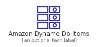
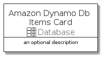

# AmazonDynamoDbItems


```text
aws-20210730/Resource/Database/AmazonDynamoDbItems
```

```text
include('aws-20210730/Resource/Database/AmazonDynamoDbItems')
```


| Illustration | AmazonDynamoDbItems | AmazonDynamoDbItemsCard | AmazonDynamoDbItemsGroup |
| :---: | :---: | :---: | :---: |
|  |  |  |  |


## AmazonDynamoDbItems

### Load remotely
```plantuml
@startuml
' configures the library
!global $LIB_BASE_LOCATION="https://raw.githubusercontent.com/tmorin/plantuml-libs/master/distribution"

' loads the library's bootstrap
!include $LIB_BASE_LOCATION/bootstrap.puml

' loads the package bootstrap
include('aws-20210730/bootstrap')

' loads the Item which embeds the element AmazonDynamoDbItems
include('aws-20210730/Resource/Database/AmazonDynamoDbItems')

' renders the element
AmazonDynamoDbItems('AmazonDynamoDbItems', 'Amazon Dynamo Db Items', 'an optional tech label')
@enduml
```

### Load locally
```plantuml
@startuml
' configures the library
!global $INCLUSION_MODE="local"
!global $LIB_BASE_LOCATION="../../.."

' loads the library's bootstrap
!include $LIB_BASE_LOCATION/bootstrap.puml

' loads the package bootstrap
include('aws-20210730/bootstrap')

' loads the Item which embeds the element AmazonDynamoDbItems
include('aws-20210730/Resource/Database/AmazonDynamoDbItems')

' renders the element
AmazonDynamoDbItems('AmazonDynamoDbItems', 'Amazon Dynamo Db Items', 'an optional tech label')
@enduml
```

## AmazonDynamoDbItemsCard

### Load remotely
```plantuml
@startuml
' configures the library
!global $LIB_BASE_LOCATION="https://raw.githubusercontent.com/tmorin/plantuml-libs/master/distribution"

' loads the library's bootstrap
!include $LIB_BASE_LOCATION/bootstrap.puml

' loads the package bootstrap
include('aws-20210730/bootstrap')

' loads the Item which embeds the element AmazonDynamoDbItemsCard
include('aws-20210730/Resource/Database/AmazonDynamoDbItems')

' renders the element
AmazonDynamoDbItemsCard('AmazonDynamoDbItemsCard', 'Amazon Dynamo Db Items Card', 'an optional description')
@enduml
```

### Load locally
```plantuml
@startuml
' configures the library
!global $INCLUSION_MODE="local"
!global $LIB_BASE_LOCATION="../../.."

' loads the library's bootstrap
!include $LIB_BASE_LOCATION/bootstrap.puml

' loads the package bootstrap
include('aws-20210730/bootstrap')

' loads the Item which embeds the element AmazonDynamoDbItemsCard
include('aws-20210730/Resource/Database/AmazonDynamoDbItems')

' renders the element
AmazonDynamoDbItemsCard('AmazonDynamoDbItemsCard', 'Amazon Dynamo Db Items Card', 'an optional description')
@enduml
```

## AmazonDynamoDbItemsGroup

### Load remotely
```plantuml
@startuml
' configures the library
!global $LIB_BASE_LOCATION="https://raw.githubusercontent.com/tmorin/plantuml-libs/master/distribution"

' loads the library's bootstrap
!include $LIB_BASE_LOCATION/bootstrap.puml

' loads the package bootstrap
include('aws-20210730/bootstrap')

' loads the Item which embeds the element AmazonDynamoDbItemsGroup
include('aws-20210730/Resource/Database/AmazonDynamoDbItems')

' renders the element
AmazonDynamoDbItemsGroup('AmazonDynamoDbItemsGroup', 'Amazon Dynamo Db Items Group', 'an optional tech label') {
    note as note
        the content of the group
    end note
}
@enduml
```

### Load locally
```plantuml
@startuml
' configures the library
!global $INCLUSION_MODE="local"
!global $LIB_BASE_LOCATION="../../.."

' loads the library's bootstrap
!include $LIB_BASE_LOCATION/bootstrap.puml

' loads the package bootstrap
include('aws-20210730/bootstrap')

' loads the Item which embeds the element AmazonDynamoDbItemsGroup
include('aws-20210730/Resource/Database/AmazonDynamoDbItems')

' renders the element
AmazonDynamoDbItemsGroup('AmazonDynamoDbItemsGroup', 'Amazon Dynamo Db Items Group', 'an optional tech label') {
    note as note
        the content of the group
    end note
}
@enduml
```

