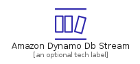
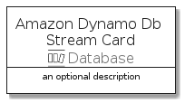
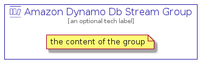

# AmazonDynamoDbStream


```text
aws-20210730/Resource/Database/AmazonDynamoDbStream
```

```text
include('aws-20210730/Resource/Database/AmazonDynamoDbStream')
```


| Illustration | AmazonDynamoDbStream | AmazonDynamoDbStreamCard | AmazonDynamoDbStreamGroup |
| :---: | :---: | :---: | :---: |
|  |  |  |  |


## AmazonDynamoDbStream

### Load remotely
```plantuml
@startuml
' configures the library
!global $LIB_BASE_LOCATION="https://raw.githubusercontent.com/tmorin/plantuml-libs/master/distribution"

' loads the library's bootstrap
!include $LIB_BASE_LOCATION/bootstrap.puml

' loads the package bootstrap
include('aws-20210730/bootstrap')

' loads the Item which embeds the element AmazonDynamoDbStream
include('aws-20210730/Resource/Database/AmazonDynamoDbStream')

' renders the element
AmazonDynamoDbStream('AmazonDynamoDbStream', 'Amazon Dynamo Db Stream', 'an optional tech label')
@enduml
```

### Load locally
```plantuml
@startuml
' configures the library
!global $INCLUSION_MODE="local"
!global $LIB_BASE_LOCATION="../../.."

' loads the library's bootstrap
!include $LIB_BASE_LOCATION/bootstrap.puml

' loads the package bootstrap
include('aws-20210730/bootstrap')

' loads the Item which embeds the element AmazonDynamoDbStream
include('aws-20210730/Resource/Database/AmazonDynamoDbStream')

' renders the element
AmazonDynamoDbStream('AmazonDynamoDbStream', 'Amazon Dynamo Db Stream', 'an optional tech label')
@enduml
```

## AmazonDynamoDbStreamCard

### Load remotely
```plantuml
@startuml
' configures the library
!global $LIB_BASE_LOCATION="https://raw.githubusercontent.com/tmorin/plantuml-libs/master/distribution"

' loads the library's bootstrap
!include $LIB_BASE_LOCATION/bootstrap.puml

' loads the package bootstrap
include('aws-20210730/bootstrap')

' loads the Item which embeds the element AmazonDynamoDbStreamCard
include('aws-20210730/Resource/Database/AmazonDynamoDbStream')

' renders the element
AmazonDynamoDbStreamCard('AmazonDynamoDbStreamCard', 'Amazon Dynamo Db Stream Card', 'an optional description')
@enduml
```

### Load locally
```plantuml
@startuml
' configures the library
!global $INCLUSION_MODE="local"
!global $LIB_BASE_LOCATION="../../.."

' loads the library's bootstrap
!include $LIB_BASE_LOCATION/bootstrap.puml

' loads the package bootstrap
include('aws-20210730/bootstrap')

' loads the Item which embeds the element AmazonDynamoDbStreamCard
include('aws-20210730/Resource/Database/AmazonDynamoDbStream')

' renders the element
AmazonDynamoDbStreamCard('AmazonDynamoDbStreamCard', 'Amazon Dynamo Db Stream Card', 'an optional description')
@enduml
```

## AmazonDynamoDbStreamGroup

### Load remotely
```plantuml
@startuml
' configures the library
!global $LIB_BASE_LOCATION="https://raw.githubusercontent.com/tmorin/plantuml-libs/master/distribution"

' loads the library's bootstrap
!include $LIB_BASE_LOCATION/bootstrap.puml

' loads the package bootstrap
include('aws-20210730/bootstrap')

' loads the Item which embeds the element AmazonDynamoDbStreamGroup
include('aws-20210730/Resource/Database/AmazonDynamoDbStream')

' renders the element
AmazonDynamoDbStreamGroup('AmazonDynamoDbStreamGroup', 'Amazon Dynamo Db Stream Group', 'an optional tech label') {
    note as note
        the content of the group
    end note
}
@enduml
```

### Load locally
```plantuml
@startuml
' configures the library
!global $INCLUSION_MODE="local"
!global $LIB_BASE_LOCATION="../../.."

' loads the library's bootstrap
!include $LIB_BASE_LOCATION/bootstrap.puml

' loads the package bootstrap
include('aws-20210730/bootstrap')

' loads the Item which embeds the element AmazonDynamoDbStreamGroup
include('aws-20210730/Resource/Database/AmazonDynamoDbStream')

' renders the element
AmazonDynamoDbStreamGroup('AmazonDynamoDbStreamGroup', 'Amazon Dynamo Db Stream Group', 'an optional tech label') {
    note as note
        the content of the group
    end note
}
@enduml
```

