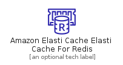
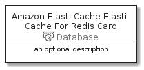

# AmazonElastiCacheElastiCacheForRedis


```text
aws-20210730/Resource/Database/AmazonElastiCacheElastiCacheForRedis
```

```text
include('aws-20210730/Resource/Database/AmazonElastiCacheElastiCacheForRedis')
```


| Illustration | AmazonElastiCacheElastiCacheForRedis | AmazonElastiCacheElastiCacheForRedisCard | AmazonElastiCacheElastiCacheForRedisGroup |
| :---: | :---: | :---: | :---: |
|  |  |  |  |


## AmazonElastiCacheElastiCacheForRedis

### Load remotely
```plantuml
@startuml
' configures the library
!global $LIB_BASE_LOCATION="https://raw.githubusercontent.com/tmorin/plantuml-libs/master/distribution"

' loads the library's bootstrap
!include $LIB_BASE_LOCATION/bootstrap.puml

' loads the package bootstrap
include('aws-20210730/bootstrap')

' loads the Item which embeds the element AmazonElastiCacheElastiCacheForRedis
include('aws-20210730/Resource/Database/AmazonElastiCacheElastiCacheForRedis')

' renders the element
AmazonElastiCacheElastiCacheForRedis('AmazonElastiCacheElastiCacheForRedis', 'Amazon Elasti Cache Elasti Cache For Redis', 'an optional tech label')
@enduml
```

### Load locally
```plantuml
@startuml
' configures the library
!global $INCLUSION_MODE="local"
!global $LIB_BASE_LOCATION="../../.."

' loads the library's bootstrap
!include $LIB_BASE_LOCATION/bootstrap.puml

' loads the package bootstrap
include('aws-20210730/bootstrap')

' loads the Item which embeds the element AmazonElastiCacheElastiCacheForRedis
include('aws-20210730/Resource/Database/AmazonElastiCacheElastiCacheForRedis')

' renders the element
AmazonElastiCacheElastiCacheForRedis('AmazonElastiCacheElastiCacheForRedis', 'Amazon Elasti Cache Elasti Cache For Redis', 'an optional tech label')
@enduml
```

## AmazonElastiCacheElastiCacheForRedisCard

### Load remotely
```plantuml
@startuml
' configures the library
!global $LIB_BASE_LOCATION="https://raw.githubusercontent.com/tmorin/plantuml-libs/master/distribution"

' loads the library's bootstrap
!include $LIB_BASE_LOCATION/bootstrap.puml

' loads the package bootstrap
include('aws-20210730/bootstrap')

' loads the Item which embeds the element AmazonElastiCacheElastiCacheForRedisCard
include('aws-20210730/Resource/Database/AmazonElastiCacheElastiCacheForRedis')

' renders the element
AmazonElastiCacheElastiCacheForRedisCard('AmazonElastiCacheElastiCacheForRedisCard', 'Amazon Elasti Cache Elasti Cache For Redis Card', 'an optional description')
@enduml
```

### Load locally
```plantuml
@startuml
' configures the library
!global $INCLUSION_MODE="local"
!global $LIB_BASE_LOCATION="../../.."

' loads the library's bootstrap
!include $LIB_BASE_LOCATION/bootstrap.puml

' loads the package bootstrap
include('aws-20210730/bootstrap')

' loads the Item which embeds the element AmazonElastiCacheElastiCacheForRedisCard
include('aws-20210730/Resource/Database/AmazonElastiCacheElastiCacheForRedis')

' renders the element
AmazonElastiCacheElastiCacheForRedisCard('AmazonElastiCacheElastiCacheForRedisCard', 'Amazon Elasti Cache Elasti Cache For Redis Card', 'an optional description')
@enduml
```

## AmazonElastiCacheElastiCacheForRedisGroup

### Load remotely
```plantuml
@startuml
' configures the library
!global $LIB_BASE_LOCATION="https://raw.githubusercontent.com/tmorin/plantuml-libs/master/distribution"

' loads the library's bootstrap
!include $LIB_BASE_LOCATION/bootstrap.puml

' loads the package bootstrap
include('aws-20210730/bootstrap')

' loads the Item which embeds the element AmazonElastiCacheElastiCacheForRedisGroup
include('aws-20210730/Resource/Database/AmazonElastiCacheElastiCacheForRedis')

' renders the element
AmazonElastiCacheElastiCacheForRedisGroup('AmazonElastiCacheElastiCacheForRedisGroup', 'Amazon Elasti Cache Elasti Cache For Redis Group', 'an optional tech label') {
    note as note
        the content of the group
    end note
}
@enduml
```

### Load locally
```plantuml
@startuml
' configures the library
!global $INCLUSION_MODE="local"
!global $LIB_BASE_LOCATION="../../.."

' loads the library's bootstrap
!include $LIB_BASE_LOCATION/bootstrap.puml

' loads the package bootstrap
include('aws-20210730/bootstrap')

' loads the Item which embeds the element AmazonElastiCacheElastiCacheForRedisGroup
include('aws-20210730/Resource/Database/AmazonElastiCacheElastiCacheForRedis')

' renders the element
AmazonElastiCacheElastiCacheForRedisGroup('AmazonElastiCacheElastiCacheForRedisGroup', 'Amazon Elasti Cache Elasti Cache For Redis Group', 'an optional tech label') {
    note as note
        the content of the group
    end note
}
@enduml
```

