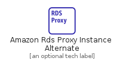
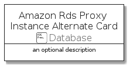

# AmazonRdsProxyInstanceAlternate


```text
aws-20210730/Resource/Database/AmazonRdsProxyInstanceAlternate
```

```text
include('aws-20210730/Resource/Database/AmazonRdsProxyInstanceAlternate')
```


| Illustration | AmazonRdsProxyInstanceAlternate | AmazonRdsProxyInstanceAlternateCard | AmazonRdsProxyInstanceAlternateGroup |
| :---: | :---: | :---: | :---: |
|  |  |  |  |


## AmazonRdsProxyInstanceAlternate

### Load remotely
```plantuml
@startuml
' configures the library
!global $LIB_BASE_LOCATION="https://github.com/tmorin/plantuml-libs/distribution"

' loads the library's bootstrap
!include $LIB_BASE_LOCATION/bootstrap.puml

' loads the package bootstrap
include('aws-20210730/bootstrap')

' loads the Item which embeds the element AmazonRdsProxyInstanceAlternate
include('aws-20210730/Resource/Database/AmazonRdsProxyInstanceAlternate')

' renders the element
AmazonRdsProxyInstanceAlternate('AmazonRdsProxyInstanceAlternate', 'Amazon Rds Proxy Instance Alternate', 'an optional tech label')
@enduml
```

### Load locally
```plantuml
@startuml
' configures the library
!global $INCLUSION_MODE="local"
!global $LIB_BASE_LOCATION="../../.."

' loads the library's bootstrap
!include $LIB_BASE_LOCATION/bootstrap.puml

' loads the package bootstrap
include('aws-20210730/bootstrap')

' loads the Item which embeds the element AmazonRdsProxyInstanceAlternate
include('aws-20210730/Resource/Database/AmazonRdsProxyInstanceAlternate')

' renders the element
AmazonRdsProxyInstanceAlternate('AmazonRdsProxyInstanceAlternate', 'Amazon Rds Proxy Instance Alternate', 'an optional tech label')
@enduml
```

## AmazonRdsProxyInstanceAlternateCard

### Load remotely
```plantuml
@startuml
' configures the library
!global $LIB_BASE_LOCATION="https://github.com/tmorin/plantuml-libs/distribution"

' loads the library's bootstrap
!include $LIB_BASE_LOCATION/bootstrap.puml

' loads the package bootstrap
include('aws-20210730/bootstrap')

' loads the Item which embeds the element AmazonRdsProxyInstanceAlternateCard
include('aws-20210730/Resource/Database/AmazonRdsProxyInstanceAlternate')

' renders the element
AmazonRdsProxyInstanceAlternateCard('AmazonRdsProxyInstanceAlternateCard', 'Amazon Rds Proxy Instance Alternate Card', 'an optional description')
@enduml
```

### Load locally
```plantuml
@startuml
' configures the library
!global $INCLUSION_MODE="local"
!global $LIB_BASE_LOCATION="../../.."

' loads the library's bootstrap
!include $LIB_BASE_LOCATION/bootstrap.puml

' loads the package bootstrap
include('aws-20210730/bootstrap')

' loads the Item which embeds the element AmazonRdsProxyInstanceAlternateCard
include('aws-20210730/Resource/Database/AmazonRdsProxyInstanceAlternate')

' renders the element
AmazonRdsProxyInstanceAlternateCard('AmazonRdsProxyInstanceAlternateCard', 'Amazon Rds Proxy Instance Alternate Card', 'an optional description')
@enduml
```

## AmazonRdsProxyInstanceAlternateGroup

### Load remotely
```plantuml
@startuml
' configures the library
!global $LIB_BASE_LOCATION="https://github.com/tmorin/plantuml-libs/distribution"

' loads the library's bootstrap
!include $LIB_BASE_LOCATION/bootstrap.puml

' loads the package bootstrap
include('aws-20210730/bootstrap')

' loads the Item which embeds the element AmazonRdsProxyInstanceAlternateGroup
include('aws-20210730/Resource/Database/AmazonRdsProxyInstanceAlternate')

' renders the element
AmazonRdsProxyInstanceAlternateGroup('AmazonRdsProxyInstanceAlternateGroup', 'Amazon Rds Proxy Instance Alternate Group', 'an optional tech label') {
    note as note
        the content of the group
    end note
}
@enduml
```

### Load locally
```plantuml
@startuml
' configures the library
!global $INCLUSION_MODE="local"
!global $LIB_BASE_LOCATION="../../.."

' loads the library's bootstrap
!include $LIB_BASE_LOCATION/bootstrap.puml

' loads the package bootstrap
include('aws-20210730/bootstrap')

' loads the Item which embeds the element AmazonRdsProxyInstanceAlternateGroup
include('aws-20210730/Resource/Database/AmazonRdsProxyInstanceAlternate')

' renders the element
AmazonRdsProxyInstanceAlternateGroup('AmazonRdsProxyInstanceAlternateGroup', 'Amazon Rds Proxy Instance Alternate Group', 'an optional tech label') {
    note as note
        the content of the group
    end note
}
@enduml
```

