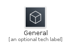
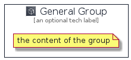

# General


```text
aws-20210730/Resource/GeneralIcons/General
```

```text
include('aws-20210730/Resource/GeneralIcons/General')
```


| Illustration | General | GeneralCard | GeneralGroup |
| :---: | :---: | :---: | :---: |
|  |  |  |  |


## General

### Load remotely
```plantuml
@startuml
' configures the library
!global $LIB_BASE_LOCATION="https://raw.githubusercontent.com/tmorin/plantuml-libs/master/distribution"

' loads the library's bootstrap
!include $LIB_BASE_LOCATION/bootstrap.puml

' loads the package bootstrap
include('aws-20210730/bootstrap')

' loads the Item which embeds the element General
include('aws-20210730/Resource/GeneralIcons/General')

' renders the element
General('General', 'General', 'an optional tech label')
@enduml
```

### Load locally
```plantuml
@startuml
' configures the library
!global $INCLUSION_MODE="local"
!global $LIB_BASE_LOCATION="../../.."

' loads the library's bootstrap
!include $LIB_BASE_LOCATION/bootstrap.puml

' loads the package bootstrap
include('aws-20210730/bootstrap')

' loads the Item which embeds the element General
include('aws-20210730/Resource/GeneralIcons/General')

' renders the element
General('General', 'General', 'an optional tech label')
@enduml
```

## GeneralCard

### Load remotely
```plantuml
@startuml
' configures the library
!global $LIB_BASE_LOCATION="https://raw.githubusercontent.com/tmorin/plantuml-libs/master/distribution"

' loads the library's bootstrap
!include $LIB_BASE_LOCATION/bootstrap.puml

' loads the package bootstrap
include('aws-20210730/bootstrap')

' loads the Item which embeds the element GeneralCard
include('aws-20210730/Resource/GeneralIcons/General')

' renders the element
GeneralCard('GeneralCard', 'General Card', 'an optional description')
@enduml
```

### Load locally
```plantuml
@startuml
' configures the library
!global $INCLUSION_MODE="local"
!global $LIB_BASE_LOCATION="../../.."

' loads the library's bootstrap
!include $LIB_BASE_LOCATION/bootstrap.puml

' loads the package bootstrap
include('aws-20210730/bootstrap')

' loads the Item which embeds the element GeneralCard
include('aws-20210730/Resource/GeneralIcons/General')

' renders the element
GeneralCard('GeneralCard', 'General Card', 'an optional description')
@enduml
```

## GeneralGroup

### Load remotely
```plantuml
@startuml
' configures the library
!global $LIB_BASE_LOCATION="https://raw.githubusercontent.com/tmorin/plantuml-libs/master/distribution"

' loads the library's bootstrap
!include $LIB_BASE_LOCATION/bootstrap.puml

' loads the package bootstrap
include('aws-20210730/bootstrap')

' loads the Item which embeds the element GeneralGroup
include('aws-20210730/Resource/GeneralIcons/General')

' renders the element
GeneralGroup('GeneralGroup', 'General Group', 'an optional tech label') {
    note as note
        the content of the group
    end note
}
@enduml
```

### Load locally
```plantuml
@startuml
' configures the library
!global $INCLUSION_MODE="local"
!global $LIB_BASE_LOCATION="../../.."

' loads the library's bootstrap
!include $LIB_BASE_LOCATION/bootstrap.puml

' loads the package bootstrap
include('aws-20210730/bootstrap')

' loads the Item which embeds the element GeneralGroup
include('aws-20210730/Resource/GeneralIcons/General')

' renders the element
GeneralGroup('GeneralGroup', 'General Group', 'an optional tech label') {
    note as note
        the content of the group
    end note
}
@enduml
```

