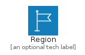
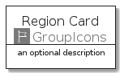
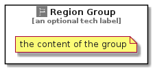

# Region


```text
aws-20210730/Resource/GroupIcons/Region
```

```text
include('aws-20210730/Resource/GroupIcons/Region')
```


| Illustration | Region | RegionCard | RegionGroup |
| :---: | :---: | :---: | :---: |
|  |  |  |  |


## Region

### Load remotely
```plantuml
@startuml
' configures the library
!global $LIB_BASE_LOCATION="https://github.com/tmorin/plantuml-libs/distribution"

' loads the library's bootstrap
!include $LIB_BASE_LOCATION/bootstrap.puml

' loads the package bootstrap
include('aws-20210730/bootstrap')

' loads the Item which embeds the element Region
include('aws-20210730/Resource/GroupIcons/Region')

' renders the element
Region('Region', 'Region', 'an optional tech label')
@enduml
```

### Load locally
```plantuml
@startuml
' configures the library
!global $INCLUSION_MODE="local"
!global $LIB_BASE_LOCATION="../../.."

' loads the library's bootstrap
!include $LIB_BASE_LOCATION/bootstrap.puml

' loads the package bootstrap
include('aws-20210730/bootstrap')

' loads the Item which embeds the element Region
include('aws-20210730/Resource/GroupIcons/Region')

' renders the element
Region('Region', 'Region', 'an optional tech label')
@enduml
```

## RegionCard

### Load remotely
```plantuml
@startuml
' configures the library
!global $LIB_BASE_LOCATION="https://github.com/tmorin/plantuml-libs/distribution"

' loads the library's bootstrap
!include $LIB_BASE_LOCATION/bootstrap.puml

' loads the package bootstrap
include('aws-20210730/bootstrap')

' loads the Item which embeds the element RegionCard
include('aws-20210730/Resource/GroupIcons/Region')

' renders the element
RegionCard('RegionCard', 'Region Card', 'an optional description')
@enduml
```

### Load locally
```plantuml
@startuml
' configures the library
!global $INCLUSION_MODE="local"
!global $LIB_BASE_LOCATION="../../.."

' loads the library's bootstrap
!include $LIB_BASE_LOCATION/bootstrap.puml

' loads the package bootstrap
include('aws-20210730/bootstrap')

' loads the Item which embeds the element RegionCard
include('aws-20210730/Resource/GroupIcons/Region')

' renders the element
RegionCard('RegionCard', 'Region Card', 'an optional description')
@enduml
```

## RegionGroup

### Load remotely
```plantuml
@startuml
' configures the library
!global $LIB_BASE_LOCATION="https://github.com/tmorin/plantuml-libs/distribution"

' loads the library's bootstrap
!include $LIB_BASE_LOCATION/bootstrap.puml

' loads the package bootstrap
include('aws-20210730/bootstrap')

' loads the Item which embeds the element RegionGroup
include('aws-20210730/Resource/GroupIcons/Region')

' renders the element
RegionGroup('RegionGroup', 'Region Group', 'an optional tech label') {
    note as note
        the content of the group
    end note
}
@enduml
```

### Load locally
```plantuml
@startuml
' configures the library
!global $INCLUSION_MODE="local"
!global $LIB_BASE_LOCATION="../../.."

' loads the library's bootstrap
!include $LIB_BASE_LOCATION/bootstrap.puml

' loads the package bootstrap
include('aws-20210730/bootstrap')

' loads the Item which embeds the element RegionGroup
include('aws-20210730/Resource/GroupIcons/Region')

' renders the element
RegionGroup('RegionGroup', 'Region Group', 'an optional tech label') {
    note as note
        the content of the group
    end note
}
@enduml
```

