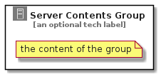

# ServerContents


```text
aws-20210730/Resource/GroupIcons/ServerContents
```

```text
include('aws-20210730/Resource/GroupIcons/ServerContents')
```


| Illustration | ServerContents | ServerContentsCard | ServerContentsGroup |
| :---: | :---: | :---: | :---: |
|  |  |  |  |


## ServerContents

### Load remotely
```plantuml
@startuml
' configures the library
!global $LIB_BASE_LOCATION="https://github.com/tmorin/plantuml-libs/distribution"

' loads the library's bootstrap
!include $LIB_BASE_LOCATION/bootstrap.puml

' loads the package bootstrap
include('aws-20210730/bootstrap')

' loads the Item which embeds the element ServerContents
include('aws-20210730/Resource/GroupIcons/ServerContents')

' renders the element
ServerContents('ServerContents', 'Server Contents', 'an optional tech label')
@enduml
```

### Load locally
```plantuml
@startuml
' configures the library
!global $INCLUSION_MODE="local"
!global $LIB_BASE_LOCATION="../../.."

' loads the library's bootstrap
!include $LIB_BASE_LOCATION/bootstrap.puml

' loads the package bootstrap
include('aws-20210730/bootstrap')

' loads the Item which embeds the element ServerContents
include('aws-20210730/Resource/GroupIcons/ServerContents')

' renders the element
ServerContents('ServerContents', 'Server Contents', 'an optional tech label')
@enduml
```

## ServerContentsCard

### Load remotely
```plantuml
@startuml
' configures the library
!global $LIB_BASE_LOCATION="https://github.com/tmorin/plantuml-libs/distribution"

' loads the library's bootstrap
!include $LIB_BASE_LOCATION/bootstrap.puml

' loads the package bootstrap
include('aws-20210730/bootstrap')

' loads the Item which embeds the element ServerContentsCard
include('aws-20210730/Resource/GroupIcons/ServerContents')

' renders the element
ServerContentsCard('ServerContentsCard', 'Server Contents Card', 'an optional description')
@enduml
```

### Load locally
```plantuml
@startuml
' configures the library
!global $INCLUSION_MODE="local"
!global $LIB_BASE_LOCATION="../../.."

' loads the library's bootstrap
!include $LIB_BASE_LOCATION/bootstrap.puml

' loads the package bootstrap
include('aws-20210730/bootstrap')

' loads the Item which embeds the element ServerContentsCard
include('aws-20210730/Resource/GroupIcons/ServerContents')

' renders the element
ServerContentsCard('ServerContentsCard', 'Server Contents Card', 'an optional description')
@enduml
```

## ServerContentsGroup

### Load remotely
```plantuml
@startuml
' configures the library
!global $LIB_BASE_LOCATION="https://github.com/tmorin/plantuml-libs/distribution"

' loads the library's bootstrap
!include $LIB_BASE_LOCATION/bootstrap.puml

' loads the package bootstrap
include('aws-20210730/bootstrap')

' loads the Item which embeds the element ServerContentsGroup
include('aws-20210730/Resource/GroupIcons/ServerContents')

' renders the element
ServerContentsGroup('ServerContentsGroup', 'Server Contents Group', 'an optional tech label') {
    note as note
        the content of the group
    end note
}
@enduml
```

### Load locally
```plantuml
@startuml
' configures the library
!global $INCLUSION_MODE="local"
!global $LIB_BASE_LOCATION="../../.."

' loads the library's bootstrap
!include $LIB_BASE_LOCATION/bootstrap.puml

' loads the package bootstrap
include('aws-20210730/bootstrap')

' loads the Item which embeds the element ServerContentsGroup
include('aws-20210730/Resource/GroupIcons/ServerContents')

' renders the element
ServerContentsGroup('ServerContentsGroup', 'Server Contents Group', 'an optional tech label') {
    note as note
        the content of the group
    end note
}
@enduml
```

