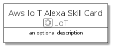
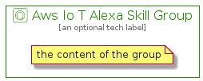

# AwsIoTAlexaSkill


```text
aws-20210730/Resource/LoT/AwsIoTAlexaSkill
```

```text
include('aws-20210730/Resource/LoT/AwsIoTAlexaSkill')
```


| Illustration | AwsIoTAlexaSkill | AwsIoTAlexaSkillCard | AwsIoTAlexaSkillGroup |
| :---: | :---: | :---: | :---: |
|  |  |  |  |


## AwsIoTAlexaSkill

### Load remotely
```plantuml
@startuml
' configures the library
!global $LIB_BASE_LOCATION="https://raw.githubusercontent.com/tmorin/plantuml-libs/master/distribution"

' loads the library's bootstrap
!include $LIB_BASE_LOCATION/bootstrap.puml

' loads the package bootstrap
include('aws-20210730/bootstrap')

' loads the Item which embeds the element AwsIoTAlexaSkill
include('aws-20210730/Resource/LoT/AwsIoTAlexaSkill')

' renders the element
AwsIoTAlexaSkill('AwsIoTAlexaSkill', 'Aws Io T Alexa Skill', 'an optional tech label')
@enduml
```

### Load locally
```plantuml
@startuml
' configures the library
!global $INCLUSION_MODE="local"
!global $LIB_BASE_LOCATION="../../.."

' loads the library's bootstrap
!include $LIB_BASE_LOCATION/bootstrap.puml

' loads the package bootstrap
include('aws-20210730/bootstrap')

' loads the Item which embeds the element AwsIoTAlexaSkill
include('aws-20210730/Resource/LoT/AwsIoTAlexaSkill')

' renders the element
AwsIoTAlexaSkill('AwsIoTAlexaSkill', 'Aws Io T Alexa Skill', 'an optional tech label')
@enduml
```

## AwsIoTAlexaSkillCard

### Load remotely
```plantuml
@startuml
' configures the library
!global $LIB_BASE_LOCATION="https://raw.githubusercontent.com/tmorin/plantuml-libs/master/distribution"

' loads the library's bootstrap
!include $LIB_BASE_LOCATION/bootstrap.puml

' loads the package bootstrap
include('aws-20210730/bootstrap')

' loads the Item which embeds the element AwsIoTAlexaSkillCard
include('aws-20210730/Resource/LoT/AwsIoTAlexaSkill')

' renders the element
AwsIoTAlexaSkillCard('AwsIoTAlexaSkillCard', 'Aws Io T Alexa Skill Card', 'an optional description')
@enduml
```

### Load locally
```plantuml
@startuml
' configures the library
!global $INCLUSION_MODE="local"
!global $LIB_BASE_LOCATION="../../.."

' loads the library's bootstrap
!include $LIB_BASE_LOCATION/bootstrap.puml

' loads the package bootstrap
include('aws-20210730/bootstrap')

' loads the Item which embeds the element AwsIoTAlexaSkillCard
include('aws-20210730/Resource/LoT/AwsIoTAlexaSkill')

' renders the element
AwsIoTAlexaSkillCard('AwsIoTAlexaSkillCard', 'Aws Io T Alexa Skill Card', 'an optional description')
@enduml
```

## AwsIoTAlexaSkillGroup

### Load remotely
```plantuml
@startuml
' configures the library
!global $LIB_BASE_LOCATION="https://raw.githubusercontent.com/tmorin/plantuml-libs/master/distribution"

' loads the library's bootstrap
!include $LIB_BASE_LOCATION/bootstrap.puml

' loads the package bootstrap
include('aws-20210730/bootstrap')

' loads the Item which embeds the element AwsIoTAlexaSkillGroup
include('aws-20210730/Resource/LoT/AwsIoTAlexaSkill')

' renders the element
AwsIoTAlexaSkillGroup('AwsIoTAlexaSkillGroup', 'Aws Io T Alexa Skill Group', 'an optional tech label') {
    note as note
        the content of the group
    end note
}
@enduml
```

### Load locally
```plantuml
@startuml
' configures the library
!global $INCLUSION_MODE="local"
!global $LIB_BASE_LOCATION="../../.."

' loads the library's bootstrap
!include $LIB_BASE_LOCATION/bootstrap.puml

' loads the package bootstrap
include('aws-20210730/bootstrap')

' loads the Item which embeds the element AwsIoTAlexaSkillGroup
include('aws-20210730/Resource/LoT/AwsIoTAlexaSkill')

' renders the element
AwsIoTAlexaSkillGroup('AwsIoTAlexaSkillGroup', 'Aws Io T Alexa Skill Group', 'an optional tech label') {
    note as note
        the content of the group
    end note
}
@enduml
```

