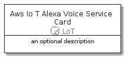
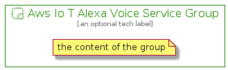

# AwsIoTAlexaVoiceService


```text
aws-20210730/Resource/LoT/AwsIoTAlexaVoiceService
```

```text
include('aws-20210730/Resource/LoT/AwsIoTAlexaVoiceService')
```


| Illustration | AwsIoTAlexaVoiceService | AwsIoTAlexaVoiceServiceCard | AwsIoTAlexaVoiceServiceGroup |
| :---: | :---: | :---: | :---: |
|  |  |  |  |


## AwsIoTAlexaVoiceService

### Load remotely
```plantuml
@startuml
' configures the library
!global $LIB_BASE_LOCATION="https://github.com/tmorin/plantuml-libs/distribution"

' loads the library's bootstrap
!include $LIB_BASE_LOCATION/bootstrap.puml

' loads the package bootstrap
include('aws-20210730/bootstrap')

' loads the Item which embeds the element AwsIoTAlexaVoiceService
include('aws-20210730/Resource/LoT/AwsIoTAlexaVoiceService')

' renders the element
AwsIoTAlexaVoiceService('AwsIoTAlexaVoiceService', 'Aws Io T Alexa Voice Service', 'an optional tech label')
@enduml
```

### Load locally
```plantuml
@startuml
' configures the library
!global $INCLUSION_MODE="local"
!global $LIB_BASE_LOCATION="../../.."

' loads the library's bootstrap
!include $LIB_BASE_LOCATION/bootstrap.puml

' loads the package bootstrap
include('aws-20210730/bootstrap')

' loads the Item which embeds the element AwsIoTAlexaVoiceService
include('aws-20210730/Resource/LoT/AwsIoTAlexaVoiceService')

' renders the element
AwsIoTAlexaVoiceService('AwsIoTAlexaVoiceService', 'Aws Io T Alexa Voice Service', 'an optional tech label')
@enduml
```

## AwsIoTAlexaVoiceServiceCard

### Load remotely
```plantuml
@startuml
' configures the library
!global $LIB_BASE_LOCATION="https://github.com/tmorin/plantuml-libs/distribution"

' loads the library's bootstrap
!include $LIB_BASE_LOCATION/bootstrap.puml

' loads the package bootstrap
include('aws-20210730/bootstrap')

' loads the Item which embeds the element AwsIoTAlexaVoiceServiceCard
include('aws-20210730/Resource/LoT/AwsIoTAlexaVoiceService')

' renders the element
AwsIoTAlexaVoiceServiceCard('AwsIoTAlexaVoiceServiceCard', 'Aws Io T Alexa Voice Service Card', 'an optional description')
@enduml
```

### Load locally
```plantuml
@startuml
' configures the library
!global $INCLUSION_MODE="local"
!global $LIB_BASE_LOCATION="../../.."

' loads the library's bootstrap
!include $LIB_BASE_LOCATION/bootstrap.puml

' loads the package bootstrap
include('aws-20210730/bootstrap')

' loads the Item which embeds the element AwsIoTAlexaVoiceServiceCard
include('aws-20210730/Resource/LoT/AwsIoTAlexaVoiceService')

' renders the element
AwsIoTAlexaVoiceServiceCard('AwsIoTAlexaVoiceServiceCard', 'Aws Io T Alexa Voice Service Card', 'an optional description')
@enduml
```

## AwsIoTAlexaVoiceServiceGroup

### Load remotely
```plantuml
@startuml
' configures the library
!global $LIB_BASE_LOCATION="https://github.com/tmorin/plantuml-libs/distribution"

' loads the library's bootstrap
!include $LIB_BASE_LOCATION/bootstrap.puml

' loads the package bootstrap
include('aws-20210730/bootstrap')

' loads the Item which embeds the element AwsIoTAlexaVoiceServiceGroup
include('aws-20210730/Resource/LoT/AwsIoTAlexaVoiceService')

' renders the element
AwsIoTAlexaVoiceServiceGroup('AwsIoTAlexaVoiceServiceGroup', 'Aws Io T Alexa Voice Service Group', 'an optional tech label') {
    note as note
        the content of the group
    end note
}
@enduml
```

### Load locally
```plantuml
@startuml
' configures the library
!global $INCLUSION_MODE="local"
!global $LIB_BASE_LOCATION="../../.."

' loads the library's bootstrap
!include $LIB_BASE_LOCATION/bootstrap.puml

' loads the package bootstrap
include('aws-20210730/bootstrap')

' loads the Item which embeds the element AwsIoTAlexaVoiceServiceGroup
include('aws-20210730/Resource/LoT/AwsIoTAlexaVoiceService')

' renders the element
AwsIoTAlexaVoiceServiceGroup('AwsIoTAlexaVoiceServiceGroup', 'Aws Io T Alexa Voice Service Group', 'an optional tech label') {
    note as note
        the content of the group
    end note
}
@enduml
```

