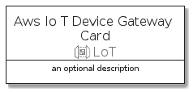
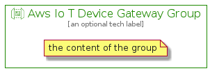

# AwsIoTDeviceGateway


```text
aws-20210730/Resource/LoT/AwsIoTDeviceGateway
```

```text
include('aws-20210730/Resource/LoT/AwsIoTDeviceGateway')
```


| Illustration | AwsIoTDeviceGateway | AwsIoTDeviceGatewayCard | AwsIoTDeviceGatewayGroup |
| :---: | :---: | :---: | :---: |
|  |  |  |  |


## AwsIoTDeviceGateway

### Load remotely
```plantuml
@startuml
' configures the library
!global $LIB_BASE_LOCATION="https://github.com/tmorin/plantuml-libs/distribution"

' loads the library's bootstrap
!include $LIB_BASE_LOCATION/bootstrap.puml

' loads the package bootstrap
include('aws-20210730/bootstrap')

' loads the Item which embeds the element AwsIoTDeviceGateway
include('aws-20210730/Resource/LoT/AwsIoTDeviceGateway')

' renders the element
AwsIoTDeviceGateway('AwsIoTDeviceGateway', 'Aws Io T Device Gateway', 'an optional tech label')
@enduml
```

### Load locally
```plantuml
@startuml
' configures the library
!global $INCLUSION_MODE="local"
!global $LIB_BASE_LOCATION="../../.."

' loads the library's bootstrap
!include $LIB_BASE_LOCATION/bootstrap.puml

' loads the package bootstrap
include('aws-20210730/bootstrap')

' loads the Item which embeds the element AwsIoTDeviceGateway
include('aws-20210730/Resource/LoT/AwsIoTDeviceGateway')

' renders the element
AwsIoTDeviceGateway('AwsIoTDeviceGateway', 'Aws Io T Device Gateway', 'an optional tech label')
@enduml
```

## AwsIoTDeviceGatewayCard

### Load remotely
```plantuml
@startuml
' configures the library
!global $LIB_BASE_LOCATION="https://github.com/tmorin/plantuml-libs/distribution"

' loads the library's bootstrap
!include $LIB_BASE_LOCATION/bootstrap.puml

' loads the package bootstrap
include('aws-20210730/bootstrap')

' loads the Item which embeds the element AwsIoTDeviceGatewayCard
include('aws-20210730/Resource/LoT/AwsIoTDeviceGateway')

' renders the element
AwsIoTDeviceGatewayCard('AwsIoTDeviceGatewayCard', 'Aws Io T Device Gateway Card', 'an optional description')
@enduml
```

### Load locally
```plantuml
@startuml
' configures the library
!global $INCLUSION_MODE="local"
!global $LIB_BASE_LOCATION="../../.."

' loads the library's bootstrap
!include $LIB_BASE_LOCATION/bootstrap.puml

' loads the package bootstrap
include('aws-20210730/bootstrap')

' loads the Item which embeds the element AwsIoTDeviceGatewayCard
include('aws-20210730/Resource/LoT/AwsIoTDeviceGateway')

' renders the element
AwsIoTDeviceGatewayCard('AwsIoTDeviceGatewayCard', 'Aws Io T Device Gateway Card', 'an optional description')
@enduml
```

## AwsIoTDeviceGatewayGroup

### Load remotely
```plantuml
@startuml
' configures the library
!global $LIB_BASE_LOCATION="https://github.com/tmorin/plantuml-libs/distribution"

' loads the library's bootstrap
!include $LIB_BASE_LOCATION/bootstrap.puml

' loads the package bootstrap
include('aws-20210730/bootstrap')

' loads the Item which embeds the element AwsIoTDeviceGatewayGroup
include('aws-20210730/Resource/LoT/AwsIoTDeviceGateway')

' renders the element
AwsIoTDeviceGatewayGroup('AwsIoTDeviceGatewayGroup', 'Aws Io T Device Gateway Group', 'an optional tech label') {
    note as note
        the content of the group
    end note
}
@enduml
```

### Load locally
```plantuml
@startuml
' configures the library
!global $INCLUSION_MODE="local"
!global $LIB_BASE_LOCATION="../../.."

' loads the library's bootstrap
!include $LIB_BASE_LOCATION/bootstrap.puml

' loads the package bootstrap
include('aws-20210730/bootstrap')

' loads the Item which embeds the element AwsIoTDeviceGatewayGroup
include('aws-20210730/Resource/LoT/AwsIoTDeviceGateway')

' renders the element
AwsIoTDeviceGatewayGroup('AwsIoTDeviceGatewayGroup', 'Aws Io T Device Gateway Group', 'an optional tech label') {
    note as note
        the content of the group
    end note
}
@enduml
```

