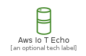
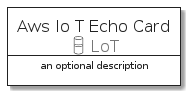
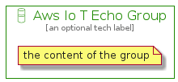

# AwsIoTEcho


```text
aws-20210730/Resource/LoT/AwsIoTEcho
```

```text
include('aws-20210730/Resource/LoT/AwsIoTEcho')
```


| Illustration | AwsIoTEcho | AwsIoTEchoCard | AwsIoTEchoGroup |
| :---: | :---: | :---: | :---: |
|  |  |  |  |


## AwsIoTEcho

### Load remotely
```plantuml
@startuml
' configures the library
!global $LIB_BASE_LOCATION="https://raw.githubusercontent.com/tmorin/plantuml-libs/master/distribution"

' loads the library's bootstrap
!include $LIB_BASE_LOCATION/bootstrap.puml

' loads the package bootstrap
include('aws-20210730/bootstrap')

' loads the Item which embeds the element AwsIoTEcho
include('aws-20210730/Resource/LoT/AwsIoTEcho')

' renders the element
AwsIoTEcho('AwsIoTEcho', 'Aws Io T Echo', 'an optional tech label')
@enduml
```

### Load locally
```plantuml
@startuml
' configures the library
!global $INCLUSION_MODE="local"
!global $LIB_BASE_LOCATION="../../.."

' loads the library's bootstrap
!include $LIB_BASE_LOCATION/bootstrap.puml

' loads the package bootstrap
include('aws-20210730/bootstrap')

' loads the Item which embeds the element AwsIoTEcho
include('aws-20210730/Resource/LoT/AwsIoTEcho')

' renders the element
AwsIoTEcho('AwsIoTEcho', 'Aws Io T Echo', 'an optional tech label')
@enduml
```

## AwsIoTEchoCard

### Load remotely
```plantuml
@startuml
' configures the library
!global $LIB_BASE_LOCATION="https://raw.githubusercontent.com/tmorin/plantuml-libs/master/distribution"

' loads the library's bootstrap
!include $LIB_BASE_LOCATION/bootstrap.puml

' loads the package bootstrap
include('aws-20210730/bootstrap')

' loads the Item which embeds the element AwsIoTEchoCard
include('aws-20210730/Resource/LoT/AwsIoTEcho')

' renders the element
AwsIoTEchoCard('AwsIoTEchoCard', 'Aws Io T Echo Card', 'an optional description')
@enduml
```

### Load locally
```plantuml
@startuml
' configures the library
!global $INCLUSION_MODE="local"
!global $LIB_BASE_LOCATION="../../.."

' loads the library's bootstrap
!include $LIB_BASE_LOCATION/bootstrap.puml

' loads the package bootstrap
include('aws-20210730/bootstrap')

' loads the Item which embeds the element AwsIoTEchoCard
include('aws-20210730/Resource/LoT/AwsIoTEcho')

' renders the element
AwsIoTEchoCard('AwsIoTEchoCard', 'Aws Io T Echo Card', 'an optional description')
@enduml
```

## AwsIoTEchoGroup

### Load remotely
```plantuml
@startuml
' configures the library
!global $LIB_BASE_LOCATION="https://raw.githubusercontent.com/tmorin/plantuml-libs/master/distribution"

' loads the library's bootstrap
!include $LIB_BASE_LOCATION/bootstrap.puml

' loads the package bootstrap
include('aws-20210730/bootstrap')

' loads the Item which embeds the element AwsIoTEchoGroup
include('aws-20210730/Resource/LoT/AwsIoTEcho')

' renders the element
AwsIoTEchoGroup('AwsIoTEchoGroup', 'Aws Io T Echo Group', 'an optional tech label') {
    note as note
        the content of the group
    end note
}
@enduml
```

### Load locally
```plantuml
@startuml
' configures the library
!global $INCLUSION_MODE="local"
!global $LIB_BASE_LOCATION="../../.."

' loads the library's bootstrap
!include $LIB_BASE_LOCATION/bootstrap.puml

' loads the package bootstrap
include('aws-20210730/bootstrap')

' loads the Item which embeds the element AwsIoTEchoGroup
include('aws-20210730/Resource/LoT/AwsIoTEcho')

' renders the element
AwsIoTEchoGroup('AwsIoTEchoGroup', 'Aws Io T Echo Group', 'an optional tech label') {
    note as note
        the content of the group
    end note
}
@enduml
```

