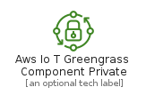
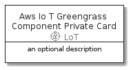

# AwsIoTGreengrassComponentPrivate


```text
aws-20210730/Resource/LoT/AwsIoTGreengrassComponentPrivate
```

```text
include('aws-20210730/Resource/LoT/AwsIoTGreengrassComponentPrivate')
```


| Illustration | AwsIoTGreengrassComponentPrivate | AwsIoTGreengrassComponentPrivateCard | AwsIoTGreengrassComponentPrivateGroup |
| :---: | :---: | :---: | :---: |
|  |  |  |  |


## AwsIoTGreengrassComponentPrivate

### Load remotely
```plantuml
@startuml
' configures the library
!global $LIB_BASE_LOCATION="https://github.com/tmorin/plantuml-libs/distribution"

' loads the library's bootstrap
!include $LIB_BASE_LOCATION/bootstrap.puml

' loads the package bootstrap
include('aws-20210730/bootstrap')

' loads the Item which embeds the element AwsIoTGreengrassComponentPrivate
include('aws-20210730/Resource/LoT/AwsIoTGreengrassComponentPrivate')

' renders the element
AwsIoTGreengrassComponentPrivate('AwsIoTGreengrassComponentPrivate', 'Aws Io T Greengrass Component Private', 'an optional tech label')
@enduml
```

### Load locally
```plantuml
@startuml
' configures the library
!global $INCLUSION_MODE="local"
!global $LIB_BASE_LOCATION="../../.."

' loads the library's bootstrap
!include $LIB_BASE_LOCATION/bootstrap.puml

' loads the package bootstrap
include('aws-20210730/bootstrap')

' loads the Item which embeds the element AwsIoTGreengrassComponentPrivate
include('aws-20210730/Resource/LoT/AwsIoTGreengrassComponentPrivate')

' renders the element
AwsIoTGreengrassComponentPrivate('AwsIoTGreengrassComponentPrivate', 'Aws Io T Greengrass Component Private', 'an optional tech label')
@enduml
```

## AwsIoTGreengrassComponentPrivateCard

### Load remotely
```plantuml
@startuml
' configures the library
!global $LIB_BASE_LOCATION="https://github.com/tmorin/plantuml-libs/distribution"

' loads the library's bootstrap
!include $LIB_BASE_LOCATION/bootstrap.puml

' loads the package bootstrap
include('aws-20210730/bootstrap')

' loads the Item which embeds the element AwsIoTGreengrassComponentPrivateCard
include('aws-20210730/Resource/LoT/AwsIoTGreengrassComponentPrivate')

' renders the element
AwsIoTGreengrassComponentPrivateCard('AwsIoTGreengrassComponentPrivateCard', 'Aws Io T Greengrass Component Private Card', 'an optional description')
@enduml
```

### Load locally
```plantuml
@startuml
' configures the library
!global $INCLUSION_MODE="local"
!global $LIB_BASE_LOCATION="../../.."

' loads the library's bootstrap
!include $LIB_BASE_LOCATION/bootstrap.puml

' loads the package bootstrap
include('aws-20210730/bootstrap')

' loads the Item which embeds the element AwsIoTGreengrassComponentPrivateCard
include('aws-20210730/Resource/LoT/AwsIoTGreengrassComponentPrivate')

' renders the element
AwsIoTGreengrassComponentPrivateCard('AwsIoTGreengrassComponentPrivateCard', 'Aws Io T Greengrass Component Private Card', 'an optional description')
@enduml
```

## AwsIoTGreengrassComponentPrivateGroup

### Load remotely
```plantuml
@startuml
' configures the library
!global $LIB_BASE_LOCATION="https://github.com/tmorin/plantuml-libs/distribution"

' loads the library's bootstrap
!include $LIB_BASE_LOCATION/bootstrap.puml

' loads the package bootstrap
include('aws-20210730/bootstrap')

' loads the Item which embeds the element AwsIoTGreengrassComponentPrivateGroup
include('aws-20210730/Resource/LoT/AwsIoTGreengrassComponentPrivate')

' renders the element
AwsIoTGreengrassComponentPrivateGroup('AwsIoTGreengrassComponentPrivateGroup', 'Aws Io T Greengrass Component Private Group', 'an optional tech label') {
    note as note
        the content of the group
    end note
}
@enduml
```

### Load locally
```plantuml
@startuml
' configures the library
!global $INCLUSION_MODE="local"
!global $LIB_BASE_LOCATION="../../.."

' loads the library's bootstrap
!include $LIB_BASE_LOCATION/bootstrap.puml

' loads the package bootstrap
include('aws-20210730/bootstrap')

' loads the Item which embeds the element AwsIoTGreengrassComponentPrivateGroup
include('aws-20210730/Resource/LoT/AwsIoTGreengrassComponentPrivate')

' renders the element
AwsIoTGreengrassComponentPrivateGroup('AwsIoTGreengrassComponentPrivateGroup', 'Aws Io T Greengrass Component Private Group', 'an optional tech label') {
    note as note
        the content of the group
    end note
}
@enduml
```

