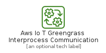
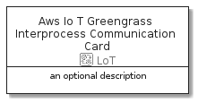

# AwsIoTGreengrassInterprocessCommunication


```text
aws-20210730/Resource/LoT/AwsIoTGreengrassInterprocessCommunication
```

```text
include('aws-20210730/Resource/LoT/AwsIoTGreengrassInterprocessCommunication')
```


| Illustration | AwsIoTGreengrassInterprocessCommunication | AwsIoTGreengrassInterprocessCommunicationCard | AwsIoTGreengrassInterprocessCommunicationGroup |
| :---: | :---: | :---: | :---: |
|  |  |  |  |


## AwsIoTGreengrassInterprocessCommunication

### Load remotely
```plantuml
@startuml
' configures the library
!global $LIB_BASE_LOCATION="https://raw.githubusercontent.com/tmorin/plantuml-libs/master/distribution"

' loads the library's bootstrap
!include $LIB_BASE_LOCATION/bootstrap.puml

' loads the package bootstrap
include('aws-20210730/bootstrap')

' loads the Item which embeds the element AwsIoTGreengrassInterprocessCommunication
include('aws-20210730/Resource/LoT/AwsIoTGreengrassInterprocessCommunication')

' renders the element
AwsIoTGreengrassInterprocessCommunication('AwsIoTGreengrassInterprocessCommunication', 'Aws Io T Greengrass Interprocess Communication', 'an optional tech label')
@enduml
```

### Load locally
```plantuml
@startuml
' configures the library
!global $INCLUSION_MODE="local"
!global $LIB_BASE_LOCATION="../../.."

' loads the library's bootstrap
!include $LIB_BASE_LOCATION/bootstrap.puml

' loads the package bootstrap
include('aws-20210730/bootstrap')

' loads the Item which embeds the element AwsIoTGreengrassInterprocessCommunication
include('aws-20210730/Resource/LoT/AwsIoTGreengrassInterprocessCommunication')

' renders the element
AwsIoTGreengrassInterprocessCommunication('AwsIoTGreengrassInterprocessCommunication', 'Aws Io T Greengrass Interprocess Communication', 'an optional tech label')
@enduml
```

## AwsIoTGreengrassInterprocessCommunicationCard

### Load remotely
```plantuml
@startuml
' configures the library
!global $LIB_BASE_LOCATION="https://raw.githubusercontent.com/tmorin/plantuml-libs/master/distribution"

' loads the library's bootstrap
!include $LIB_BASE_LOCATION/bootstrap.puml

' loads the package bootstrap
include('aws-20210730/bootstrap')

' loads the Item which embeds the element AwsIoTGreengrassInterprocessCommunicationCard
include('aws-20210730/Resource/LoT/AwsIoTGreengrassInterprocessCommunication')

' renders the element
AwsIoTGreengrassInterprocessCommunicationCard('AwsIoTGreengrassInterprocessCommunicationCard', 'Aws Io T Greengrass Interprocess Communication Card', 'an optional description')
@enduml
```

### Load locally
```plantuml
@startuml
' configures the library
!global $INCLUSION_MODE="local"
!global $LIB_BASE_LOCATION="../../.."

' loads the library's bootstrap
!include $LIB_BASE_LOCATION/bootstrap.puml

' loads the package bootstrap
include('aws-20210730/bootstrap')

' loads the Item which embeds the element AwsIoTGreengrassInterprocessCommunicationCard
include('aws-20210730/Resource/LoT/AwsIoTGreengrassInterprocessCommunication')

' renders the element
AwsIoTGreengrassInterprocessCommunicationCard('AwsIoTGreengrassInterprocessCommunicationCard', 'Aws Io T Greengrass Interprocess Communication Card', 'an optional description')
@enduml
```

## AwsIoTGreengrassInterprocessCommunicationGroup

### Load remotely
```plantuml
@startuml
' configures the library
!global $LIB_BASE_LOCATION="https://raw.githubusercontent.com/tmorin/plantuml-libs/master/distribution"

' loads the library's bootstrap
!include $LIB_BASE_LOCATION/bootstrap.puml

' loads the package bootstrap
include('aws-20210730/bootstrap')

' loads the Item which embeds the element AwsIoTGreengrassInterprocessCommunicationGroup
include('aws-20210730/Resource/LoT/AwsIoTGreengrassInterprocessCommunication')

' renders the element
AwsIoTGreengrassInterprocessCommunicationGroup('AwsIoTGreengrassInterprocessCommunicationGroup', 'Aws Io T Greengrass Interprocess Communication Group', 'an optional tech label') {
    note as note
        the content of the group
    end note
}
@enduml
```

### Load locally
```plantuml
@startuml
' configures the library
!global $INCLUSION_MODE="local"
!global $LIB_BASE_LOCATION="../../.."

' loads the library's bootstrap
!include $LIB_BASE_LOCATION/bootstrap.puml

' loads the package bootstrap
include('aws-20210730/bootstrap')

' loads the Item which embeds the element AwsIoTGreengrassInterprocessCommunicationGroup
include('aws-20210730/Resource/LoT/AwsIoTGreengrassInterprocessCommunication')

' renders the element
AwsIoTGreengrassInterprocessCommunicationGroup('AwsIoTGreengrassInterprocessCommunicationGroup', 'Aws Io T Greengrass Interprocess Communication Group', 'an optional tech label') {
    note as note
        the content of the group
    end note
}
@enduml
```

