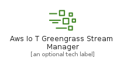
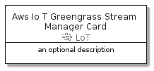

# AwsIoTGreengrassStreamManager


```text
aws-20210730/Resource/LoT/AwsIoTGreengrassStreamManager
```

```text
include('aws-20210730/Resource/LoT/AwsIoTGreengrassStreamManager')
```


| Illustration | AwsIoTGreengrassStreamManager | AwsIoTGreengrassStreamManagerCard | AwsIoTGreengrassStreamManagerGroup |
| :---: | :---: | :---: | :---: |
|  |  |  |  |


## AwsIoTGreengrassStreamManager

### Load remotely
```plantuml
@startuml
' configures the library
!global $LIB_BASE_LOCATION="https://github.com/tmorin/plantuml-libs/distribution"

' loads the library's bootstrap
!include $LIB_BASE_LOCATION/bootstrap.puml

' loads the package bootstrap
include('aws-20210730/bootstrap')

' loads the Item which embeds the element AwsIoTGreengrassStreamManager
include('aws-20210730/Resource/LoT/AwsIoTGreengrassStreamManager')

' renders the element
AwsIoTGreengrassStreamManager('AwsIoTGreengrassStreamManager', 'Aws Io T Greengrass Stream Manager', 'an optional tech label')
@enduml
```

### Load locally
```plantuml
@startuml
' configures the library
!global $INCLUSION_MODE="local"
!global $LIB_BASE_LOCATION="../../.."

' loads the library's bootstrap
!include $LIB_BASE_LOCATION/bootstrap.puml

' loads the package bootstrap
include('aws-20210730/bootstrap')

' loads the Item which embeds the element AwsIoTGreengrassStreamManager
include('aws-20210730/Resource/LoT/AwsIoTGreengrassStreamManager')

' renders the element
AwsIoTGreengrassStreamManager('AwsIoTGreengrassStreamManager', 'Aws Io T Greengrass Stream Manager', 'an optional tech label')
@enduml
```

## AwsIoTGreengrassStreamManagerCard

### Load remotely
```plantuml
@startuml
' configures the library
!global $LIB_BASE_LOCATION="https://github.com/tmorin/plantuml-libs/distribution"

' loads the library's bootstrap
!include $LIB_BASE_LOCATION/bootstrap.puml

' loads the package bootstrap
include('aws-20210730/bootstrap')

' loads the Item which embeds the element AwsIoTGreengrassStreamManagerCard
include('aws-20210730/Resource/LoT/AwsIoTGreengrassStreamManager')

' renders the element
AwsIoTGreengrassStreamManagerCard('AwsIoTGreengrassStreamManagerCard', 'Aws Io T Greengrass Stream Manager Card', 'an optional description')
@enduml
```

### Load locally
```plantuml
@startuml
' configures the library
!global $INCLUSION_MODE="local"
!global $LIB_BASE_LOCATION="../../.."

' loads the library's bootstrap
!include $LIB_BASE_LOCATION/bootstrap.puml

' loads the package bootstrap
include('aws-20210730/bootstrap')

' loads the Item which embeds the element AwsIoTGreengrassStreamManagerCard
include('aws-20210730/Resource/LoT/AwsIoTGreengrassStreamManager')

' renders the element
AwsIoTGreengrassStreamManagerCard('AwsIoTGreengrassStreamManagerCard', 'Aws Io T Greengrass Stream Manager Card', 'an optional description')
@enduml
```

## AwsIoTGreengrassStreamManagerGroup

### Load remotely
```plantuml
@startuml
' configures the library
!global $LIB_BASE_LOCATION="https://github.com/tmorin/plantuml-libs/distribution"

' loads the library's bootstrap
!include $LIB_BASE_LOCATION/bootstrap.puml

' loads the package bootstrap
include('aws-20210730/bootstrap')

' loads the Item which embeds the element AwsIoTGreengrassStreamManagerGroup
include('aws-20210730/Resource/LoT/AwsIoTGreengrassStreamManager')

' renders the element
AwsIoTGreengrassStreamManagerGroup('AwsIoTGreengrassStreamManagerGroup', 'Aws Io T Greengrass Stream Manager Group', 'an optional tech label') {
    note as note
        the content of the group
    end note
}
@enduml
```

### Load locally
```plantuml
@startuml
' configures the library
!global $INCLUSION_MODE="local"
!global $LIB_BASE_LOCATION="../../.."

' loads the library's bootstrap
!include $LIB_BASE_LOCATION/bootstrap.puml

' loads the package bootstrap
include('aws-20210730/bootstrap')

' loads the Item which embeds the element AwsIoTGreengrassStreamManagerGroup
include('aws-20210730/Resource/LoT/AwsIoTGreengrassStreamManager')

' renders the element
AwsIoTGreengrassStreamManagerGroup('AwsIoTGreengrassStreamManagerGroup', 'Aws Io T Greengrass Stream Manager Group', 'an optional tech label') {
    note as note
        the content of the group
    end note
}
@enduml
```

