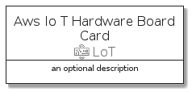

# AwsIoTHardwareBoard


```text
aws-20210730/Resource/LoT/AwsIoTHardwareBoard
```

```text
include('aws-20210730/Resource/LoT/AwsIoTHardwareBoard')
```


| Illustration | AwsIoTHardwareBoard | AwsIoTHardwareBoardCard | AwsIoTHardwareBoardGroup |
| :---: | :---: | :---: | :---: |
|  |  |  |  |


## AwsIoTHardwareBoard

### Load remotely
```plantuml
@startuml
' configures the library
!global $LIB_BASE_LOCATION="https://github.com/tmorin/plantuml-libs/distribution"

' loads the library's bootstrap
!include $LIB_BASE_LOCATION/bootstrap.puml

' loads the package bootstrap
include('aws-20210730/bootstrap')

' loads the Item which embeds the element AwsIoTHardwareBoard
include('aws-20210730/Resource/LoT/AwsIoTHardwareBoard')

' renders the element
AwsIoTHardwareBoard('AwsIoTHardwareBoard', 'Aws Io T Hardware Board', 'an optional tech label')
@enduml
```

### Load locally
```plantuml
@startuml
' configures the library
!global $INCLUSION_MODE="local"
!global $LIB_BASE_LOCATION="../../.."

' loads the library's bootstrap
!include $LIB_BASE_LOCATION/bootstrap.puml

' loads the package bootstrap
include('aws-20210730/bootstrap')

' loads the Item which embeds the element AwsIoTHardwareBoard
include('aws-20210730/Resource/LoT/AwsIoTHardwareBoard')

' renders the element
AwsIoTHardwareBoard('AwsIoTHardwareBoard', 'Aws Io T Hardware Board', 'an optional tech label')
@enduml
```

## AwsIoTHardwareBoardCard

### Load remotely
```plantuml
@startuml
' configures the library
!global $LIB_BASE_LOCATION="https://github.com/tmorin/plantuml-libs/distribution"

' loads the library's bootstrap
!include $LIB_BASE_LOCATION/bootstrap.puml

' loads the package bootstrap
include('aws-20210730/bootstrap')

' loads the Item which embeds the element AwsIoTHardwareBoardCard
include('aws-20210730/Resource/LoT/AwsIoTHardwareBoard')

' renders the element
AwsIoTHardwareBoardCard('AwsIoTHardwareBoardCard', 'Aws Io T Hardware Board Card', 'an optional description')
@enduml
```

### Load locally
```plantuml
@startuml
' configures the library
!global $INCLUSION_MODE="local"
!global $LIB_BASE_LOCATION="../../.."

' loads the library's bootstrap
!include $LIB_BASE_LOCATION/bootstrap.puml

' loads the package bootstrap
include('aws-20210730/bootstrap')

' loads the Item which embeds the element AwsIoTHardwareBoardCard
include('aws-20210730/Resource/LoT/AwsIoTHardwareBoard')

' renders the element
AwsIoTHardwareBoardCard('AwsIoTHardwareBoardCard', 'Aws Io T Hardware Board Card', 'an optional description')
@enduml
```

## AwsIoTHardwareBoardGroup

### Load remotely
```plantuml
@startuml
' configures the library
!global $LIB_BASE_LOCATION="https://github.com/tmorin/plantuml-libs/distribution"

' loads the library's bootstrap
!include $LIB_BASE_LOCATION/bootstrap.puml

' loads the package bootstrap
include('aws-20210730/bootstrap')

' loads the Item which embeds the element AwsIoTHardwareBoardGroup
include('aws-20210730/Resource/LoT/AwsIoTHardwareBoard')

' renders the element
AwsIoTHardwareBoardGroup('AwsIoTHardwareBoardGroup', 'Aws Io T Hardware Board Group', 'an optional tech label') {
    note as note
        the content of the group
    end note
}
@enduml
```

### Load locally
```plantuml
@startuml
' configures the library
!global $INCLUSION_MODE="local"
!global $LIB_BASE_LOCATION="../../.."

' loads the library's bootstrap
!include $LIB_BASE_LOCATION/bootstrap.puml

' loads the package bootstrap
include('aws-20210730/bootstrap')

' loads the Item which embeds the element AwsIoTHardwareBoardGroup
include('aws-20210730/Resource/LoT/AwsIoTHardwareBoard')

' renders the element
AwsIoTHardwareBoardGroup('AwsIoTHardwareBoardGroup', 'Aws Io T Hardware Board Group', 'an optional tech label') {
    note as note
        the content of the group
    end note
}
@enduml
```

