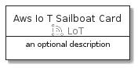
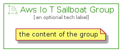

# AwsIoTSailboat


```text
aws-20210730/Resource/LoT/AwsIoTSailboat
```

```text
include('aws-20210730/Resource/LoT/AwsIoTSailboat')
```


| Illustration | AwsIoTSailboat | AwsIoTSailboatCard | AwsIoTSailboatGroup |
| :---: | :---: | :---: | :---: |
|  |  |  |  |


## AwsIoTSailboat

### Load remotely
```plantuml
@startuml
' configures the library
!global $LIB_BASE_LOCATION="https://github.com/tmorin/plantuml-libs/distribution"

' loads the library's bootstrap
!include $LIB_BASE_LOCATION/bootstrap.puml

' loads the package bootstrap
include('aws-20210730/bootstrap')

' loads the Item which embeds the element AwsIoTSailboat
include('aws-20210730/Resource/LoT/AwsIoTSailboat')

' renders the element
AwsIoTSailboat('AwsIoTSailboat', 'Aws Io T Sailboat', 'an optional tech label')
@enduml
```

### Load locally
```plantuml
@startuml
' configures the library
!global $INCLUSION_MODE="local"
!global $LIB_BASE_LOCATION="../../.."

' loads the library's bootstrap
!include $LIB_BASE_LOCATION/bootstrap.puml

' loads the package bootstrap
include('aws-20210730/bootstrap')

' loads the Item which embeds the element AwsIoTSailboat
include('aws-20210730/Resource/LoT/AwsIoTSailboat')

' renders the element
AwsIoTSailboat('AwsIoTSailboat', 'Aws Io T Sailboat', 'an optional tech label')
@enduml
```

## AwsIoTSailboatCard

### Load remotely
```plantuml
@startuml
' configures the library
!global $LIB_BASE_LOCATION="https://github.com/tmorin/plantuml-libs/distribution"

' loads the library's bootstrap
!include $LIB_BASE_LOCATION/bootstrap.puml

' loads the package bootstrap
include('aws-20210730/bootstrap')

' loads the Item which embeds the element AwsIoTSailboatCard
include('aws-20210730/Resource/LoT/AwsIoTSailboat')

' renders the element
AwsIoTSailboatCard('AwsIoTSailboatCard', 'Aws Io T Sailboat Card', 'an optional description')
@enduml
```

### Load locally
```plantuml
@startuml
' configures the library
!global $INCLUSION_MODE="local"
!global $LIB_BASE_LOCATION="../../.."

' loads the library's bootstrap
!include $LIB_BASE_LOCATION/bootstrap.puml

' loads the package bootstrap
include('aws-20210730/bootstrap')

' loads the Item which embeds the element AwsIoTSailboatCard
include('aws-20210730/Resource/LoT/AwsIoTSailboat')

' renders the element
AwsIoTSailboatCard('AwsIoTSailboatCard', 'Aws Io T Sailboat Card', 'an optional description')
@enduml
```

## AwsIoTSailboatGroup

### Load remotely
```plantuml
@startuml
' configures the library
!global $LIB_BASE_LOCATION="https://github.com/tmorin/plantuml-libs/distribution"

' loads the library's bootstrap
!include $LIB_BASE_LOCATION/bootstrap.puml

' loads the package bootstrap
include('aws-20210730/bootstrap')

' loads the Item which embeds the element AwsIoTSailboatGroup
include('aws-20210730/Resource/LoT/AwsIoTSailboat')

' renders the element
AwsIoTSailboatGroup('AwsIoTSailboatGroup', 'Aws Io T Sailboat Group', 'an optional tech label') {
    note as note
        the content of the group
    end note
}
@enduml
```

### Load locally
```plantuml
@startuml
' configures the library
!global $INCLUSION_MODE="local"
!global $LIB_BASE_LOCATION="../../.."

' loads the library's bootstrap
!include $LIB_BASE_LOCATION/bootstrap.puml

' loads the package bootstrap
include('aws-20210730/bootstrap')

' loads the Item which embeds the element AwsIoTSailboatGroup
include('aws-20210730/Resource/LoT/AwsIoTSailboat')

' renders the element
AwsIoTSailboatGroup('AwsIoTSailboatGroup', 'Aws Io T Sailboat Group', 'an optional tech label') {
    note as note
        the content of the group
    end note
}
@enduml
```

