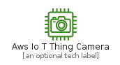
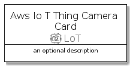
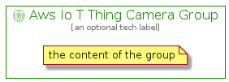

# AwsIoTThingCamera


```text
aws-20210730/Resource/LoT/AwsIoTThingCamera
```

```text
include('aws-20210730/Resource/LoT/AwsIoTThingCamera')
```


| Illustration | AwsIoTThingCamera | AwsIoTThingCameraCard | AwsIoTThingCameraGroup |
| :---: | :---: | :---: | :---: |
|  |  |  |  |


## AwsIoTThingCamera

### Load remotely
```plantuml
@startuml
' configures the library
!global $LIB_BASE_LOCATION="https://raw.githubusercontent.com/tmorin/plantuml-libs/master/distribution"

' loads the library's bootstrap
!include $LIB_BASE_LOCATION/bootstrap.puml

' loads the package bootstrap
include('aws-20210730/bootstrap')

' loads the Item which embeds the element AwsIoTThingCamera
include('aws-20210730/Resource/LoT/AwsIoTThingCamera')

' renders the element
AwsIoTThingCamera('AwsIoTThingCamera', 'Aws Io T Thing Camera', 'an optional tech label')
@enduml
```

### Load locally
```plantuml
@startuml
' configures the library
!global $INCLUSION_MODE="local"
!global $LIB_BASE_LOCATION="../../.."

' loads the library's bootstrap
!include $LIB_BASE_LOCATION/bootstrap.puml

' loads the package bootstrap
include('aws-20210730/bootstrap')

' loads the Item which embeds the element AwsIoTThingCamera
include('aws-20210730/Resource/LoT/AwsIoTThingCamera')

' renders the element
AwsIoTThingCamera('AwsIoTThingCamera', 'Aws Io T Thing Camera', 'an optional tech label')
@enduml
```

## AwsIoTThingCameraCard

### Load remotely
```plantuml
@startuml
' configures the library
!global $LIB_BASE_LOCATION="https://raw.githubusercontent.com/tmorin/plantuml-libs/master/distribution"

' loads the library's bootstrap
!include $LIB_BASE_LOCATION/bootstrap.puml

' loads the package bootstrap
include('aws-20210730/bootstrap')

' loads the Item which embeds the element AwsIoTThingCameraCard
include('aws-20210730/Resource/LoT/AwsIoTThingCamera')

' renders the element
AwsIoTThingCameraCard('AwsIoTThingCameraCard', 'Aws Io T Thing Camera Card', 'an optional description')
@enduml
```

### Load locally
```plantuml
@startuml
' configures the library
!global $INCLUSION_MODE="local"
!global $LIB_BASE_LOCATION="../../.."

' loads the library's bootstrap
!include $LIB_BASE_LOCATION/bootstrap.puml

' loads the package bootstrap
include('aws-20210730/bootstrap')

' loads the Item which embeds the element AwsIoTThingCameraCard
include('aws-20210730/Resource/LoT/AwsIoTThingCamera')

' renders the element
AwsIoTThingCameraCard('AwsIoTThingCameraCard', 'Aws Io T Thing Camera Card', 'an optional description')
@enduml
```

## AwsIoTThingCameraGroup

### Load remotely
```plantuml
@startuml
' configures the library
!global $LIB_BASE_LOCATION="https://raw.githubusercontent.com/tmorin/plantuml-libs/master/distribution"

' loads the library's bootstrap
!include $LIB_BASE_LOCATION/bootstrap.puml

' loads the package bootstrap
include('aws-20210730/bootstrap')

' loads the Item which embeds the element AwsIoTThingCameraGroup
include('aws-20210730/Resource/LoT/AwsIoTThingCamera')

' renders the element
AwsIoTThingCameraGroup('AwsIoTThingCameraGroup', 'Aws Io T Thing Camera Group', 'an optional tech label') {
    note as note
        the content of the group
    end note
}
@enduml
```

### Load locally
```plantuml
@startuml
' configures the library
!global $INCLUSION_MODE="local"
!global $LIB_BASE_LOCATION="../../.."

' loads the library's bootstrap
!include $LIB_BASE_LOCATION/bootstrap.puml

' loads the package bootstrap
include('aws-20210730/bootstrap')

' loads the Item which embeds the element AwsIoTThingCameraGroup
include('aws-20210730/Resource/LoT/AwsIoTThingCamera')

' renders the element
AwsIoTThingCameraGroup('AwsIoTThingCameraGroup', 'Aws Io T Thing Camera Group', 'an optional tech label') {
    note as note
        the content of the group
    end note
}
@enduml
```

