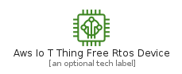
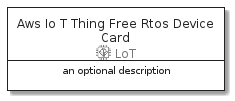

# AwsIoTThingFreeRtosDevice


```text
aws-20210730/Resource/LoT/AwsIoTThingFreeRtosDevice
```

```text
include('aws-20210730/Resource/LoT/AwsIoTThingFreeRtosDevice')
```


| Illustration | AwsIoTThingFreeRtosDevice | AwsIoTThingFreeRtosDeviceCard | AwsIoTThingFreeRtosDeviceGroup |
| :---: | :---: | :---: | :---: |
|  |  |  |  |


## AwsIoTThingFreeRtosDevice

### Load remotely
```plantuml
@startuml
' configures the library
!global $LIB_BASE_LOCATION="https://raw.githubusercontent.com/tmorin/plantuml-libs/master/distribution"

' loads the library's bootstrap
!include $LIB_BASE_LOCATION/bootstrap.puml

' loads the package bootstrap
include('aws-20210730/bootstrap')

' loads the Item which embeds the element AwsIoTThingFreeRtosDevice
include('aws-20210730/Resource/LoT/AwsIoTThingFreeRtosDevice')

' renders the element
AwsIoTThingFreeRtosDevice('AwsIoTThingFreeRtosDevice', 'Aws Io T Thing Free Rtos Device', 'an optional tech label')
@enduml
```

### Load locally
```plantuml
@startuml
' configures the library
!global $INCLUSION_MODE="local"
!global $LIB_BASE_LOCATION="../../.."

' loads the library's bootstrap
!include $LIB_BASE_LOCATION/bootstrap.puml

' loads the package bootstrap
include('aws-20210730/bootstrap')

' loads the Item which embeds the element AwsIoTThingFreeRtosDevice
include('aws-20210730/Resource/LoT/AwsIoTThingFreeRtosDevice')

' renders the element
AwsIoTThingFreeRtosDevice('AwsIoTThingFreeRtosDevice', 'Aws Io T Thing Free Rtos Device', 'an optional tech label')
@enduml
```

## AwsIoTThingFreeRtosDeviceCard

### Load remotely
```plantuml
@startuml
' configures the library
!global $LIB_BASE_LOCATION="https://raw.githubusercontent.com/tmorin/plantuml-libs/master/distribution"

' loads the library's bootstrap
!include $LIB_BASE_LOCATION/bootstrap.puml

' loads the package bootstrap
include('aws-20210730/bootstrap')

' loads the Item which embeds the element AwsIoTThingFreeRtosDeviceCard
include('aws-20210730/Resource/LoT/AwsIoTThingFreeRtosDevice')

' renders the element
AwsIoTThingFreeRtosDeviceCard('AwsIoTThingFreeRtosDeviceCard', 'Aws Io T Thing Free Rtos Device Card', 'an optional description')
@enduml
```

### Load locally
```plantuml
@startuml
' configures the library
!global $INCLUSION_MODE="local"
!global $LIB_BASE_LOCATION="../../.."

' loads the library's bootstrap
!include $LIB_BASE_LOCATION/bootstrap.puml

' loads the package bootstrap
include('aws-20210730/bootstrap')

' loads the Item which embeds the element AwsIoTThingFreeRtosDeviceCard
include('aws-20210730/Resource/LoT/AwsIoTThingFreeRtosDevice')

' renders the element
AwsIoTThingFreeRtosDeviceCard('AwsIoTThingFreeRtosDeviceCard', 'Aws Io T Thing Free Rtos Device Card', 'an optional description')
@enduml
```

## AwsIoTThingFreeRtosDeviceGroup

### Load remotely
```plantuml
@startuml
' configures the library
!global $LIB_BASE_LOCATION="https://raw.githubusercontent.com/tmorin/plantuml-libs/master/distribution"

' loads the library's bootstrap
!include $LIB_BASE_LOCATION/bootstrap.puml

' loads the package bootstrap
include('aws-20210730/bootstrap')

' loads the Item which embeds the element AwsIoTThingFreeRtosDeviceGroup
include('aws-20210730/Resource/LoT/AwsIoTThingFreeRtosDevice')

' renders the element
AwsIoTThingFreeRtosDeviceGroup('AwsIoTThingFreeRtosDeviceGroup', 'Aws Io T Thing Free Rtos Device Group', 'an optional tech label') {
    note as note
        the content of the group
    end note
}
@enduml
```

### Load locally
```plantuml
@startuml
' configures the library
!global $INCLUSION_MODE="local"
!global $LIB_BASE_LOCATION="../../.."

' loads the library's bootstrap
!include $LIB_BASE_LOCATION/bootstrap.puml

' loads the package bootstrap
include('aws-20210730/bootstrap')

' loads the Item which embeds the element AwsIoTThingFreeRtosDeviceGroup
include('aws-20210730/Resource/LoT/AwsIoTThingFreeRtosDevice')

' renders the element
AwsIoTThingFreeRtosDeviceGroup('AwsIoTThingFreeRtosDeviceGroup', 'Aws Io T Thing Free Rtos Device Group', 'an optional tech label') {
    note as note
        the content of the group
    end note
}
@enduml
```

