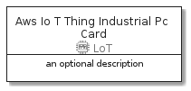

# AwsIoTThingIndustrialPc


```text
aws-20210730/Resource/LoT/AwsIoTThingIndustrialPc
```

```text
include('aws-20210730/Resource/LoT/AwsIoTThingIndustrialPc')
```


| Illustration | AwsIoTThingIndustrialPc | AwsIoTThingIndustrialPcCard | AwsIoTThingIndustrialPcGroup |
| :---: | :---: | :---: | :---: |
|  |  |  |  |


## AwsIoTThingIndustrialPc

### Load remotely
```plantuml
@startuml
' configures the library
!global $LIB_BASE_LOCATION="https://github.com/tmorin/plantuml-libs/distribution"

' loads the library's bootstrap
!include $LIB_BASE_LOCATION/bootstrap.puml

' loads the package bootstrap
include('aws-20210730/bootstrap')

' loads the Item which embeds the element AwsIoTThingIndustrialPc
include('aws-20210730/Resource/LoT/AwsIoTThingIndustrialPc')

' renders the element
AwsIoTThingIndustrialPc('AwsIoTThingIndustrialPc', 'Aws Io T Thing Industrial Pc', 'an optional tech label')
@enduml
```

### Load locally
```plantuml
@startuml
' configures the library
!global $INCLUSION_MODE="local"
!global $LIB_BASE_LOCATION="../../.."

' loads the library's bootstrap
!include $LIB_BASE_LOCATION/bootstrap.puml

' loads the package bootstrap
include('aws-20210730/bootstrap')

' loads the Item which embeds the element AwsIoTThingIndustrialPc
include('aws-20210730/Resource/LoT/AwsIoTThingIndustrialPc')

' renders the element
AwsIoTThingIndustrialPc('AwsIoTThingIndustrialPc', 'Aws Io T Thing Industrial Pc', 'an optional tech label')
@enduml
```

## AwsIoTThingIndustrialPcCard

### Load remotely
```plantuml
@startuml
' configures the library
!global $LIB_BASE_LOCATION="https://github.com/tmorin/plantuml-libs/distribution"

' loads the library's bootstrap
!include $LIB_BASE_LOCATION/bootstrap.puml

' loads the package bootstrap
include('aws-20210730/bootstrap')

' loads the Item which embeds the element AwsIoTThingIndustrialPcCard
include('aws-20210730/Resource/LoT/AwsIoTThingIndustrialPc')

' renders the element
AwsIoTThingIndustrialPcCard('AwsIoTThingIndustrialPcCard', 'Aws Io T Thing Industrial Pc Card', 'an optional description')
@enduml
```

### Load locally
```plantuml
@startuml
' configures the library
!global $INCLUSION_MODE="local"
!global $LIB_BASE_LOCATION="../../.."

' loads the library's bootstrap
!include $LIB_BASE_LOCATION/bootstrap.puml

' loads the package bootstrap
include('aws-20210730/bootstrap')

' loads the Item which embeds the element AwsIoTThingIndustrialPcCard
include('aws-20210730/Resource/LoT/AwsIoTThingIndustrialPc')

' renders the element
AwsIoTThingIndustrialPcCard('AwsIoTThingIndustrialPcCard', 'Aws Io T Thing Industrial Pc Card', 'an optional description')
@enduml
```

## AwsIoTThingIndustrialPcGroup

### Load remotely
```plantuml
@startuml
' configures the library
!global $LIB_BASE_LOCATION="https://github.com/tmorin/plantuml-libs/distribution"

' loads the library's bootstrap
!include $LIB_BASE_LOCATION/bootstrap.puml

' loads the package bootstrap
include('aws-20210730/bootstrap')

' loads the Item which embeds the element AwsIoTThingIndustrialPcGroup
include('aws-20210730/Resource/LoT/AwsIoTThingIndustrialPc')

' renders the element
AwsIoTThingIndustrialPcGroup('AwsIoTThingIndustrialPcGroup', 'Aws Io T Thing Industrial Pc Group', 'an optional tech label') {
    note as note
        the content of the group
    end note
}
@enduml
```

### Load locally
```plantuml
@startuml
' configures the library
!global $INCLUSION_MODE="local"
!global $LIB_BASE_LOCATION="../../.."

' loads the library's bootstrap
!include $LIB_BASE_LOCATION/bootstrap.puml

' loads the package bootstrap
include('aws-20210730/bootstrap')

' loads the Item which embeds the element AwsIoTThingIndustrialPcGroup
include('aws-20210730/Resource/LoT/AwsIoTThingIndustrialPc')

' renders the element
AwsIoTThingIndustrialPcGroup('AwsIoTThingIndustrialPcGroup', 'Aws Io T Thing Industrial Pc Group', 'an optional tech label') {
    note as note
        the content of the group
    end note
}
@enduml
```

