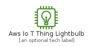
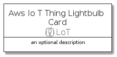
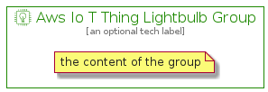

# AwsIoTThingLightbulb


```text
aws-20210730/Resource/LoT/AwsIoTThingLightbulb
```

```text
include('aws-20210730/Resource/LoT/AwsIoTThingLightbulb')
```


| Illustration | AwsIoTThingLightbulb | AwsIoTThingLightbulbCard | AwsIoTThingLightbulbGroup |
| :---: | :---: | :---: | :---: |
|  |  |  |  |


## AwsIoTThingLightbulb

### Load remotely
```plantuml
@startuml
' configures the library
!global $LIB_BASE_LOCATION="https://raw.githubusercontent.com/tmorin/plantuml-libs/master/distribution"

' loads the library's bootstrap
!include $LIB_BASE_LOCATION/bootstrap.puml

' loads the package bootstrap
include('aws-20210730/bootstrap')

' loads the Item which embeds the element AwsIoTThingLightbulb
include('aws-20210730/Resource/LoT/AwsIoTThingLightbulb')

' renders the element
AwsIoTThingLightbulb('AwsIoTThingLightbulb', 'Aws Io T Thing Lightbulb', 'an optional tech label')
@enduml
```

### Load locally
```plantuml
@startuml
' configures the library
!global $INCLUSION_MODE="local"
!global $LIB_BASE_LOCATION="../../.."

' loads the library's bootstrap
!include $LIB_BASE_LOCATION/bootstrap.puml

' loads the package bootstrap
include('aws-20210730/bootstrap')

' loads the Item which embeds the element AwsIoTThingLightbulb
include('aws-20210730/Resource/LoT/AwsIoTThingLightbulb')

' renders the element
AwsIoTThingLightbulb('AwsIoTThingLightbulb', 'Aws Io T Thing Lightbulb', 'an optional tech label')
@enduml
```

## AwsIoTThingLightbulbCard

### Load remotely
```plantuml
@startuml
' configures the library
!global $LIB_BASE_LOCATION="https://raw.githubusercontent.com/tmorin/plantuml-libs/master/distribution"

' loads the library's bootstrap
!include $LIB_BASE_LOCATION/bootstrap.puml

' loads the package bootstrap
include('aws-20210730/bootstrap')

' loads the Item which embeds the element AwsIoTThingLightbulbCard
include('aws-20210730/Resource/LoT/AwsIoTThingLightbulb')

' renders the element
AwsIoTThingLightbulbCard('AwsIoTThingLightbulbCard', 'Aws Io T Thing Lightbulb Card', 'an optional description')
@enduml
```

### Load locally
```plantuml
@startuml
' configures the library
!global $INCLUSION_MODE="local"
!global $LIB_BASE_LOCATION="../../.."

' loads the library's bootstrap
!include $LIB_BASE_LOCATION/bootstrap.puml

' loads the package bootstrap
include('aws-20210730/bootstrap')

' loads the Item which embeds the element AwsIoTThingLightbulbCard
include('aws-20210730/Resource/LoT/AwsIoTThingLightbulb')

' renders the element
AwsIoTThingLightbulbCard('AwsIoTThingLightbulbCard', 'Aws Io T Thing Lightbulb Card', 'an optional description')
@enduml
```

## AwsIoTThingLightbulbGroup

### Load remotely
```plantuml
@startuml
' configures the library
!global $LIB_BASE_LOCATION="https://raw.githubusercontent.com/tmorin/plantuml-libs/master/distribution"

' loads the library's bootstrap
!include $LIB_BASE_LOCATION/bootstrap.puml

' loads the package bootstrap
include('aws-20210730/bootstrap')

' loads the Item which embeds the element AwsIoTThingLightbulbGroup
include('aws-20210730/Resource/LoT/AwsIoTThingLightbulb')

' renders the element
AwsIoTThingLightbulbGroup('AwsIoTThingLightbulbGroup', 'Aws Io T Thing Lightbulb Group', 'an optional tech label') {
    note as note
        the content of the group
    end note
}
@enduml
```

### Load locally
```plantuml
@startuml
' configures the library
!global $INCLUSION_MODE="local"
!global $LIB_BASE_LOCATION="../../.."

' loads the library's bootstrap
!include $LIB_BASE_LOCATION/bootstrap.puml

' loads the package bootstrap
include('aws-20210730/bootstrap')

' loads the Item which embeds the element AwsIoTThingLightbulbGroup
include('aws-20210730/Resource/LoT/AwsIoTThingLightbulb')

' renders the element
AwsIoTThingLightbulbGroup('AwsIoTThingLightbulbGroup', 'Aws Io T Thing Lightbulb Group', 'an optional tech label') {
    note as note
        the content of the group
    end note
}
@enduml
```

