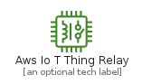
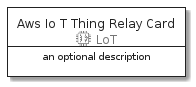
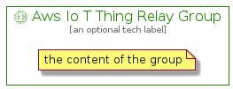

# AwsIoTThingRelay


```text
aws-20210730/Resource/LoT/AwsIoTThingRelay
```

```text
include('aws-20210730/Resource/LoT/AwsIoTThingRelay')
```


| Illustration | AwsIoTThingRelay | AwsIoTThingRelayCard | AwsIoTThingRelayGroup |
| :---: | :---: | :---: | :---: |
|  |  |  |  |


## AwsIoTThingRelay

### Load remotely
```plantuml
@startuml
' configures the library
!global $LIB_BASE_LOCATION="https://raw.githubusercontent.com/tmorin/plantuml-libs/master/distribution"

' loads the library's bootstrap
!include $LIB_BASE_LOCATION/bootstrap.puml

' loads the package bootstrap
include('aws-20210730/bootstrap')

' loads the Item which embeds the element AwsIoTThingRelay
include('aws-20210730/Resource/LoT/AwsIoTThingRelay')

' renders the element
AwsIoTThingRelay('AwsIoTThingRelay', 'Aws Io T Thing Relay', 'an optional tech label')
@enduml
```

### Load locally
```plantuml
@startuml
' configures the library
!global $INCLUSION_MODE="local"
!global $LIB_BASE_LOCATION="../../.."

' loads the library's bootstrap
!include $LIB_BASE_LOCATION/bootstrap.puml

' loads the package bootstrap
include('aws-20210730/bootstrap')

' loads the Item which embeds the element AwsIoTThingRelay
include('aws-20210730/Resource/LoT/AwsIoTThingRelay')

' renders the element
AwsIoTThingRelay('AwsIoTThingRelay', 'Aws Io T Thing Relay', 'an optional tech label')
@enduml
```

## AwsIoTThingRelayCard

### Load remotely
```plantuml
@startuml
' configures the library
!global $LIB_BASE_LOCATION="https://raw.githubusercontent.com/tmorin/plantuml-libs/master/distribution"

' loads the library's bootstrap
!include $LIB_BASE_LOCATION/bootstrap.puml

' loads the package bootstrap
include('aws-20210730/bootstrap')

' loads the Item which embeds the element AwsIoTThingRelayCard
include('aws-20210730/Resource/LoT/AwsIoTThingRelay')

' renders the element
AwsIoTThingRelayCard('AwsIoTThingRelayCard', 'Aws Io T Thing Relay Card', 'an optional description')
@enduml
```

### Load locally
```plantuml
@startuml
' configures the library
!global $INCLUSION_MODE="local"
!global $LIB_BASE_LOCATION="../../.."

' loads the library's bootstrap
!include $LIB_BASE_LOCATION/bootstrap.puml

' loads the package bootstrap
include('aws-20210730/bootstrap')

' loads the Item which embeds the element AwsIoTThingRelayCard
include('aws-20210730/Resource/LoT/AwsIoTThingRelay')

' renders the element
AwsIoTThingRelayCard('AwsIoTThingRelayCard', 'Aws Io T Thing Relay Card', 'an optional description')
@enduml
```

## AwsIoTThingRelayGroup

### Load remotely
```plantuml
@startuml
' configures the library
!global $LIB_BASE_LOCATION="https://raw.githubusercontent.com/tmorin/plantuml-libs/master/distribution"

' loads the library's bootstrap
!include $LIB_BASE_LOCATION/bootstrap.puml

' loads the package bootstrap
include('aws-20210730/bootstrap')

' loads the Item which embeds the element AwsIoTThingRelayGroup
include('aws-20210730/Resource/LoT/AwsIoTThingRelay')

' renders the element
AwsIoTThingRelayGroup('AwsIoTThingRelayGroup', 'Aws Io T Thing Relay Group', 'an optional tech label') {
    note as note
        the content of the group
    end note
}
@enduml
```

### Load locally
```plantuml
@startuml
' configures the library
!global $INCLUSION_MODE="local"
!global $LIB_BASE_LOCATION="../../.."

' loads the library's bootstrap
!include $LIB_BASE_LOCATION/bootstrap.puml

' loads the package bootstrap
include('aws-20210730/bootstrap')

' loads the Item which embeds the element AwsIoTThingRelayGroup
include('aws-20210730/Resource/LoT/AwsIoTThingRelay')

' renders the element
AwsIoTThingRelayGroup('AwsIoTThingRelayGroup', 'Aws Io T Thing Relay Group', 'an optional tech label') {
    note as note
        the content of the group
    end note
}
@enduml
```

