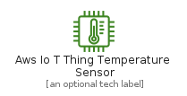
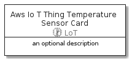

# AwsIoTThingTemperatureSensor


```text
aws-20210730/Resource/LoT/AwsIoTThingTemperatureSensor
```

```text
include('aws-20210730/Resource/LoT/AwsIoTThingTemperatureSensor')
```


| Illustration | AwsIoTThingTemperatureSensor | AwsIoTThingTemperatureSensorCard | AwsIoTThingTemperatureSensorGroup |
| :---: | :---: | :---: | :---: |
|  |  |  |  |


## AwsIoTThingTemperatureSensor

### Load remotely
```plantuml
@startuml
' configures the library
!global $LIB_BASE_LOCATION="https://github.com/tmorin/plantuml-libs/distribution"

' loads the library's bootstrap
!include $LIB_BASE_LOCATION/bootstrap.puml

' loads the package bootstrap
include('aws-20210730/bootstrap')

' loads the Item which embeds the element AwsIoTThingTemperatureSensor
include('aws-20210730/Resource/LoT/AwsIoTThingTemperatureSensor')

' renders the element
AwsIoTThingTemperatureSensor('AwsIoTThingTemperatureSensor', 'Aws Io T Thing Temperature Sensor', 'an optional tech label')
@enduml
```

### Load locally
```plantuml
@startuml
' configures the library
!global $INCLUSION_MODE="local"
!global $LIB_BASE_LOCATION="../../.."

' loads the library's bootstrap
!include $LIB_BASE_LOCATION/bootstrap.puml

' loads the package bootstrap
include('aws-20210730/bootstrap')

' loads the Item which embeds the element AwsIoTThingTemperatureSensor
include('aws-20210730/Resource/LoT/AwsIoTThingTemperatureSensor')

' renders the element
AwsIoTThingTemperatureSensor('AwsIoTThingTemperatureSensor', 'Aws Io T Thing Temperature Sensor', 'an optional tech label')
@enduml
```

## AwsIoTThingTemperatureSensorCard

### Load remotely
```plantuml
@startuml
' configures the library
!global $LIB_BASE_LOCATION="https://github.com/tmorin/plantuml-libs/distribution"

' loads the library's bootstrap
!include $LIB_BASE_LOCATION/bootstrap.puml

' loads the package bootstrap
include('aws-20210730/bootstrap')

' loads the Item which embeds the element AwsIoTThingTemperatureSensorCard
include('aws-20210730/Resource/LoT/AwsIoTThingTemperatureSensor')

' renders the element
AwsIoTThingTemperatureSensorCard('AwsIoTThingTemperatureSensorCard', 'Aws Io T Thing Temperature Sensor Card', 'an optional description')
@enduml
```

### Load locally
```plantuml
@startuml
' configures the library
!global $INCLUSION_MODE="local"
!global $LIB_BASE_LOCATION="../../.."

' loads the library's bootstrap
!include $LIB_BASE_LOCATION/bootstrap.puml

' loads the package bootstrap
include('aws-20210730/bootstrap')

' loads the Item which embeds the element AwsIoTThingTemperatureSensorCard
include('aws-20210730/Resource/LoT/AwsIoTThingTemperatureSensor')

' renders the element
AwsIoTThingTemperatureSensorCard('AwsIoTThingTemperatureSensorCard', 'Aws Io T Thing Temperature Sensor Card', 'an optional description')
@enduml
```

## AwsIoTThingTemperatureSensorGroup

### Load remotely
```plantuml
@startuml
' configures the library
!global $LIB_BASE_LOCATION="https://github.com/tmorin/plantuml-libs/distribution"

' loads the library's bootstrap
!include $LIB_BASE_LOCATION/bootstrap.puml

' loads the package bootstrap
include('aws-20210730/bootstrap')

' loads the Item which embeds the element AwsIoTThingTemperatureSensorGroup
include('aws-20210730/Resource/LoT/AwsIoTThingTemperatureSensor')

' renders the element
AwsIoTThingTemperatureSensorGroup('AwsIoTThingTemperatureSensorGroup', 'Aws Io T Thing Temperature Sensor Group', 'an optional tech label') {
    note as note
        the content of the group
    end note
}
@enduml
```

### Load locally
```plantuml
@startuml
' configures the library
!global $INCLUSION_MODE="local"
!global $LIB_BASE_LOCATION="../../.."

' loads the library's bootstrap
!include $LIB_BASE_LOCATION/bootstrap.puml

' loads the package bootstrap
include('aws-20210730/bootstrap')

' loads the Item which embeds the element AwsIoTThingTemperatureSensorGroup
include('aws-20210730/Resource/LoT/AwsIoTThingTemperatureSensor')

' renders the element
AwsIoTThingTemperatureSensorGroup('AwsIoTThingTemperatureSensorGroup', 'Aws Io T Thing Temperature Sensor Group', 'an optional tech label') {
    note as note
        the content of the group
    end note
}
@enduml
```

