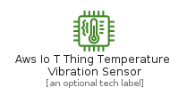
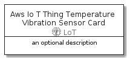

# AwsIoTThingTemperatureVibrationSensor


```text
aws-20210730/Resource/LoT/AwsIoTThingTemperatureVibrationSensor
```

```text
include('aws-20210730/Resource/LoT/AwsIoTThingTemperatureVibrationSensor')
```


| Illustration | AwsIoTThingTemperatureVibrationSensor | AwsIoTThingTemperatureVibrationSensorCard | AwsIoTThingTemperatureVibrationSensorGroup |
| :---: | :---: | :---: | :---: |
|  |  |  |  |


## AwsIoTThingTemperatureVibrationSensor

### Load remotely
```plantuml
@startuml
' configures the library
!global $LIB_BASE_LOCATION="https://raw.githubusercontent.com/tmorin/plantuml-libs/master/distribution"

' loads the library's bootstrap
!include $LIB_BASE_LOCATION/bootstrap.puml

' loads the package bootstrap
include('aws-20210730/bootstrap')

' loads the Item which embeds the element AwsIoTThingTemperatureVibrationSensor
include('aws-20210730/Resource/LoT/AwsIoTThingTemperatureVibrationSensor')

' renders the element
AwsIoTThingTemperatureVibrationSensor('AwsIoTThingTemperatureVibrationSensor', 'Aws Io T Thing Temperature Vibration Sensor', 'an optional tech label')
@enduml
```

### Load locally
```plantuml
@startuml
' configures the library
!global $INCLUSION_MODE="local"
!global $LIB_BASE_LOCATION="../../.."

' loads the library's bootstrap
!include $LIB_BASE_LOCATION/bootstrap.puml

' loads the package bootstrap
include('aws-20210730/bootstrap')

' loads the Item which embeds the element AwsIoTThingTemperatureVibrationSensor
include('aws-20210730/Resource/LoT/AwsIoTThingTemperatureVibrationSensor')

' renders the element
AwsIoTThingTemperatureVibrationSensor('AwsIoTThingTemperatureVibrationSensor', 'Aws Io T Thing Temperature Vibration Sensor', 'an optional tech label')
@enduml
```

## AwsIoTThingTemperatureVibrationSensorCard

### Load remotely
```plantuml
@startuml
' configures the library
!global $LIB_BASE_LOCATION="https://raw.githubusercontent.com/tmorin/plantuml-libs/master/distribution"

' loads the library's bootstrap
!include $LIB_BASE_LOCATION/bootstrap.puml

' loads the package bootstrap
include('aws-20210730/bootstrap')

' loads the Item which embeds the element AwsIoTThingTemperatureVibrationSensorCard
include('aws-20210730/Resource/LoT/AwsIoTThingTemperatureVibrationSensor')

' renders the element
AwsIoTThingTemperatureVibrationSensorCard('AwsIoTThingTemperatureVibrationSensorCard', 'Aws Io T Thing Temperature Vibration Sensor Card', 'an optional description')
@enduml
```

### Load locally
```plantuml
@startuml
' configures the library
!global $INCLUSION_MODE="local"
!global $LIB_BASE_LOCATION="../../.."

' loads the library's bootstrap
!include $LIB_BASE_LOCATION/bootstrap.puml

' loads the package bootstrap
include('aws-20210730/bootstrap')

' loads the Item which embeds the element AwsIoTThingTemperatureVibrationSensorCard
include('aws-20210730/Resource/LoT/AwsIoTThingTemperatureVibrationSensor')

' renders the element
AwsIoTThingTemperatureVibrationSensorCard('AwsIoTThingTemperatureVibrationSensorCard', 'Aws Io T Thing Temperature Vibration Sensor Card', 'an optional description')
@enduml
```

## AwsIoTThingTemperatureVibrationSensorGroup

### Load remotely
```plantuml
@startuml
' configures the library
!global $LIB_BASE_LOCATION="https://raw.githubusercontent.com/tmorin/plantuml-libs/master/distribution"

' loads the library's bootstrap
!include $LIB_BASE_LOCATION/bootstrap.puml

' loads the package bootstrap
include('aws-20210730/bootstrap')

' loads the Item which embeds the element AwsIoTThingTemperatureVibrationSensorGroup
include('aws-20210730/Resource/LoT/AwsIoTThingTemperatureVibrationSensor')

' renders the element
AwsIoTThingTemperatureVibrationSensorGroup('AwsIoTThingTemperatureVibrationSensorGroup', 'Aws Io T Thing Temperature Vibration Sensor Group', 'an optional tech label') {
    note as note
        the content of the group
    end note
}
@enduml
```

### Load locally
```plantuml
@startuml
' configures the library
!global $INCLUSION_MODE="local"
!global $LIB_BASE_LOCATION="../../.."

' loads the library's bootstrap
!include $LIB_BASE_LOCATION/bootstrap.puml

' loads the package bootstrap
include('aws-20210730/bootstrap')

' loads the Item which embeds the element AwsIoTThingTemperatureVibrationSensorGroup
include('aws-20210730/Resource/LoT/AwsIoTThingTemperatureVibrationSensor')

' renders the element
AwsIoTThingTemperatureVibrationSensorGroup('AwsIoTThingTemperatureVibrationSensorGroup', 'Aws Io T Thing Temperature Vibration Sensor Group', 'an optional tech label') {
    note as note
        the content of the group
    end note
}
@enduml
```

