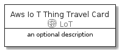
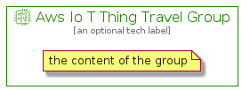

# AwsIoTThingTravel


```text
aws-20210730/Resource/LoT/AwsIoTThingTravel
```

```text
include('aws-20210730/Resource/LoT/AwsIoTThingTravel')
```


| Illustration | AwsIoTThingTravel | AwsIoTThingTravelCard | AwsIoTThingTravelGroup |
| :---: | :---: | :---: | :---: |
|  |  |  |  |


## AwsIoTThingTravel

### Load remotely
```plantuml
@startuml
' configures the library
!global $LIB_BASE_LOCATION="https://raw.githubusercontent.com/tmorin/plantuml-libs/master/distribution"

' loads the library's bootstrap
!include $LIB_BASE_LOCATION/bootstrap.puml

' loads the package bootstrap
include('aws-20210730/bootstrap')

' loads the Item which embeds the element AwsIoTThingTravel
include('aws-20210730/Resource/LoT/AwsIoTThingTravel')

' renders the element
AwsIoTThingTravel('AwsIoTThingTravel', 'Aws Io T Thing Travel', 'an optional tech label')
@enduml
```

### Load locally
```plantuml
@startuml
' configures the library
!global $INCLUSION_MODE="local"
!global $LIB_BASE_LOCATION="../../.."

' loads the library's bootstrap
!include $LIB_BASE_LOCATION/bootstrap.puml

' loads the package bootstrap
include('aws-20210730/bootstrap')

' loads the Item which embeds the element AwsIoTThingTravel
include('aws-20210730/Resource/LoT/AwsIoTThingTravel')

' renders the element
AwsIoTThingTravel('AwsIoTThingTravel', 'Aws Io T Thing Travel', 'an optional tech label')
@enduml
```

## AwsIoTThingTravelCard

### Load remotely
```plantuml
@startuml
' configures the library
!global $LIB_BASE_LOCATION="https://raw.githubusercontent.com/tmorin/plantuml-libs/master/distribution"

' loads the library's bootstrap
!include $LIB_BASE_LOCATION/bootstrap.puml

' loads the package bootstrap
include('aws-20210730/bootstrap')

' loads the Item which embeds the element AwsIoTThingTravelCard
include('aws-20210730/Resource/LoT/AwsIoTThingTravel')

' renders the element
AwsIoTThingTravelCard('AwsIoTThingTravelCard', 'Aws Io T Thing Travel Card', 'an optional description')
@enduml
```

### Load locally
```plantuml
@startuml
' configures the library
!global $INCLUSION_MODE="local"
!global $LIB_BASE_LOCATION="../../.."

' loads the library's bootstrap
!include $LIB_BASE_LOCATION/bootstrap.puml

' loads the package bootstrap
include('aws-20210730/bootstrap')

' loads the Item which embeds the element AwsIoTThingTravelCard
include('aws-20210730/Resource/LoT/AwsIoTThingTravel')

' renders the element
AwsIoTThingTravelCard('AwsIoTThingTravelCard', 'Aws Io T Thing Travel Card', 'an optional description')
@enduml
```

## AwsIoTThingTravelGroup

### Load remotely
```plantuml
@startuml
' configures the library
!global $LIB_BASE_LOCATION="https://raw.githubusercontent.com/tmorin/plantuml-libs/master/distribution"

' loads the library's bootstrap
!include $LIB_BASE_LOCATION/bootstrap.puml

' loads the package bootstrap
include('aws-20210730/bootstrap')

' loads the Item which embeds the element AwsIoTThingTravelGroup
include('aws-20210730/Resource/LoT/AwsIoTThingTravel')

' renders the element
AwsIoTThingTravelGroup('AwsIoTThingTravelGroup', 'Aws Io T Thing Travel Group', 'an optional tech label') {
    note as note
        the content of the group
    end note
}
@enduml
```

### Load locally
```plantuml
@startuml
' configures the library
!global $INCLUSION_MODE="local"
!global $LIB_BASE_LOCATION="../../.."

' loads the library's bootstrap
!include $LIB_BASE_LOCATION/bootstrap.puml

' loads the package bootstrap
include('aws-20210730/bootstrap')

' loads the Item which embeds the element AwsIoTThingTravelGroup
include('aws-20210730/Resource/LoT/AwsIoTThingTravel')

' renders the element
AwsIoTThingTravelGroup('AwsIoTThingTravelGroup', 'Aws Io T Thing Travel Group', 'an optional tech label') {
    note as note
        the content of the group
    end note
}
@enduml
```

