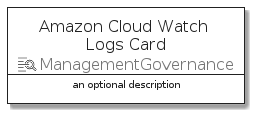
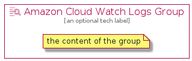

# AmazonCloudWatchLogs


```text
aws-20210730/Resource/ManagementGovernance/AmazonCloudWatchLogs
```

```text
include('aws-20210730/Resource/ManagementGovernance/AmazonCloudWatchLogs')
```


| Illustration | AmazonCloudWatchLogs | AmazonCloudWatchLogsCard | AmazonCloudWatchLogsGroup |
| :---: | :---: | :---: | :---: |
|  |  |  |  |


## AmazonCloudWatchLogs

### Load remotely
```plantuml
@startuml
' configures the library
!global $LIB_BASE_LOCATION="https://github.com/tmorin/plantuml-libs/distribution"

' loads the library's bootstrap
!include $LIB_BASE_LOCATION/bootstrap.puml

' loads the package bootstrap
include('aws-20210730/bootstrap')

' loads the Item which embeds the element AmazonCloudWatchLogs
include('aws-20210730/Resource/ManagementGovernance/AmazonCloudWatchLogs')

' renders the element
AmazonCloudWatchLogs('AmazonCloudWatchLogs', 'Amazon Cloud Watch Logs', 'an optional tech label')
@enduml
```

### Load locally
```plantuml
@startuml
' configures the library
!global $INCLUSION_MODE="local"
!global $LIB_BASE_LOCATION="../../.."

' loads the library's bootstrap
!include $LIB_BASE_LOCATION/bootstrap.puml

' loads the package bootstrap
include('aws-20210730/bootstrap')

' loads the Item which embeds the element AmazonCloudWatchLogs
include('aws-20210730/Resource/ManagementGovernance/AmazonCloudWatchLogs')

' renders the element
AmazonCloudWatchLogs('AmazonCloudWatchLogs', 'Amazon Cloud Watch Logs', 'an optional tech label')
@enduml
```

## AmazonCloudWatchLogsCard

### Load remotely
```plantuml
@startuml
' configures the library
!global $LIB_BASE_LOCATION="https://github.com/tmorin/plantuml-libs/distribution"

' loads the library's bootstrap
!include $LIB_BASE_LOCATION/bootstrap.puml

' loads the package bootstrap
include('aws-20210730/bootstrap')

' loads the Item which embeds the element AmazonCloudWatchLogsCard
include('aws-20210730/Resource/ManagementGovernance/AmazonCloudWatchLogs')

' renders the element
AmazonCloudWatchLogsCard('AmazonCloudWatchLogsCard', 'Amazon Cloud Watch Logs Card', 'an optional description')
@enduml
```

### Load locally
```plantuml
@startuml
' configures the library
!global $INCLUSION_MODE="local"
!global $LIB_BASE_LOCATION="../../.."

' loads the library's bootstrap
!include $LIB_BASE_LOCATION/bootstrap.puml

' loads the package bootstrap
include('aws-20210730/bootstrap')

' loads the Item which embeds the element AmazonCloudWatchLogsCard
include('aws-20210730/Resource/ManagementGovernance/AmazonCloudWatchLogs')

' renders the element
AmazonCloudWatchLogsCard('AmazonCloudWatchLogsCard', 'Amazon Cloud Watch Logs Card', 'an optional description')
@enduml
```

## AmazonCloudWatchLogsGroup

### Load remotely
```plantuml
@startuml
' configures the library
!global $LIB_BASE_LOCATION="https://github.com/tmorin/plantuml-libs/distribution"

' loads the library's bootstrap
!include $LIB_BASE_LOCATION/bootstrap.puml

' loads the package bootstrap
include('aws-20210730/bootstrap')

' loads the Item which embeds the element AmazonCloudWatchLogsGroup
include('aws-20210730/Resource/ManagementGovernance/AmazonCloudWatchLogs')

' renders the element
AmazonCloudWatchLogsGroup('AmazonCloudWatchLogsGroup', 'Amazon Cloud Watch Logs Group', 'an optional tech label') {
    note as note
        the content of the group
    end note
}
@enduml
```

### Load locally
```plantuml
@startuml
' configures the library
!global $INCLUSION_MODE="local"
!global $LIB_BASE_LOCATION="../../.."

' loads the library's bootstrap
!include $LIB_BASE_LOCATION/bootstrap.puml

' loads the package bootstrap
include('aws-20210730/bootstrap')

' loads the Item which embeds the element AmazonCloudWatchLogsGroup
include('aws-20210730/Resource/ManagementGovernance/AmazonCloudWatchLogs')

' renders the element
AmazonCloudWatchLogsGroup('AmazonCloudWatchLogsGroup', 'Amazon Cloud Watch Logs Group', 'an optional tech label') {
    note as note
        the content of the group
    end note
}
@enduml
```

