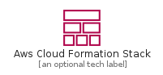
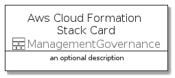
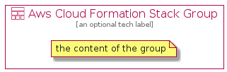

# AwsCloudFormationStack


```text
aws-20210730/Resource/ManagementGovernance/AwsCloudFormationStack
```

```text
include('aws-20210730/Resource/ManagementGovernance/AwsCloudFormationStack')
```


| Illustration | AwsCloudFormationStack | AwsCloudFormationStackCard | AwsCloudFormationStackGroup |
| :---: | :---: | :---: | :---: |
|  |  |  |  |


## AwsCloudFormationStack

### Load remotely
```plantuml
@startuml
' configures the library
!global $LIB_BASE_LOCATION="https://github.com/tmorin/plantuml-libs/distribution"

' loads the library's bootstrap
!include $LIB_BASE_LOCATION/bootstrap.puml

' loads the package bootstrap
include('aws-20210730/bootstrap')

' loads the Item which embeds the element AwsCloudFormationStack
include('aws-20210730/Resource/ManagementGovernance/AwsCloudFormationStack')

' renders the element
AwsCloudFormationStack('AwsCloudFormationStack', 'Aws Cloud Formation Stack', 'an optional tech label')
@enduml
```

### Load locally
```plantuml
@startuml
' configures the library
!global $INCLUSION_MODE="local"
!global $LIB_BASE_LOCATION="../../.."

' loads the library's bootstrap
!include $LIB_BASE_LOCATION/bootstrap.puml

' loads the package bootstrap
include('aws-20210730/bootstrap')

' loads the Item which embeds the element AwsCloudFormationStack
include('aws-20210730/Resource/ManagementGovernance/AwsCloudFormationStack')

' renders the element
AwsCloudFormationStack('AwsCloudFormationStack', 'Aws Cloud Formation Stack', 'an optional tech label')
@enduml
```

## AwsCloudFormationStackCard

### Load remotely
```plantuml
@startuml
' configures the library
!global $LIB_BASE_LOCATION="https://github.com/tmorin/plantuml-libs/distribution"

' loads the library's bootstrap
!include $LIB_BASE_LOCATION/bootstrap.puml

' loads the package bootstrap
include('aws-20210730/bootstrap')

' loads the Item which embeds the element AwsCloudFormationStackCard
include('aws-20210730/Resource/ManagementGovernance/AwsCloudFormationStack')

' renders the element
AwsCloudFormationStackCard('AwsCloudFormationStackCard', 'Aws Cloud Formation Stack Card', 'an optional description')
@enduml
```

### Load locally
```plantuml
@startuml
' configures the library
!global $INCLUSION_MODE="local"
!global $LIB_BASE_LOCATION="../../.."

' loads the library's bootstrap
!include $LIB_BASE_LOCATION/bootstrap.puml

' loads the package bootstrap
include('aws-20210730/bootstrap')

' loads the Item which embeds the element AwsCloudFormationStackCard
include('aws-20210730/Resource/ManagementGovernance/AwsCloudFormationStack')

' renders the element
AwsCloudFormationStackCard('AwsCloudFormationStackCard', 'Aws Cloud Formation Stack Card', 'an optional description')
@enduml
```

## AwsCloudFormationStackGroup

### Load remotely
```plantuml
@startuml
' configures the library
!global $LIB_BASE_LOCATION="https://github.com/tmorin/plantuml-libs/distribution"

' loads the library's bootstrap
!include $LIB_BASE_LOCATION/bootstrap.puml

' loads the package bootstrap
include('aws-20210730/bootstrap')

' loads the Item which embeds the element AwsCloudFormationStackGroup
include('aws-20210730/Resource/ManagementGovernance/AwsCloudFormationStack')

' renders the element
AwsCloudFormationStackGroup('AwsCloudFormationStackGroup', 'Aws Cloud Formation Stack Group', 'an optional tech label') {
    note as note
        the content of the group
    end note
}
@enduml
```

### Load locally
```plantuml
@startuml
' configures the library
!global $INCLUSION_MODE="local"
!global $LIB_BASE_LOCATION="../../.."

' loads the library's bootstrap
!include $LIB_BASE_LOCATION/bootstrap.puml

' loads the package bootstrap
include('aws-20210730/bootstrap')

' loads the Item which embeds the element AwsCloudFormationStackGroup
include('aws-20210730/Resource/ManagementGovernance/AwsCloudFormationStack')

' renders the element
AwsCloudFormationStackGroup('AwsCloudFormationStackGroup', 'Aws Cloud Formation Stack Group', 'an optional tech label') {
    note as note
        the content of the group
    end note
}
@enduml
```

