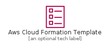
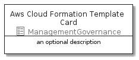
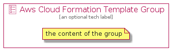

# AwsCloudFormationTemplate


```text
aws-20210730/Resource/ManagementGovernance/AwsCloudFormationTemplate
```

```text
include('aws-20210730/Resource/ManagementGovernance/AwsCloudFormationTemplate')
```


| Illustration | AwsCloudFormationTemplate | AwsCloudFormationTemplateCard | AwsCloudFormationTemplateGroup |
| :---: | :---: | :---: | :---: |
|  |  |  |  |


## AwsCloudFormationTemplate

### Load remotely
```plantuml
@startuml
' configures the library
!global $LIB_BASE_LOCATION="https://github.com/tmorin/plantuml-libs/distribution"

' loads the library's bootstrap
!include $LIB_BASE_LOCATION/bootstrap.puml

' loads the package bootstrap
include('aws-20210730/bootstrap')

' loads the Item which embeds the element AwsCloudFormationTemplate
include('aws-20210730/Resource/ManagementGovernance/AwsCloudFormationTemplate')

' renders the element
AwsCloudFormationTemplate('AwsCloudFormationTemplate', 'Aws Cloud Formation Template', 'an optional tech label')
@enduml
```

### Load locally
```plantuml
@startuml
' configures the library
!global $INCLUSION_MODE="local"
!global $LIB_BASE_LOCATION="../../.."

' loads the library's bootstrap
!include $LIB_BASE_LOCATION/bootstrap.puml

' loads the package bootstrap
include('aws-20210730/bootstrap')

' loads the Item which embeds the element AwsCloudFormationTemplate
include('aws-20210730/Resource/ManagementGovernance/AwsCloudFormationTemplate')

' renders the element
AwsCloudFormationTemplate('AwsCloudFormationTemplate', 'Aws Cloud Formation Template', 'an optional tech label')
@enduml
```

## AwsCloudFormationTemplateCard

### Load remotely
```plantuml
@startuml
' configures the library
!global $LIB_BASE_LOCATION="https://github.com/tmorin/plantuml-libs/distribution"

' loads the library's bootstrap
!include $LIB_BASE_LOCATION/bootstrap.puml

' loads the package bootstrap
include('aws-20210730/bootstrap')

' loads the Item which embeds the element AwsCloudFormationTemplateCard
include('aws-20210730/Resource/ManagementGovernance/AwsCloudFormationTemplate')

' renders the element
AwsCloudFormationTemplateCard('AwsCloudFormationTemplateCard', 'Aws Cloud Formation Template Card', 'an optional description')
@enduml
```

### Load locally
```plantuml
@startuml
' configures the library
!global $INCLUSION_MODE="local"
!global $LIB_BASE_LOCATION="../../.."

' loads the library's bootstrap
!include $LIB_BASE_LOCATION/bootstrap.puml

' loads the package bootstrap
include('aws-20210730/bootstrap')

' loads the Item which embeds the element AwsCloudFormationTemplateCard
include('aws-20210730/Resource/ManagementGovernance/AwsCloudFormationTemplate')

' renders the element
AwsCloudFormationTemplateCard('AwsCloudFormationTemplateCard', 'Aws Cloud Formation Template Card', 'an optional description')
@enduml
```

## AwsCloudFormationTemplateGroup

### Load remotely
```plantuml
@startuml
' configures the library
!global $LIB_BASE_LOCATION="https://github.com/tmorin/plantuml-libs/distribution"

' loads the library's bootstrap
!include $LIB_BASE_LOCATION/bootstrap.puml

' loads the package bootstrap
include('aws-20210730/bootstrap')

' loads the Item which embeds the element AwsCloudFormationTemplateGroup
include('aws-20210730/Resource/ManagementGovernance/AwsCloudFormationTemplate')

' renders the element
AwsCloudFormationTemplateGroup('AwsCloudFormationTemplateGroup', 'Aws Cloud Formation Template Group', 'an optional tech label') {
    note as note
        the content of the group
    end note
}
@enduml
```

### Load locally
```plantuml
@startuml
' configures the library
!global $INCLUSION_MODE="local"
!global $LIB_BASE_LOCATION="../../.."

' loads the library's bootstrap
!include $LIB_BASE_LOCATION/bootstrap.puml

' loads the package bootstrap
include('aws-20210730/bootstrap')

' loads the Item which embeds the element AwsCloudFormationTemplateGroup
include('aws-20210730/Resource/ManagementGovernance/AwsCloudFormationTemplate')

' renders the element
AwsCloudFormationTemplateGroup('AwsCloudFormationTemplateGroup', 'Aws Cloud Formation Template Group', 'an optional tech label') {
    note as note
        the content of the group
    end note
}
@enduml
```

