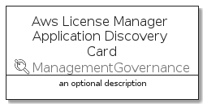

# AwsLicenseManagerApplicationDiscovery


```text
aws-20210730/Resource/ManagementGovernance/AwsLicenseManagerApplicationDiscovery
```

```text
include('aws-20210730/Resource/ManagementGovernance/AwsLicenseManagerApplicationDiscovery')
```


| Illustration | AwsLicenseManagerApplicationDiscovery | AwsLicenseManagerApplicationDiscoveryCard | AwsLicenseManagerApplicationDiscoveryGroup |
| :---: | :---: | :---: | :---: |
|  |  |  |  |


## AwsLicenseManagerApplicationDiscovery

### Load remotely
```plantuml
@startuml
' configures the library
!global $LIB_BASE_LOCATION="https://github.com/tmorin/plantuml-libs/distribution"

' loads the library's bootstrap
!include $LIB_BASE_LOCATION/bootstrap.puml

' loads the package bootstrap
include('aws-20210730/bootstrap')

' loads the Item which embeds the element AwsLicenseManagerApplicationDiscovery
include('aws-20210730/Resource/ManagementGovernance/AwsLicenseManagerApplicationDiscovery')

' renders the element
AwsLicenseManagerApplicationDiscovery('AwsLicenseManagerApplicationDiscovery', 'Aws License Manager Application Discovery', 'an optional tech label')
@enduml
```

### Load locally
```plantuml
@startuml
' configures the library
!global $INCLUSION_MODE="local"
!global $LIB_BASE_LOCATION="../../.."

' loads the library's bootstrap
!include $LIB_BASE_LOCATION/bootstrap.puml

' loads the package bootstrap
include('aws-20210730/bootstrap')

' loads the Item which embeds the element AwsLicenseManagerApplicationDiscovery
include('aws-20210730/Resource/ManagementGovernance/AwsLicenseManagerApplicationDiscovery')

' renders the element
AwsLicenseManagerApplicationDiscovery('AwsLicenseManagerApplicationDiscovery', 'Aws License Manager Application Discovery', 'an optional tech label')
@enduml
```

## AwsLicenseManagerApplicationDiscoveryCard

### Load remotely
```plantuml
@startuml
' configures the library
!global $LIB_BASE_LOCATION="https://github.com/tmorin/plantuml-libs/distribution"

' loads the library's bootstrap
!include $LIB_BASE_LOCATION/bootstrap.puml

' loads the package bootstrap
include('aws-20210730/bootstrap')

' loads the Item which embeds the element AwsLicenseManagerApplicationDiscoveryCard
include('aws-20210730/Resource/ManagementGovernance/AwsLicenseManagerApplicationDiscovery')

' renders the element
AwsLicenseManagerApplicationDiscoveryCard('AwsLicenseManagerApplicationDiscoveryCard', 'Aws License Manager Application Discovery Card', 'an optional description')
@enduml
```

### Load locally
```plantuml
@startuml
' configures the library
!global $INCLUSION_MODE="local"
!global $LIB_BASE_LOCATION="../../.."

' loads the library's bootstrap
!include $LIB_BASE_LOCATION/bootstrap.puml

' loads the package bootstrap
include('aws-20210730/bootstrap')

' loads the Item which embeds the element AwsLicenseManagerApplicationDiscoveryCard
include('aws-20210730/Resource/ManagementGovernance/AwsLicenseManagerApplicationDiscovery')

' renders the element
AwsLicenseManagerApplicationDiscoveryCard('AwsLicenseManagerApplicationDiscoveryCard', 'Aws License Manager Application Discovery Card', 'an optional description')
@enduml
```

## AwsLicenseManagerApplicationDiscoveryGroup

### Load remotely
```plantuml
@startuml
' configures the library
!global $LIB_BASE_LOCATION="https://github.com/tmorin/plantuml-libs/distribution"

' loads the library's bootstrap
!include $LIB_BASE_LOCATION/bootstrap.puml

' loads the package bootstrap
include('aws-20210730/bootstrap')

' loads the Item which embeds the element AwsLicenseManagerApplicationDiscoveryGroup
include('aws-20210730/Resource/ManagementGovernance/AwsLicenseManagerApplicationDiscovery')

' renders the element
AwsLicenseManagerApplicationDiscoveryGroup('AwsLicenseManagerApplicationDiscoveryGroup', 'Aws License Manager Application Discovery Group', 'an optional tech label') {
    note as note
        the content of the group
    end note
}
@enduml
```

### Load locally
```plantuml
@startuml
' configures the library
!global $INCLUSION_MODE="local"
!global $LIB_BASE_LOCATION="../../.."

' loads the library's bootstrap
!include $LIB_BASE_LOCATION/bootstrap.puml

' loads the package bootstrap
include('aws-20210730/bootstrap')

' loads the Item which embeds the element AwsLicenseManagerApplicationDiscoveryGroup
include('aws-20210730/Resource/ManagementGovernance/AwsLicenseManagerApplicationDiscovery')

' renders the element
AwsLicenseManagerApplicationDiscoveryGroup('AwsLicenseManagerApplicationDiscoveryGroup', 'Aws License Manager Application Discovery Group', 'an optional tech label') {
    note as note
        the content of the group
    end note
}
@enduml
```

