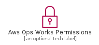
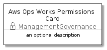
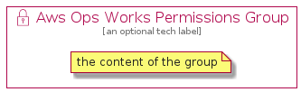

# AwsOpsWorksPermissions


```text
aws-20210730/Resource/ManagementGovernance/AwsOpsWorksPermissions
```

```text
include('aws-20210730/Resource/ManagementGovernance/AwsOpsWorksPermissions')
```


| Illustration | AwsOpsWorksPermissions | AwsOpsWorksPermissionsCard | AwsOpsWorksPermissionsGroup |
| :---: | :---: | :---: | :---: |
|  |  |  |  |


## AwsOpsWorksPermissions

### Load remotely
```plantuml
@startuml
' configures the library
!global $LIB_BASE_LOCATION="https://github.com/tmorin/plantuml-libs/distribution"

' loads the library's bootstrap
!include $LIB_BASE_LOCATION/bootstrap.puml

' loads the package bootstrap
include('aws-20210730/bootstrap')

' loads the Item which embeds the element AwsOpsWorksPermissions
include('aws-20210730/Resource/ManagementGovernance/AwsOpsWorksPermissions')

' renders the element
AwsOpsWorksPermissions('AwsOpsWorksPermissions', 'Aws Ops Works Permissions', 'an optional tech label')
@enduml
```

### Load locally
```plantuml
@startuml
' configures the library
!global $INCLUSION_MODE="local"
!global $LIB_BASE_LOCATION="../../.."

' loads the library's bootstrap
!include $LIB_BASE_LOCATION/bootstrap.puml

' loads the package bootstrap
include('aws-20210730/bootstrap')

' loads the Item which embeds the element AwsOpsWorksPermissions
include('aws-20210730/Resource/ManagementGovernance/AwsOpsWorksPermissions')

' renders the element
AwsOpsWorksPermissions('AwsOpsWorksPermissions', 'Aws Ops Works Permissions', 'an optional tech label')
@enduml
```

## AwsOpsWorksPermissionsCard

### Load remotely
```plantuml
@startuml
' configures the library
!global $LIB_BASE_LOCATION="https://github.com/tmorin/plantuml-libs/distribution"

' loads the library's bootstrap
!include $LIB_BASE_LOCATION/bootstrap.puml

' loads the package bootstrap
include('aws-20210730/bootstrap')

' loads the Item which embeds the element AwsOpsWorksPermissionsCard
include('aws-20210730/Resource/ManagementGovernance/AwsOpsWorksPermissions')

' renders the element
AwsOpsWorksPermissionsCard('AwsOpsWorksPermissionsCard', 'Aws Ops Works Permissions Card', 'an optional description')
@enduml
```

### Load locally
```plantuml
@startuml
' configures the library
!global $INCLUSION_MODE="local"
!global $LIB_BASE_LOCATION="../../.."

' loads the library's bootstrap
!include $LIB_BASE_LOCATION/bootstrap.puml

' loads the package bootstrap
include('aws-20210730/bootstrap')

' loads the Item which embeds the element AwsOpsWorksPermissionsCard
include('aws-20210730/Resource/ManagementGovernance/AwsOpsWorksPermissions')

' renders the element
AwsOpsWorksPermissionsCard('AwsOpsWorksPermissionsCard', 'Aws Ops Works Permissions Card', 'an optional description')
@enduml
```

## AwsOpsWorksPermissionsGroup

### Load remotely
```plantuml
@startuml
' configures the library
!global $LIB_BASE_LOCATION="https://github.com/tmorin/plantuml-libs/distribution"

' loads the library's bootstrap
!include $LIB_BASE_LOCATION/bootstrap.puml

' loads the package bootstrap
include('aws-20210730/bootstrap')

' loads the Item which embeds the element AwsOpsWorksPermissionsGroup
include('aws-20210730/Resource/ManagementGovernance/AwsOpsWorksPermissions')

' renders the element
AwsOpsWorksPermissionsGroup('AwsOpsWorksPermissionsGroup', 'Aws Ops Works Permissions Group', 'an optional tech label') {
    note as note
        the content of the group
    end note
}
@enduml
```

### Load locally
```plantuml
@startuml
' configures the library
!global $INCLUSION_MODE="local"
!global $LIB_BASE_LOCATION="../../.."

' loads the library's bootstrap
!include $LIB_BASE_LOCATION/bootstrap.puml

' loads the package bootstrap
include('aws-20210730/bootstrap')

' loads the Item which embeds the element AwsOpsWorksPermissionsGroup
include('aws-20210730/Resource/ManagementGovernance/AwsOpsWorksPermissions')

' renders the element
AwsOpsWorksPermissionsGroup('AwsOpsWorksPermissionsGroup', 'Aws Ops Works Permissions Group', 'an optional tech label') {
    note as note
        the content of the group
    end note
}
@enduml
```

