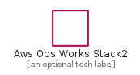
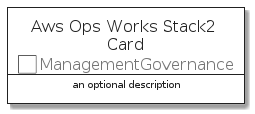
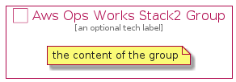

# AwsOpsWorksStack2


```text
aws-20210730/Resource/ManagementGovernance/AwsOpsWorksStack2
```

```text
include('aws-20210730/Resource/ManagementGovernance/AwsOpsWorksStack2')
```


| Illustration | AwsOpsWorksStack2 | AwsOpsWorksStack2Card | AwsOpsWorksStack2Group |
| :---: | :---: | :---: | :---: |
|  |  |  |  |


## AwsOpsWorksStack2

### Load remotely
```plantuml
@startuml
' configures the library
!global $LIB_BASE_LOCATION="https://github.com/tmorin/plantuml-libs/distribution"

' loads the library's bootstrap
!include $LIB_BASE_LOCATION/bootstrap.puml

' loads the package bootstrap
include('aws-20210730/bootstrap')

' loads the Item which embeds the element AwsOpsWorksStack2
include('aws-20210730/Resource/ManagementGovernance/AwsOpsWorksStack2')

' renders the element
AwsOpsWorksStack2('AwsOpsWorksStack2', 'Aws Ops Works Stack2', 'an optional tech label')
@enduml
```

### Load locally
```plantuml
@startuml
' configures the library
!global $INCLUSION_MODE="local"
!global $LIB_BASE_LOCATION="../../.."

' loads the library's bootstrap
!include $LIB_BASE_LOCATION/bootstrap.puml

' loads the package bootstrap
include('aws-20210730/bootstrap')

' loads the Item which embeds the element AwsOpsWorksStack2
include('aws-20210730/Resource/ManagementGovernance/AwsOpsWorksStack2')

' renders the element
AwsOpsWorksStack2('AwsOpsWorksStack2', 'Aws Ops Works Stack2', 'an optional tech label')
@enduml
```

## AwsOpsWorksStack2Card

### Load remotely
```plantuml
@startuml
' configures the library
!global $LIB_BASE_LOCATION="https://github.com/tmorin/plantuml-libs/distribution"

' loads the library's bootstrap
!include $LIB_BASE_LOCATION/bootstrap.puml

' loads the package bootstrap
include('aws-20210730/bootstrap')

' loads the Item which embeds the element AwsOpsWorksStack2Card
include('aws-20210730/Resource/ManagementGovernance/AwsOpsWorksStack2')

' renders the element
AwsOpsWorksStack2Card('AwsOpsWorksStack2Card', 'Aws Ops Works Stack2 Card', 'an optional description')
@enduml
```

### Load locally
```plantuml
@startuml
' configures the library
!global $INCLUSION_MODE="local"
!global $LIB_BASE_LOCATION="../../.."

' loads the library's bootstrap
!include $LIB_BASE_LOCATION/bootstrap.puml

' loads the package bootstrap
include('aws-20210730/bootstrap')

' loads the Item which embeds the element AwsOpsWorksStack2Card
include('aws-20210730/Resource/ManagementGovernance/AwsOpsWorksStack2')

' renders the element
AwsOpsWorksStack2Card('AwsOpsWorksStack2Card', 'Aws Ops Works Stack2 Card', 'an optional description')
@enduml
```

## AwsOpsWorksStack2Group

### Load remotely
```plantuml
@startuml
' configures the library
!global $LIB_BASE_LOCATION="https://github.com/tmorin/plantuml-libs/distribution"

' loads the library's bootstrap
!include $LIB_BASE_LOCATION/bootstrap.puml

' loads the package bootstrap
include('aws-20210730/bootstrap')

' loads the Item which embeds the element AwsOpsWorksStack2Group
include('aws-20210730/Resource/ManagementGovernance/AwsOpsWorksStack2')

' renders the element
AwsOpsWorksStack2Group('AwsOpsWorksStack2Group', 'Aws Ops Works Stack2 Group', 'an optional tech label') {
    note as note
        the content of the group
    end note
}
@enduml
```

### Load locally
```plantuml
@startuml
' configures the library
!global $INCLUSION_MODE="local"
!global $LIB_BASE_LOCATION="../../.."

' loads the library's bootstrap
!include $LIB_BASE_LOCATION/bootstrap.puml

' loads the package bootstrap
include('aws-20210730/bootstrap')

' loads the Item which embeds the element AwsOpsWorksStack2Group
include('aws-20210730/Resource/ManagementGovernance/AwsOpsWorksStack2')

' renders the element
AwsOpsWorksStack2Group('AwsOpsWorksStack2Group', 'Aws Ops Works Stack2 Group', 'an optional tech label') {
    note as note
        the content of the group
    end note
}
@enduml
```

