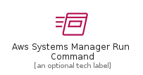
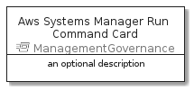
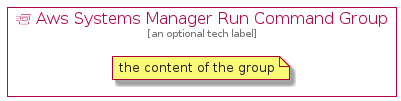

# AwsSystemsManagerRunCommand


```text
aws-20210730/Resource/ManagementGovernance/AwsSystemsManagerRunCommand
```

```text
include('aws-20210730/Resource/ManagementGovernance/AwsSystemsManagerRunCommand')
```


| Illustration | AwsSystemsManagerRunCommand | AwsSystemsManagerRunCommandCard | AwsSystemsManagerRunCommandGroup |
| :---: | :---: | :---: | :---: |
|  |  |  |  |


## AwsSystemsManagerRunCommand

### Load remotely
```plantuml
@startuml
' configures the library
!global $LIB_BASE_LOCATION="https://github.com/tmorin/plantuml-libs/distribution"

' loads the library's bootstrap
!include $LIB_BASE_LOCATION/bootstrap.puml

' loads the package bootstrap
include('aws-20210730/bootstrap')

' loads the Item which embeds the element AwsSystemsManagerRunCommand
include('aws-20210730/Resource/ManagementGovernance/AwsSystemsManagerRunCommand')

' renders the element
AwsSystemsManagerRunCommand('AwsSystemsManagerRunCommand', 'Aws Systems Manager Run Command', 'an optional tech label')
@enduml
```

### Load locally
```plantuml
@startuml
' configures the library
!global $INCLUSION_MODE="local"
!global $LIB_BASE_LOCATION="../../.."

' loads the library's bootstrap
!include $LIB_BASE_LOCATION/bootstrap.puml

' loads the package bootstrap
include('aws-20210730/bootstrap')

' loads the Item which embeds the element AwsSystemsManagerRunCommand
include('aws-20210730/Resource/ManagementGovernance/AwsSystemsManagerRunCommand')

' renders the element
AwsSystemsManagerRunCommand('AwsSystemsManagerRunCommand', 'Aws Systems Manager Run Command', 'an optional tech label')
@enduml
```

## AwsSystemsManagerRunCommandCard

### Load remotely
```plantuml
@startuml
' configures the library
!global $LIB_BASE_LOCATION="https://github.com/tmorin/plantuml-libs/distribution"

' loads the library's bootstrap
!include $LIB_BASE_LOCATION/bootstrap.puml

' loads the package bootstrap
include('aws-20210730/bootstrap')

' loads the Item which embeds the element AwsSystemsManagerRunCommandCard
include('aws-20210730/Resource/ManagementGovernance/AwsSystemsManagerRunCommand')

' renders the element
AwsSystemsManagerRunCommandCard('AwsSystemsManagerRunCommandCard', 'Aws Systems Manager Run Command Card', 'an optional description')
@enduml
```

### Load locally
```plantuml
@startuml
' configures the library
!global $INCLUSION_MODE="local"
!global $LIB_BASE_LOCATION="../../.."

' loads the library's bootstrap
!include $LIB_BASE_LOCATION/bootstrap.puml

' loads the package bootstrap
include('aws-20210730/bootstrap')

' loads the Item which embeds the element AwsSystemsManagerRunCommandCard
include('aws-20210730/Resource/ManagementGovernance/AwsSystemsManagerRunCommand')

' renders the element
AwsSystemsManagerRunCommandCard('AwsSystemsManagerRunCommandCard', 'Aws Systems Manager Run Command Card', 'an optional description')
@enduml
```

## AwsSystemsManagerRunCommandGroup

### Load remotely
```plantuml
@startuml
' configures the library
!global $LIB_BASE_LOCATION="https://github.com/tmorin/plantuml-libs/distribution"

' loads the library's bootstrap
!include $LIB_BASE_LOCATION/bootstrap.puml

' loads the package bootstrap
include('aws-20210730/bootstrap')

' loads the Item which embeds the element AwsSystemsManagerRunCommandGroup
include('aws-20210730/Resource/ManagementGovernance/AwsSystemsManagerRunCommand')

' renders the element
AwsSystemsManagerRunCommandGroup('AwsSystemsManagerRunCommandGroup', 'Aws Systems Manager Run Command Group', 'an optional tech label') {
    note as note
        the content of the group
    end note
}
@enduml
```

### Load locally
```plantuml
@startuml
' configures the library
!global $INCLUSION_MODE="local"
!global $LIB_BASE_LOCATION="../../.."

' loads the library's bootstrap
!include $LIB_BASE_LOCATION/bootstrap.puml

' loads the package bootstrap
include('aws-20210730/bootstrap')

' loads the Item which embeds the element AwsSystemsManagerRunCommandGroup
include('aws-20210730/Resource/ManagementGovernance/AwsSystemsManagerRunCommand')

' renders the element
AwsSystemsManagerRunCommandGroup('AwsSystemsManagerRunCommandGroup', 'Aws Systems Manager Run Command Group', 'an optional tech label') {
    note as note
        the content of the group
    end note
}
@enduml
```

