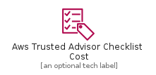
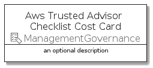
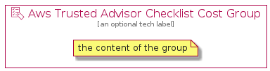

# AwsTrustedAdvisorChecklistCost


```text
aws-20210730/Resource/ManagementGovernance/AwsTrustedAdvisorChecklistCost
```

```text
include('aws-20210730/Resource/ManagementGovernance/AwsTrustedAdvisorChecklistCost')
```


| Illustration | AwsTrustedAdvisorChecklistCost | AwsTrustedAdvisorChecklistCostCard | AwsTrustedAdvisorChecklistCostGroup |
| :---: | :---: | :---: | :---: |
|  |  |  |  |


## AwsTrustedAdvisorChecklistCost

### Load remotely
```plantuml
@startuml
' configures the library
!global $LIB_BASE_LOCATION="https://github.com/tmorin/plantuml-libs/distribution"

' loads the library's bootstrap
!include $LIB_BASE_LOCATION/bootstrap.puml

' loads the package bootstrap
include('aws-20210730/bootstrap')

' loads the Item which embeds the element AwsTrustedAdvisorChecklistCost
include('aws-20210730/Resource/ManagementGovernance/AwsTrustedAdvisorChecklistCost')

' renders the element
AwsTrustedAdvisorChecklistCost('AwsTrustedAdvisorChecklistCost', 'Aws Trusted Advisor Checklist Cost', 'an optional tech label')
@enduml
```

### Load locally
```plantuml
@startuml
' configures the library
!global $INCLUSION_MODE="local"
!global $LIB_BASE_LOCATION="../../.."

' loads the library's bootstrap
!include $LIB_BASE_LOCATION/bootstrap.puml

' loads the package bootstrap
include('aws-20210730/bootstrap')

' loads the Item which embeds the element AwsTrustedAdvisorChecklistCost
include('aws-20210730/Resource/ManagementGovernance/AwsTrustedAdvisorChecklistCost')

' renders the element
AwsTrustedAdvisorChecklistCost('AwsTrustedAdvisorChecklistCost', 'Aws Trusted Advisor Checklist Cost', 'an optional tech label')
@enduml
```

## AwsTrustedAdvisorChecklistCostCard

### Load remotely
```plantuml
@startuml
' configures the library
!global $LIB_BASE_LOCATION="https://github.com/tmorin/plantuml-libs/distribution"

' loads the library's bootstrap
!include $LIB_BASE_LOCATION/bootstrap.puml

' loads the package bootstrap
include('aws-20210730/bootstrap')

' loads the Item which embeds the element AwsTrustedAdvisorChecklistCostCard
include('aws-20210730/Resource/ManagementGovernance/AwsTrustedAdvisorChecklistCost')

' renders the element
AwsTrustedAdvisorChecklistCostCard('AwsTrustedAdvisorChecklistCostCard', 'Aws Trusted Advisor Checklist Cost Card', 'an optional description')
@enduml
```

### Load locally
```plantuml
@startuml
' configures the library
!global $INCLUSION_MODE="local"
!global $LIB_BASE_LOCATION="../../.."

' loads the library's bootstrap
!include $LIB_BASE_LOCATION/bootstrap.puml

' loads the package bootstrap
include('aws-20210730/bootstrap')

' loads the Item which embeds the element AwsTrustedAdvisorChecklistCostCard
include('aws-20210730/Resource/ManagementGovernance/AwsTrustedAdvisorChecklistCost')

' renders the element
AwsTrustedAdvisorChecklistCostCard('AwsTrustedAdvisorChecklistCostCard', 'Aws Trusted Advisor Checklist Cost Card', 'an optional description')
@enduml
```

## AwsTrustedAdvisorChecklistCostGroup

### Load remotely
```plantuml
@startuml
' configures the library
!global $LIB_BASE_LOCATION="https://github.com/tmorin/plantuml-libs/distribution"

' loads the library's bootstrap
!include $LIB_BASE_LOCATION/bootstrap.puml

' loads the package bootstrap
include('aws-20210730/bootstrap')

' loads the Item which embeds the element AwsTrustedAdvisorChecklistCostGroup
include('aws-20210730/Resource/ManagementGovernance/AwsTrustedAdvisorChecklistCost')

' renders the element
AwsTrustedAdvisorChecklistCostGroup('AwsTrustedAdvisorChecklistCostGroup', 'Aws Trusted Advisor Checklist Cost Group', 'an optional tech label') {
    note as note
        the content of the group
    end note
}
@enduml
```

### Load locally
```plantuml
@startuml
' configures the library
!global $INCLUSION_MODE="local"
!global $LIB_BASE_LOCATION="../../.."

' loads the library's bootstrap
!include $LIB_BASE_LOCATION/bootstrap.puml

' loads the package bootstrap
include('aws-20210730/bootstrap')

' loads the Item which embeds the element AwsTrustedAdvisorChecklistCostGroup
include('aws-20210730/Resource/ManagementGovernance/AwsTrustedAdvisorChecklistCost')

' renders the element
AwsTrustedAdvisorChecklistCostGroup('AwsTrustedAdvisorChecklistCostGroup', 'Aws Trusted Advisor Checklist Cost Group', 'an optional tech label') {
    note as note
        the content of the group
    end note
}
@enduml
```

