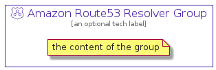

# AmazonRoute53Resolver


```text
aws-20210730/Resource/NetworkingAndContentDelivery/AmazonRoute53Resolver
```

```text
include('aws-20210730/Resource/NetworkingAndContentDelivery/AmazonRoute53Resolver')
```


| Illustration | AmazonRoute53Resolver | AmazonRoute53ResolverCard | AmazonRoute53ResolverGroup |
| :---: | :---: | :---: | :---: |
|  |  |  |  |


## AmazonRoute53Resolver

### Load remotely
```plantuml
@startuml
' configures the library
!global $LIB_BASE_LOCATION="https://github.com/tmorin/plantuml-libs/distribution"

' loads the library's bootstrap
!include $LIB_BASE_LOCATION/bootstrap.puml

' loads the package bootstrap
include('aws-20210730/bootstrap')

' loads the Item which embeds the element AmazonRoute53Resolver
include('aws-20210730/Resource/NetworkingAndContentDelivery/AmazonRoute53Resolver')

' renders the element
AmazonRoute53Resolver('AmazonRoute53Resolver', 'Amazon Route53 Resolver', 'an optional tech label')
@enduml
```

### Load locally
```plantuml
@startuml
' configures the library
!global $INCLUSION_MODE="local"
!global $LIB_BASE_LOCATION="../../.."

' loads the library's bootstrap
!include $LIB_BASE_LOCATION/bootstrap.puml

' loads the package bootstrap
include('aws-20210730/bootstrap')

' loads the Item which embeds the element AmazonRoute53Resolver
include('aws-20210730/Resource/NetworkingAndContentDelivery/AmazonRoute53Resolver')

' renders the element
AmazonRoute53Resolver('AmazonRoute53Resolver', 'Amazon Route53 Resolver', 'an optional tech label')
@enduml
```

## AmazonRoute53ResolverCard

### Load remotely
```plantuml
@startuml
' configures the library
!global $LIB_BASE_LOCATION="https://github.com/tmorin/plantuml-libs/distribution"

' loads the library's bootstrap
!include $LIB_BASE_LOCATION/bootstrap.puml

' loads the package bootstrap
include('aws-20210730/bootstrap')

' loads the Item which embeds the element AmazonRoute53ResolverCard
include('aws-20210730/Resource/NetworkingAndContentDelivery/AmazonRoute53Resolver')

' renders the element
AmazonRoute53ResolverCard('AmazonRoute53ResolverCard', 'Amazon Route53 Resolver Card', 'an optional description')
@enduml
```

### Load locally
```plantuml
@startuml
' configures the library
!global $INCLUSION_MODE="local"
!global $LIB_BASE_LOCATION="../../.."

' loads the library's bootstrap
!include $LIB_BASE_LOCATION/bootstrap.puml

' loads the package bootstrap
include('aws-20210730/bootstrap')

' loads the Item which embeds the element AmazonRoute53ResolverCard
include('aws-20210730/Resource/NetworkingAndContentDelivery/AmazonRoute53Resolver')

' renders the element
AmazonRoute53ResolverCard('AmazonRoute53ResolverCard', 'Amazon Route53 Resolver Card', 'an optional description')
@enduml
```

## AmazonRoute53ResolverGroup

### Load remotely
```plantuml
@startuml
' configures the library
!global $LIB_BASE_LOCATION="https://github.com/tmorin/plantuml-libs/distribution"

' loads the library's bootstrap
!include $LIB_BASE_LOCATION/bootstrap.puml

' loads the package bootstrap
include('aws-20210730/bootstrap')

' loads the Item which embeds the element AmazonRoute53ResolverGroup
include('aws-20210730/Resource/NetworkingAndContentDelivery/AmazonRoute53Resolver')

' renders the element
AmazonRoute53ResolverGroup('AmazonRoute53ResolverGroup', 'Amazon Route53 Resolver Group', 'an optional tech label') {
    note as note
        the content of the group
    end note
}
@enduml
```

### Load locally
```plantuml
@startuml
' configures the library
!global $INCLUSION_MODE="local"
!global $LIB_BASE_LOCATION="../../.."

' loads the library's bootstrap
!include $LIB_BASE_LOCATION/bootstrap.puml

' loads the package bootstrap
include('aws-20210730/bootstrap')

' loads the Item which embeds the element AmazonRoute53ResolverGroup
include('aws-20210730/Resource/NetworkingAndContentDelivery/AmazonRoute53Resolver')

' renders the element
AmazonRoute53ResolverGroup('AmazonRoute53ResolverGroup', 'Amazon Route53 Resolver Group', 'an optional tech label') {
    note as note
        the content of the group
    end note
}
@enduml
```

