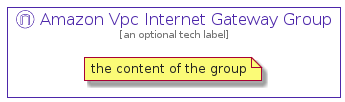

# AmazonVpcInternetGateway


```text
aws-20210730/Resource/NetworkingAndContentDelivery/AmazonVpcInternetGateway
```

```text
include('aws-20210730/Resource/NetworkingAndContentDelivery/AmazonVpcInternetGateway')
```


| Illustration | AmazonVpcInternetGateway | AmazonVpcInternetGatewayCard | AmazonVpcInternetGatewayGroup |
| :---: | :---: | :---: | :---: |
|  |  |  |  |


## AmazonVpcInternetGateway

### Load remotely
```plantuml
@startuml
' configures the library
!global $LIB_BASE_LOCATION="https://github.com/tmorin/plantuml-libs/distribution"

' loads the library's bootstrap
!include $LIB_BASE_LOCATION/bootstrap.puml

' loads the package bootstrap
include('aws-20210730/bootstrap')

' loads the Item which embeds the element AmazonVpcInternetGateway
include('aws-20210730/Resource/NetworkingAndContentDelivery/AmazonVpcInternetGateway')

' renders the element
AmazonVpcInternetGateway('AmazonVpcInternetGateway', 'Amazon Vpc Internet Gateway', 'an optional tech label')
@enduml
```

### Load locally
```plantuml
@startuml
' configures the library
!global $INCLUSION_MODE="local"
!global $LIB_BASE_LOCATION="../../.."

' loads the library's bootstrap
!include $LIB_BASE_LOCATION/bootstrap.puml

' loads the package bootstrap
include('aws-20210730/bootstrap')

' loads the Item which embeds the element AmazonVpcInternetGateway
include('aws-20210730/Resource/NetworkingAndContentDelivery/AmazonVpcInternetGateway')

' renders the element
AmazonVpcInternetGateway('AmazonVpcInternetGateway', 'Amazon Vpc Internet Gateway', 'an optional tech label')
@enduml
```

## AmazonVpcInternetGatewayCard

### Load remotely
```plantuml
@startuml
' configures the library
!global $LIB_BASE_LOCATION="https://github.com/tmorin/plantuml-libs/distribution"

' loads the library's bootstrap
!include $LIB_BASE_LOCATION/bootstrap.puml

' loads the package bootstrap
include('aws-20210730/bootstrap')

' loads the Item which embeds the element AmazonVpcInternetGatewayCard
include('aws-20210730/Resource/NetworkingAndContentDelivery/AmazonVpcInternetGateway')

' renders the element
AmazonVpcInternetGatewayCard('AmazonVpcInternetGatewayCard', 'Amazon Vpc Internet Gateway Card', 'an optional description')
@enduml
```

### Load locally
```plantuml
@startuml
' configures the library
!global $INCLUSION_MODE="local"
!global $LIB_BASE_LOCATION="../../.."

' loads the library's bootstrap
!include $LIB_BASE_LOCATION/bootstrap.puml

' loads the package bootstrap
include('aws-20210730/bootstrap')

' loads the Item which embeds the element AmazonVpcInternetGatewayCard
include('aws-20210730/Resource/NetworkingAndContentDelivery/AmazonVpcInternetGateway')

' renders the element
AmazonVpcInternetGatewayCard('AmazonVpcInternetGatewayCard', 'Amazon Vpc Internet Gateway Card', 'an optional description')
@enduml
```

## AmazonVpcInternetGatewayGroup

### Load remotely
```plantuml
@startuml
' configures the library
!global $LIB_BASE_LOCATION="https://github.com/tmorin/plantuml-libs/distribution"

' loads the library's bootstrap
!include $LIB_BASE_LOCATION/bootstrap.puml

' loads the package bootstrap
include('aws-20210730/bootstrap')

' loads the Item which embeds the element AmazonVpcInternetGatewayGroup
include('aws-20210730/Resource/NetworkingAndContentDelivery/AmazonVpcInternetGateway')

' renders the element
AmazonVpcInternetGatewayGroup('AmazonVpcInternetGatewayGroup', 'Amazon Vpc Internet Gateway Group', 'an optional tech label') {
    note as note
        the content of the group
    end note
}
@enduml
```

### Load locally
```plantuml
@startuml
' configures the library
!global $INCLUSION_MODE="local"
!global $LIB_BASE_LOCATION="../../.."

' loads the library's bootstrap
!include $LIB_BASE_LOCATION/bootstrap.puml

' loads the package bootstrap
include('aws-20210730/bootstrap')

' loads the Item which embeds the element AmazonVpcInternetGatewayGroup
include('aws-20210730/Resource/NetworkingAndContentDelivery/AmazonVpcInternetGateway')

' renders the element
AmazonVpcInternetGatewayGroup('AmazonVpcInternetGatewayGroup', 'Amazon Vpc Internet Gateway Group', 'an optional tech label') {
    note as note
        the content of the group
    end note
}
@enduml
```

