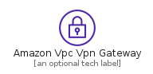
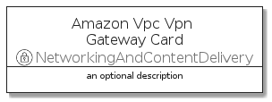
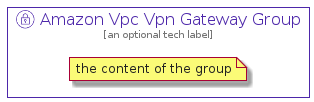

# AmazonVpcVpnGateway


```text
aws-20210730/Resource/NetworkingAndContentDelivery/AmazonVpcVpnGateway
```

```text
include('aws-20210730/Resource/NetworkingAndContentDelivery/AmazonVpcVpnGateway')
```


| Illustration | AmazonVpcVpnGateway | AmazonVpcVpnGatewayCard | AmazonVpcVpnGatewayGroup |
| :---: | :---: | :---: | :---: |
|  |  |  |  |


## AmazonVpcVpnGateway

### Load remotely
```plantuml
@startuml
' configures the library
!global $LIB_BASE_LOCATION="https://github.com/tmorin/plantuml-libs/distribution"

' loads the library's bootstrap
!include $LIB_BASE_LOCATION/bootstrap.puml

' loads the package bootstrap
include('aws-20210730/bootstrap')

' loads the Item which embeds the element AmazonVpcVpnGateway
include('aws-20210730/Resource/NetworkingAndContentDelivery/AmazonVpcVpnGateway')

' renders the element
AmazonVpcVpnGateway('AmazonVpcVpnGateway', 'Amazon Vpc Vpn Gateway', 'an optional tech label')
@enduml
```

### Load locally
```plantuml
@startuml
' configures the library
!global $INCLUSION_MODE="local"
!global $LIB_BASE_LOCATION="../../.."

' loads the library's bootstrap
!include $LIB_BASE_LOCATION/bootstrap.puml

' loads the package bootstrap
include('aws-20210730/bootstrap')

' loads the Item which embeds the element AmazonVpcVpnGateway
include('aws-20210730/Resource/NetworkingAndContentDelivery/AmazonVpcVpnGateway')

' renders the element
AmazonVpcVpnGateway('AmazonVpcVpnGateway', 'Amazon Vpc Vpn Gateway', 'an optional tech label')
@enduml
```

## AmazonVpcVpnGatewayCard

### Load remotely
```plantuml
@startuml
' configures the library
!global $LIB_BASE_LOCATION="https://github.com/tmorin/plantuml-libs/distribution"

' loads the library's bootstrap
!include $LIB_BASE_LOCATION/bootstrap.puml

' loads the package bootstrap
include('aws-20210730/bootstrap')

' loads the Item which embeds the element AmazonVpcVpnGatewayCard
include('aws-20210730/Resource/NetworkingAndContentDelivery/AmazonVpcVpnGateway')

' renders the element
AmazonVpcVpnGatewayCard('AmazonVpcVpnGatewayCard', 'Amazon Vpc Vpn Gateway Card', 'an optional description')
@enduml
```

### Load locally
```plantuml
@startuml
' configures the library
!global $INCLUSION_MODE="local"
!global $LIB_BASE_LOCATION="../../.."

' loads the library's bootstrap
!include $LIB_BASE_LOCATION/bootstrap.puml

' loads the package bootstrap
include('aws-20210730/bootstrap')

' loads the Item which embeds the element AmazonVpcVpnGatewayCard
include('aws-20210730/Resource/NetworkingAndContentDelivery/AmazonVpcVpnGateway')

' renders the element
AmazonVpcVpnGatewayCard('AmazonVpcVpnGatewayCard', 'Amazon Vpc Vpn Gateway Card', 'an optional description')
@enduml
```

## AmazonVpcVpnGatewayGroup

### Load remotely
```plantuml
@startuml
' configures the library
!global $LIB_BASE_LOCATION="https://github.com/tmorin/plantuml-libs/distribution"

' loads the library's bootstrap
!include $LIB_BASE_LOCATION/bootstrap.puml

' loads the package bootstrap
include('aws-20210730/bootstrap')

' loads the Item which embeds the element AmazonVpcVpnGatewayGroup
include('aws-20210730/Resource/NetworkingAndContentDelivery/AmazonVpcVpnGateway')

' renders the element
AmazonVpcVpnGatewayGroup('AmazonVpcVpnGatewayGroup', 'Amazon Vpc Vpn Gateway Group', 'an optional tech label') {
    note as note
        the content of the group
    end note
}
@enduml
```

### Load locally
```plantuml
@startuml
' configures the library
!global $INCLUSION_MODE="local"
!global $LIB_BASE_LOCATION="../../.."

' loads the library's bootstrap
!include $LIB_BASE_LOCATION/bootstrap.puml

' loads the package bootstrap
include('aws-20210730/bootstrap')

' loads the Item which embeds the element AmazonVpcVpnGatewayGroup
include('aws-20210730/Resource/NetworkingAndContentDelivery/AmazonVpcVpnGateway')

' renders the element
AmazonVpcVpnGatewayGroup('AmazonVpcVpnGatewayGroup', 'Amazon Vpc Vpn Gateway Group', 'an optional tech label') {
    note as note
        the content of the group
    end note
}
@enduml
```

