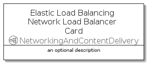

# ElasticLoadBalancingNetworkLoadBalancer


```text
aws-20210730/Resource/NetworkingAndContentDelivery/ElasticLoadBalancingNetworkLoadBalancer
```

```text
include('aws-20210730/Resource/NetworkingAndContentDelivery/ElasticLoadBalancingNetworkLoadBalancer')
```


| Illustration | ElasticLoadBalancingNetworkLoadBalancer | ElasticLoadBalancingNetworkLoadBalancerCard | ElasticLoadBalancingNetworkLoadBalancerGroup |
| :---: | :---: | :---: | :---: |
|  |  |  |  |


## ElasticLoadBalancingNetworkLoadBalancer

### Load remotely
```plantuml
@startuml
' configures the library
!global $LIB_BASE_LOCATION="https://raw.githubusercontent.com/tmorin/plantuml-libs/master/distribution"

' loads the library's bootstrap
!include $LIB_BASE_LOCATION/bootstrap.puml

' loads the package bootstrap
include('aws-20210730/bootstrap')

' loads the Item which embeds the element ElasticLoadBalancingNetworkLoadBalancer
include('aws-20210730/Resource/NetworkingAndContentDelivery/ElasticLoadBalancingNetworkLoadBalancer')

' renders the element
ElasticLoadBalancingNetworkLoadBalancer('ElasticLoadBalancingNetworkLoadBalancer', 'Elastic Load Balancing Network Load Balancer', 'an optional tech label')
@enduml
```

### Load locally
```plantuml
@startuml
' configures the library
!global $INCLUSION_MODE="local"
!global $LIB_BASE_LOCATION="../../.."

' loads the library's bootstrap
!include $LIB_BASE_LOCATION/bootstrap.puml

' loads the package bootstrap
include('aws-20210730/bootstrap')

' loads the Item which embeds the element ElasticLoadBalancingNetworkLoadBalancer
include('aws-20210730/Resource/NetworkingAndContentDelivery/ElasticLoadBalancingNetworkLoadBalancer')

' renders the element
ElasticLoadBalancingNetworkLoadBalancer('ElasticLoadBalancingNetworkLoadBalancer', 'Elastic Load Balancing Network Load Balancer', 'an optional tech label')
@enduml
```

## ElasticLoadBalancingNetworkLoadBalancerCard

### Load remotely
```plantuml
@startuml
' configures the library
!global $LIB_BASE_LOCATION="https://raw.githubusercontent.com/tmorin/plantuml-libs/master/distribution"

' loads the library's bootstrap
!include $LIB_BASE_LOCATION/bootstrap.puml

' loads the package bootstrap
include('aws-20210730/bootstrap')

' loads the Item which embeds the element ElasticLoadBalancingNetworkLoadBalancerCard
include('aws-20210730/Resource/NetworkingAndContentDelivery/ElasticLoadBalancingNetworkLoadBalancer')

' renders the element
ElasticLoadBalancingNetworkLoadBalancerCard('ElasticLoadBalancingNetworkLoadBalancerCard', 'Elastic Load Balancing Network Load Balancer Card', 'an optional description')
@enduml
```

### Load locally
```plantuml
@startuml
' configures the library
!global $INCLUSION_MODE="local"
!global $LIB_BASE_LOCATION="../../.."

' loads the library's bootstrap
!include $LIB_BASE_LOCATION/bootstrap.puml

' loads the package bootstrap
include('aws-20210730/bootstrap')

' loads the Item which embeds the element ElasticLoadBalancingNetworkLoadBalancerCard
include('aws-20210730/Resource/NetworkingAndContentDelivery/ElasticLoadBalancingNetworkLoadBalancer')

' renders the element
ElasticLoadBalancingNetworkLoadBalancerCard('ElasticLoadBalancingNetworkLoadBalancerCard', 'Elastic Load Balancing Network Load Balancer Card', 'an optional description')
@enduml
```

## ElasticLoadBalancingNetworkLoadBalancerGroup

### Load remotely
```plantuml
@startuml
' configures the library
!global $LIB_BASE_LOCATION="https://raw.githubusercontent.com/tmorin/plantuml-libs/master/distribution"

' loads the library's bootstrap
!include $LIB_BASE_LOCATION/bootstrap.puml

' loads the package bootstrap
include('aws-20210730/bootstrap')

' loads the Item which embeds the element ElasticLoadBalancingNetworkLoadBalancerGroup
include('aws-20210730/Resource/NetworkingAndContentDelivery/ElasticLoadBalancingNetworkLoadBalancer')

' renders the element
ElasticLoadBalancingNetworkLoadBalancerGroup('ElasticLoadBalancingNetworkLoadBalancerGroup', 'Elastic Load Balancing Network Load Balancer Group', 'an optional tech label') {
    note as note
        the content of the group
    end note
}
@enduml
```

### Load locally
```plantuml
@startuml
' configures the library
!global $INCLUSION_MODE="local"
!global $LIB_BASE_LOCATION="../../.."

' loads the library's bootstrap
!include $LIB_BASE_LOCATION/bootstrap.puml

' loads the package bootstrap
include('aws-20210730/bootstrap')

' loads the Item which embeds the element ElasticLoadBalancingNetworkLoadBalancerGroup
include('aws-20210730/Resource/NetworkingAndContentDelivery/ElasticLoadBalancingNetworkLoadBalancer')

' renders the element
ElasticLoadBalancingNetworkLoadBalancerGroup('ElasticLoadBalancingNetworkLoadBalancerGroup', 'Elastic Load Balancing Network Load Balancer Group', 'an optional tech label') {
    note as note
        the content of the group
    end note
}
@enduml
```

