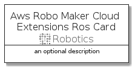

# AwsRoboMakerCloudExtensionsRos


```text
aws-20210730/Resource/Robotics/AwsRoboMakerCloudExtensionsRos
```

```text
include('aws-20210730/Resource/Robotics/AwsRoboMakerCloudExtensionsRos')
```


| Illustration | AwsRoboMakerCloudExtensionsRos | AwsRoboMakerCloudExtensionsRosCard | AwsRoboMakerCloudExtensionsRosGroup |
| :---: | :---: | :---: | :---: |
|  |  |  |  |


## AwsRoboMakerCloudExtensionsRos

### Load remotely
```plantuml
@startuml
' configures the library
!global $LIB_BASE_LOCATION="https://github.com/tmorin/plantuml-libs/distribution"

' loads the library's bootstrap
!include $LIB_BASE_LOCATION/bootstrap.puml

' loads the package bootstrap
include('aws-20210730/bootstrap')

' loads the Item which embeds the element AwsRoboMakerCloudExtensionsRos
include('aws-20210730/Resource/Robotics/AwsRoboMakerCloudExtensionsRos')

' renders the element
AwsRoboMakerCloudExtensionsRos('AwsRoboMakerCloudExtensionsRos', 'Aws Robo Maker Cloud Extensions Ros', 'an optional tech label')
@enduml
```

### Load locally
```plantuml
@startuml
' configures the library
!global $INCLUSION_MODE="local"
!global $LIB_BASE_LOCATION="../../.."

' loads the library's bootstrap
!include $LIB_BASE_LOCATION/bootstrap.puml

' loads the package bootstrap
include('aws-20210730/bootstrap')

' loads the Item which embeds the element AwsRoboMakerCloudExtensionsRos
include('aws-20210730/Resource/Robotics/AwsRoboMakerCloudExtensionsRos')

' renders the element
AwsRoboMakerCloudExtensionsRos('AwsRoboMakerCloudExtensionsRos', 'Aws Robo Maker Cloud Extensions Ros', 'an optional tech label')
@enduml
```

## AwsRoboMakerCloudExtensionsRosCard

### Load remotely
```plantuml
@startuml
' configures the library
!global $LIB_BASE_LOCATION="https://github.com/tmorin/plantuml-libs/distribution"

' loads the library's bootstrap
!include $LIB_BASE_LOCATION/bootstrap.puml

' loads the package bootstrap
include('aws-20210730/bootstrap')

' loads the Item which embeds the element AwsRoboMakerCloudExtensionsRosCard
include('aws-20210730/Resource/Robotics/AwsRoboMakerCloudExtensionsRos')

' renders the element
AwsRoboMakerCloudExtensionsRosCard('AwsRoboMakerCloudExtensionsRosCard', 'Aws Robo Maker Cloud Extensions Ros Card', 'an optional description')
@enduml
```

### Load locally
```plantuml
@startuml
' configures the library
!global $INCLUSION_MODE="local"
!global $LIB_BASE_LOCATION="../../.."

' loads the library's bootstrap
!include $LIB_BASE_LOCATION/bootstrap.puml

' loads the package bootstrap
include('aws-20210730/bootstrap')

' loads the Item which embeds the element AwsRoboMakerCloudExtensionsRosCard
include('aws-20210730/Resource/Robotics/AwsRoboMakerCloudExtensionsRos')

' renders the element
AwsRoboMakerCloudExtensionsRosCard('AwsRoboMakerCloudExtensionsRosCard', 'Aws Robo Maker Cloud Extensions Ros Card', 'an optional description')
@enduml
```

## AwsRoboMakerCloudExtensionsRosGroup

### Load remotely
```plantuml
@startuml
' configures the library
!global $LIB_BASE_LOCATION="https://github.com/tmorin/plantuml-libs/distribution"

' loads the library's bootstrap
!include $LIB_BASE_LOCATION/bootstrap.puml

' loads the package bootstrap
include('aws-20210730/bootstrap')

' loads the Item which embeds the element AwsRoboMakerCloudExtensionsRosGroup
include('aws-20210730/Resource/Robotics/AwsRoboMakerCloudExtensionsRos')

' renders the element
AwsRoboMakerCloudExtensionsRosGroup('AwsRoboMakerCloudExtensionsRosGroup', 'Aws Robo Maker Cloud Extensions Ros Group', 'an optional tech label') {
    note as note
        the content of the group
    end note
}
@enduml
```

### Load locally
```plantuml
@startuml
' configures the library
!global $INCLUSION_MODE="local"
!global $LIB_BASE_LOCATION="../../.."

' loads the library's bootstrap
!include $LIB_BASE_LOCATION/bootstrap.puml

' loads the package bootstrap
include('aws-20210730/bootstrap')

' loads the Item which embeds the element AwsRoboMakerCloudExtensionsRosGroup
include('aws-20210730/Resource/Robotics/AwsRoboMakerCloudExtensionsRos')

' renders the element
AwsRoboMakerCloudExtensionsRosGroup('AwsRoboMakerCloudExtensionsRosGroup', 'Aws Robo Maker Cloud Extensions Ros Group', 'an optional tech label') {
    note as note
        the content of the group
    end note
}
@enduml
```

