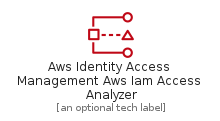
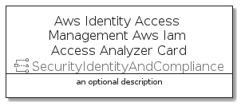
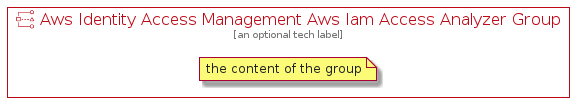

# AwsIdentityAccessManagementAwsIamAccessAnalyzer


```text
aws-20210730/Resource/SecurityIdentityAndCompliance/AwsIdentityAccessManagementAwsIamAccessAnalyzer
```

```text
include('aws-20210730/Resource/SecurityIdentityAndCompliance/AwsIdentityAccessManagementAwsIamAccessAnalyzer')
```


| Illustration | AwsIdentityAccessManagementAwsIamAccessAnalyzer | AwsIdentityAccessManagementAwsIamAccessAnalyzerCard | AwsIdentityAccessManagementAwsIamAccessAnalyzerGroup |
| :---: | :---: | :---: | :---: |
|  |  |  |  |


## AwsIdentityAccessManagementAwsIamAccessAnalyzer

### Load remotely
```plantuml
@startuml
' configures the library
!global $LIB_BASE_LOCATION="https://github.com/tmorin/plantuml-libs/distribution"

' loads the library's bootstrap
!include $LIB_BASE_LOCATION/bootstrap.puml

' loads the package bootstrap
include('aws-20210730/bootstrap')

' loads the Item which embeds the element AwsIdentityAccessManagementAwsIamAccessAnalyzer
include('aws-20210730/Resource/SecurityIdentityAndCompliance/AwsIdentityAccessManagementAwsIamAccessAnalyzer')

' renders the element
AwsIdentityAccessManagementAwsIamAccessAnalyzer('AwsIdentityAccessManagementAwsIamAccessAnalyzer', 'Aws Identity Access Management Aws Iam Access Analyzer', 'an optional tech label')
@enduml
```

### Load locally
```plantuml
@startuml
' configures the library
!global $INCLUSION_MODE="local"
!global $LIB_BASE_LOCATION="../../.."

' loads the library's bootstrap
!include $LIB_BASE_LOCATION/bootstrap.puml

' loads the package bootstrap
include('aws-20210730/bootstrap')

' loads the Item which embeds the element AwsIdentityAccessManagementAwsIamAccessAnalyzer
include('aws-20210730/Resource/SecurityIdentityAndCompliance/AwsIdentityAccessManagementAwsIamAccessAnalyzer')

' renders the element
AwsIdentityAccessManagementAwsIamAccessAnalyzer('AwsIdentityAccessManagementAwsIamAccessAnalyzer', 'Aws Identity Access Management Aws Iam Access Analyzer', 'an optional tech label')
@enduml
```

## AwsIdentityAccessManagementAwsIamAccessAnalyzerCard

### Load remotely
```plantuml
@startuml
' configures the library
!global $LIB_BASE_LOCATION="https://github.com/tmorin/plantuml-libs/distribution"

' loads the library's bootstrap
!include $LIB_BASE_LOCATION/bootstrap.puml

' loads the package bootstrap
include('aws-20210730/bootstrap')

' loads the Item which embeds the element AwsIdentityAccessManagementAwsIamAccessAnalyzerCard
include('aws-20210730/Resource/SecurityIdentityAndCompliance/AwsIdentityAccessManagementAwsIamAccessAnalyzer')

' renders the element
AwsIdentityAccessManagementAwsIamAccessAnalyzerCard('AwsIdentityAccessManagementAwsIamAccessAnalyzerCard', 'Aws Identity Access Management Aws Iam Access Analyzer Card', 'an optional description')
@enduml
```

### Load locally
```plantuml
@startuml
' configures the library
!global $INCLUSION_MODE="local"
!global $LIB_BASE_LOCATION="../../.."

' loads the library's bootstrap
!include $LIB_BASE_LOCATION/bootstrap.puml

' loads the package bootstrap
include('aws-20210730/bootstrap')

' loads the Item which embeds the element AwsIdentityAccessManagementAwsIamAccessAnalyzerCard
include('aws-20210730/Resource/SecurityIdentityAndCompliance/AwsIdentityAccessManagementAwsIamAccessAnalyzer')

' renders the element
AwsIdentityAccessManagementAwsIamAccessAnalyzerCard('AwsIdentityAccessManagementAwsIamAccessAnalyzerCard', 'Aws Identity Access Management Aws Iam Access Analyzer Card', 'an optional description')
@enduml
```

## AwsIdentityAccessManagementAwsIamAccessAnalyzerGroup

### Load remotely
```plantuml
@startuml
' configures the library
!global $LIB_BASE_LOCATION="https://github.com/tmorin/plantuml-libs/distribution"

' loads the library's bootstrap
!include $LIB_BASE_LOCATION/bootstrap.puml

' loads the package bootstrap
include('aws-20210730/bootstrap')

' loads the Item which embeds the element AwsIdentityAccessManagementAwsIamAccessAnalyzerGroup
include('aws-20210730/Resource/SecurityIdentityAndCompliance/AwsIdentityAccessManagementAwsIamAccessAnalyzer')

' renders the element
AwsIdentityAccessManagementAwsIamAccessAnalyzerGroup('AwsIdentityAccessManagementAwsIamAccessAnalyzerGroup', 'Aws Identity Access Management Aws Iam Access Analyzer Group', 'an optional tech label') {
    note as note
        the content of the group
    end note
}
@enduml
```

### Load locally
```plantuml
@startuml
' configures the library
!global $INCLUSION_MODE="local"
!global $LIB_BASE_LOCATION="../../.."

' loads the library's bootstrap
!include $LIB_BASE_LOCATION/bootstrap.puml

' loads the package bootstrap
include('aws-20210730/bootstrap')

' loads the Item which embeds the element AwsIdentityAccessManagementAwsIamAccessAnalyzerGroup
include('aws-20210730/Resource/SecurityIdentityAndCompliance/AwsIdentityAccessManagementAwsIamAccessAnalyzer')

' renders the element
AwsIdentityAccessManagementAwsIamAccessAnalyzerGroup('AwsIdentityAccessManagementAwsIamAccessAnalyzerGroup', 'Aws Identity Access Management Aws Iam Access Analyzer Group', 'an optional tech label') {
    note as note
        the content of the group
    end note
}
@enduml
```

