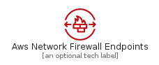
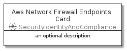
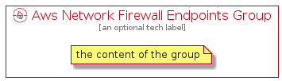

# AwsNetworkFirewallEndpoints


```text
aws-20210730/Resource/SecurityIdentityAndCompliance/AwsNetworkFirewallEndpoints
```

```text
include('aws-20210730/Resource/SecurityIdentityAndCompliance/AwsNetworkFirewallEndpoints')
```


| Illustration | AwsNetworkFirewallEndpoints | AwsNetworkFirewallEndpointsCard | AwsNetworkFirewallEndpointsGroup |
| :---: | :---: | :---: | :---: |
|  |  |  |  |


## AwsNetworkFirewallEndpoints

### Load remotely
```plantuml
@startuml
' configures the library
!global $LIB_BASE_LOCATION="https://raw.githubusercontent.com/tmorin/plantuml-libs/master/distribution"

' loads the library's bootstrap
!include $LIB_BASE_LOCATION/bootstrap.puml

' loads the package bootstrap
include('aws-20210730/bootstrap')

' loads the Item which embeds the element AwsNetworkFirewallEndpoints
include('aws-20210730/Resource/SecurityIdentityAndCompliance/AwsNetworkFirewallEndpoints')

' renders the element
AwsNetworkFirewallEndpoints('AwsNetworkFirewallEndpoints', 'Aws Network Firewall Endpoints', 'an optional tech label')
@enduml
```

### Load locally
```plantuml
@startuml
' configures the library
!global $INCLUSION_MODE="local"
!global $LIB_BASE_LOCATION="../../.."

' loads the library's bootstrap
!include $LIB_BASE_LOCATION/bootstrap.puml

' loads the package bootstrap
include('aws-20210730/bootstrap')

' loads the Item which embeds the element AwsNetworkFirewallEndpoints
include('aws-20210730/Resource/SecurityIdentityAndCompliance/AwsNetworkFirewallEndpoints')

' renders the element
AwsNetworkFirewallEndpoints('AwsNetworkFirewallEndpoints', 'Aws Network Firewall Endpoints', 'an optional tech label')
@enduml
```

## AwsNetworkFirewallEndpointsCard

### Load remotely
```plantuml
@startuml
' configures the library
!global $LIB_BASE_LOCATION="https://raw.githubusercontent.com/tmorin/plantuml-libs/master/distribution"

' loads the library's bootstrap
!include $LIB_BASE_LOCATION/bootstrap.puml

' loads the package bootstrap
include('aws-20210730/bootstrap')

' loads the Item which embeds the element AwsNetworkFirewallEndpointsCard
include('aws-20210730/Resource/SecurityIdentityAndCompliance/AwsNetworkFirewallEndpoints')

' renders the element
AwsNetworkFirewallEndpointsCard('AwsNetworkFirewallEndpointsCard', 'Aws Network Firewall Endpoints Card', 'an optional description')
@enduml
```

### Load locally
```plantuml
@startuml
' configures the library
!global $INCLUSION_MODE="local"
!global $LIB_BASE_LOCATION="../../.."

' loads the library's bootstrap
!include $LIB_BASE_LOCATION/bootstrap.puml

' loads the package bootstrap
include('aws-20210730/bootstrap')

' loads the Item which embeds the element AwsNetworkFirewallEndpointsCard
include('aws-20210730/Resource/SecurityIdentityAndCompliance/AwsNetworkFirewallEndpoints')

' renders the element
AwsNetworkFirewallEndpointsCard('AwsNetworkFirewallEndpointsCard', 'Aws Network Firewall Endpoints Card', 'an optional description')
@enduml
```

## AwsNetworkFirewallEndpointsGroup

### Load remotely
```plantuml
@startuml
' configures the library
!global $LIB_BASE_LOCATION="https://raw.githubusercontent.com/tmorin/plantuml-libs/master/distribution"

' loads the library's bootstrap
!include $LIB_BASE_LOCATION/bootstrap.puml

' loads the package bootstrap
include('aws-20210730/bootstrap')

' loads the Item which embeds the element AwsNetworkFirewallEndpointsGroup
include('aws-20210730/Resource/SecurityIdentityAndCompliance/AwsNetworkFirewallEndpoints')

' renders the element
AwsNetworkFirewallEndpointsGroup('AwsNetworkFirewallEndpointsGroup', 'Aws Network Firewall Endpoints Group', 'an optional tech label') {
    note as note
        the content of the group
    end note
}
@enduml
```

### Load locally
```plantuml
@startuml
' configures the library
!global $INCLUSION_MODE="local"
!global $LIB_BASE_LOCATION="../../.."

' loads the library's bootstrap
!include $LIB_BASE_LOCATION/bootstrap.puml

' loads the package bootstrap
include('aws-20210730/bootstrap')

' loads the Item which embeds the element AwsNetworkFirewallEndpointsGroup
include('aws-20210730/Resource/SecurityIdentityAndCompliance/AwsNetworkFirewallEndpoints')

' renders the element
AwsNetworkFirewallEndpointsGroup('AwsNetworkFirewallEndpointsGroup', 'Aws Network Firewall Endpoints Group', 'an optional tech label') {
    note as note
        the content of the group
    end note
}
@enduml
```

