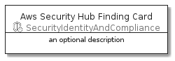
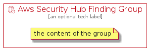

# AwsSecurityHubFinding


```text
aws-20210730/Resource/SecurityIdentityAndCompliance/AwsSecurityHubFinding
```

```text
include('aws-20210730/Resource/SecurityIdentityAndCompliance/AwsSecurityHubFinding')
```


| Illustration | AwsSecurityHubFinding | AwsSecurityHubFindingCard | AwsSecurityHubFindingGroup |
| :---: | :---: | :---: | :---: |
|  |  |  |  |


## AwsSecurityHubFinding

### Load remotely
```plantuml
@startuml
' configures the library
!global $LIB_BASE_LOCATION="https://github.com/tmorin/plantuml-libs/distribution"

' loads the library's bootstrap
!include $LIB_BASE_LOCATION/bootstrap.puml

' loads the package bootstrap
include('aws-20210730/bootstrap')

' loads the Item which embeds the element AwsSecurityHubFinding
include('aws-20210730/Resource/SecurityIdentityAndCompliance/AwsSecurityHubFinding')

' renders the element
AwsSecurityHubFinding('AwsSecurityHubFinding', 'Aws Security Hub Finding', 'an optional tech label')
@enduml
```

### Load locally
```plantuml
@startuml
' configures the library
!global $INCLUSION_MODE="local"
!global $LIB_BASE_LOCATION="../../.."

' loads the library's bootstrap
!include $LIB_BASE_LOCATION/bootstrap.puml

' loads the package bootstrap
include('aws-20210730/bootstrap')

' loads the Item which embeds the element AwsSecurityHubFinding
include('aws-20210730/Resource/SecurityIdentityAndCompliance/AwsSecurityHubFinding')

' renders the element
AwsSecurityHubFinding('AwsSecurityHubFinding', 'Aws Security Hub Finding', 'an optional tech label')
@enduml
```

## AwsSecurityHubFindingCard

### Load remotely
```plantuml
@startuml
' configures the library
!global $LIB_BASE_LOCATION="https://github.com/tmorin/plantuml-libs/distribution"

' loads the library's bootstrap
!include $LIB_BASE_LOCATION/bootstrap.puml

' loads the package bootstrap
include('aws-20210730/bootstrap')

' loads the Item which embeds the element AwsSecurityHubFindingCard
include('aws-20210730/Resource/SecurityIdentityAndCompliance/AwsSecurityHubFinding')

' renders the element
AwsSecurityHubFindingCard('AwsSecurityHubFindingCard', 'Aws Security Hub Finding Card', 'an optional description')
@enduml
```

### Load locally
```plantuml
@startuml
' configures the library
!global $INCLUSION_MODE="local"
!global $LIB_BASE_LOCATION="../../.."

' loads the library's bootstrap
!include $LIB_BASE_LOCATION/bootstrap.puml

' loads the package bootstrap
include('aws-20210730/bootstrap')

' loads the Item which embeds the element AwsSecurityHubFindingCard
include('aws-20210730/Resource/SecurityIdentityAndCompliance/AwsSecurityHubFinding')

' renders the element
AwsSecurityHubFindingCard('AwsSecurityHubFindingCard', 'Aws Security Hub Finding Card', 'an optional description')
@enduml
```

## AwsSecurityHubFindingGroup

### Load remotely
```plantuml
@startuml
' configures the library
!global $LIB_BASE_LOCATION="https://github.com/tmorin/plantuml-libs/distribution"

' loads the library's bootstrap
!include $LIB_BASE_LOCATION/bootstrap.puml

' loads the package bootstrap
include('aws-20210730/bootstrap')

' loads the Item which embeds the element AwsSecurityHubFindingGroup
include('aws-20210730/Resource/SecurityIdentityAndCompliance/AwsSecurityHubFinding')

' renders the element
AwsSecurityHubFindingGroup('AwsSecurityHubFindingGroup', 'Aws Security Hub Finding Group', 'an optional tech label') {
    note as note
        the content of the group
    end note
}
@enduml
```

### Load locally
```plantuml
@startuml
' configures the library
!global $INCLUSION_MODE="local"
!global $LIB_BASE_LOCATION="../../.."

' loads the library's bootstrap
!include $LIB_BASE_LOCATION/bootstrap.puml

' loads the package bootstrap
include('aws-20210730/bootstrap')

' loads the Item which embeds the element AwsSecurityHubFindingGroup
include('aws-20210730/Resource/SecurityIdentityAndCompliance/AwsSecurityHubFinding')

' renders the element
AwsSecurityHubFindingGroup('AwsSecurityHubFindingGroup', 'Aws Security Hub Finding Group', 'an optional tech label') {
    note as note
        the content of the group
    end note
}
@enduml
```

