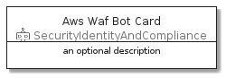
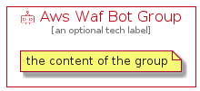

# AwsWafBot


```text
aws-20210730/Resource/SecurityIdentityAndCompliance/AwsWafBot
```

```text
include('aws-20210730/Resource/SecurityIdentityAndCompliance/AwsWafBot')
```


| Illustration | AwsWafBot | AwsWafBotCard | AwsWafBotGroup |
| :---: | :---: | :---: | :---: |
|  |  |  |  |


## AwsWafBot

### Load remotely
```plantuml
@startuml
' configures the library
!global $LIB_BASE_LOCATION="https://raw.githubusercontent.com/tmorin/plantuml-libs/master/distribution"

' loads the library's bootstrap
!include $LIB_BASE_LOCATION/bootstrap.puml

' loads the package bootstrap
include('aws-20210730/bootstrap')

' loads the Item which embeds the element AwsWafBot
include('aws-20210730/Resource/SecurityIdentityAndCompliance/AwsWafBot')

' renders the element
AwsWafBot('AwsWafBot', 'Aws Waf Bot', 'an optional tech label')
@enduml
```

### Load locally
```plantuml
@startuml
' configures the library
!global $INCLUSION_MODE="local"
!global $LIB_BASE_LOCATION="../../.."

' loads the library's bootstrap
!include $LIB_BASE_LOCATION/bootstrap.puml

' loads the package bootstrap
include('aws-20210730/bootstrap')

' loads the Item which embeds the element AwsWafBot
include('aws-20210730/Resource/SecurityIdentityAndCompliance/AwsWafBot')

' renders the element
AwsWafBot('AwsWafBot', 'Aws Waf Bot', 'an optional tech label')
@enduml
```

## AwsWafBotCard

### Load remotely
```plantuml
@startuml
' configures the library
!global $LIB_BASE_LOCATION="https://raw.githubusercontent.com/tmorin/plantuml-libs/master/distribution"

' loads the library's bootstrap
!include $LIB_BASE_LOCATION/bootstrap.puml

' loads the package bootstrap
include('aws-20210730/bootstrap')

' loads the Item which embeds the element AwsWafBotCard
include('aws-20210730/Resource/SecurityIdentityAndCompliance/AwsWafBot')

' renders the element
AwsWafBotCard('AwsWafBotCard', 'Aws Waf Bot Card', 'an optional description')
@enduml
```

### Load locally
```plantuml
@startuml
' configures the library
!global $INCLUSION_MODE="local"
!global $LIB_BASE_LOCATION="../../.."

' loads the library's bootstrap
!include $LIB_BASE_LOCATION/bootstrap.puml

' loads the package bootstrap
include('aws-20210730/bootstrap')

' loads the Item which embeds the element AwsWafBotCard
include('aws-20210730/Resource/SecurityIdentityAndCompliance/AwsWafBot')

' renders the element
AwsWafBotCard('AwsWafBotCard', 'Aws Waf Bot Card', 'an optional description')
@enduml
```

## AwsWafBotGroup

### Load remotely
```plantuml
@startuml
' configures the library
!global $LIB_BASE_LOCATION="https://raw.githubusercontent.com/tmorin/plantuml-libs/master/distribution"

' loads the library's bootstrap
!include $LIB_BASE_LOCATION/bootstrap.puml

' loads the package bootstrap
include('aws-20210730/bootstrap')

' loads the Item which embeds the element AwsWafBotGroup
include('aws-20210730/Resource/SecurityIdentityAndCompliance/AwsWafBot')

' renders the element
AwsWafBotGroup('AwsWafBotGroup', 'Aws Waf Bot Group', 'an optional tech label') {
    note as note
        the content of the group
    end note
}
@enduml
```

### Load locally
```plantuml
@startuml
' configures the library
!global $INCLUSION_MODE="local"
!global $LIB_BASE_LOCATION="../../.."

' loads the library's bootstrap
!include $LIB_BASE_LOCATION/bootstrap.puml

' loads the package bootstrap
include('aws-20210730/bootstrap')

' loads the Item which embeds the element AwsWafBotGroup
include('aws-20210730/Resource/SecurityIdentityAndCompliance/AwsWafBot')

' renders the element
AwsWafBotGroup('AwsWafBotGroup', 'Aws Waf Bot Group', 'an optional tech label') {
    note as note
        the content of the group
    end note
}
@enduml
```

