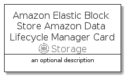

# AmazonElasticBlockStoreAmazonDataLifecycleManager


```text
aws-20210730/Resource/Storage/AmazonElasticBlockStoreAmazonDataLifecycleManager
```

```text
include('aws-20210730/Resource/Storage/AmazonElasticBlockStoreAmazonDataLifecycleManager')
```


| Illustration | AmazonElasticBlockStoreAmazonDataLifecycleManager | AmazonElasticBlockStoreAmazonDataLifecycleManagerCard | AmazonElasticBlockStoreAmazonDataLifecycleManagerGroup |
| :---: | :---: | :---: | :---: |
|  |  |  |  |


## AmazonElasticBlockStoreAmazonDataLifecycleManager

### Load remotely
```plantuml
@startuml
' configures the library
!global $LIB_BASE_LOCATION="https://github.com/tmorin/plantuml-libs/distribution"

' loads the library's bootstrap
!include $LIB_BASE_LOCATION/bootstrap.puml

' loads the package bootstrap
include('aws-20210730/bootstrap')

' loads the Item which embeds the element AmazonElasticBlockStoreAmazonDataLifecycleManager
include('aws-20210730/Resource/Storage/AmazonElasticBlockStoreAmazonDataLifecycleManager')

' renders the element
AmazonElasticBlockStoreAmazonDataLifecycleManager('AmazonElasticBlockStoreAmazonDataLifecycleManager', 'Amazon Elastic Block Store Amazon Data Lifecycle Manager', 'an optional tech label')
@enduml
```

### Load locally
```plantuml
@startuml
' configures the library
!global $INCLUSION_MODE="local"
!global $LIB_BASE_LOCATION="../../.."

' loads the library's bootstrap
!include $LIB_BASE_LOCATION/bootstrap.puml

' loads the package bootstrap
include('aws-20210730/bootstrap')

' loads the Item which embeds the element AmazonElasticBlockStoreAmazonDataLifecycleManager
include('aws-20210730/Resource/Storage/AmazonElasticBlockStoreAmazonDataLifecycleManager')

' renders the element
AmazonElasticBlockStoreAmazonDataLifecycleManager('AmazonElasticBlockStoreAmazonDataLifecycleManager', 'Amazon Elastic Block Store Amazon Data Lifecycle Manager', 'an optional tech label')
@enduml
```

## AmazonElasticBlockStoreAmazonDataLifecycleManagerCard

### Load remotely
```plantuml
@startuml
' configures the library
!global $LIB_BASE_LOCATION="https://github.com/tmorin/plantuml-libs/distribution"

' loads the library's bootstrap
!include $LIB_BASE_LOCATION/bootstrap.puml

' loads the package bootstrap
include('aws-20210730/bootstrap')

' loads the Item which embeds the element AmazonElasticBlockStoreAmazonDataLifecycleManagerCard
include('aws-20210730/Resource/Storage/AmazonElasticBlockStoreAmazonDataLifecycleManager')

' renders the element
AmazonElasticBlockStoreAmazonDataLifecycleManagerCard('AmazonElasticBlockStoreAmazonDataLifecycleManagerCard', 'Amazon Elastic Block Store Amazon Data Lifecycle Manager Card', 'an optional description')
@enduml
```

### Load locally
```plantuml
@startuml
' configures the library
!global $INCLUSION_MODE="local"
!global $LIB_BASE_LOCATION="../../.."

' loads the library's bootstrap
!include $LIB_BASE_LOCATION/bootstrap.puml

' loads the package bootstrap
include('aws-20210730/bootstrap')

' loads the Item which embeds the element AmazonElasticBlockStoreAmazonDataLifecycleManagerCard
include('aws-20210730/Resource/Storage/AmazonElasticBlockStoreAmazonDataLifecycleManager')

' renders the element
AmazonElasticBlockStoreAmazonDataLifecycleManagerCard('AmazonElasticBlockStoreAmazonDataLifecycleManagerCard', 'Amazon Elastic Block Store Amazon Data Lifecycle Manager Card', 'an optional description')
@enduml
```

## AmazonElasticBlockStoreAmazonDataLifecycleManagerGroup

### Load remotely
```plantuml
@startuml
' configures the library
!global $LIB_BASE_LOCATION="https://github.com/tmorin/plantuml-libs/distribution"

' loads the library's bootstrap
!include $LIB_BASE_LOCATION/bootstrap.puml

' loads the package bootstrap
include('aws-20210730/bootstrap')

' loads the Item which embeds the element AmazonElasticBlockStoreAmazonDataLifecycleManagerGroup
include('aws-20210730/Resource/Storage/AmazonElasticBlockStoreAmazonDataLifecycleManager')

' renders the element
AmazonElasticBlockStoreAmazonDataLifecycleManagerGroup('AmazonElasticBlockStoreAmazonDataLifecycleManagerGroup', 'Amazon Elastic Block Store Amazon Data Lifecycle Manager Group', 'an optional tech label') {
    note as note
        the content of the group
    end note
}
@enduml
```

### Load locally
```plantuml
@startuml
' configures the library
!global $INCLUSION_MODE="local"
!global $LIB_BASE_LOCATION="../../.."

' loads the library's bootstrap
!include $LIB_BASE_LOCATION/bootstrap.puml

' loads the package bootstrap
include('aws-20210730/bootstrap')

' loads the Item which embeds the element AmazonElasticBlockStoreAmazonDataLifecycleManagerGroup
include('aws-20210730/Resource/Storage/AmazonElasticBlockStoreAmazonDataLifecycleManager')

' renders the element
AmazonElasticBlockStoreAmazonDataLifecycleManagerGroup('AmazonElasticBlockStoreAmazonDataLifecycleManagerGroup', 'Amazon Elastic Block Store Amazon Data Lifecycle Manager Group', 'an optional tech label') {
    note as note
        the content of the group
    end note
}
@enduml
```

